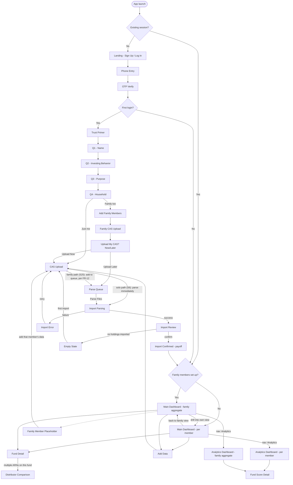
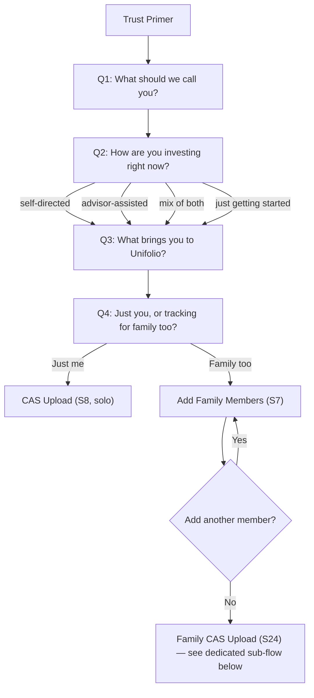
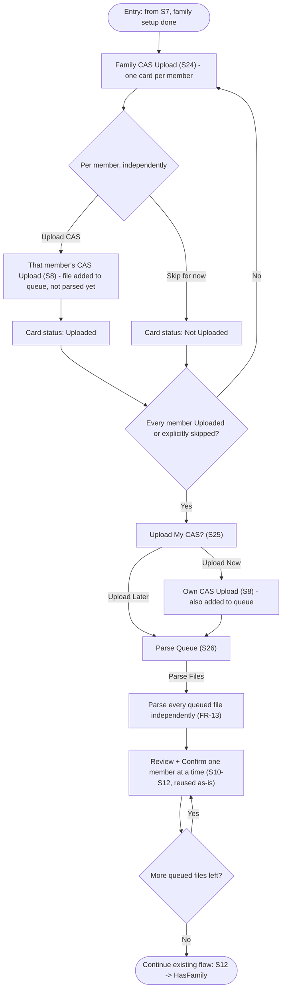
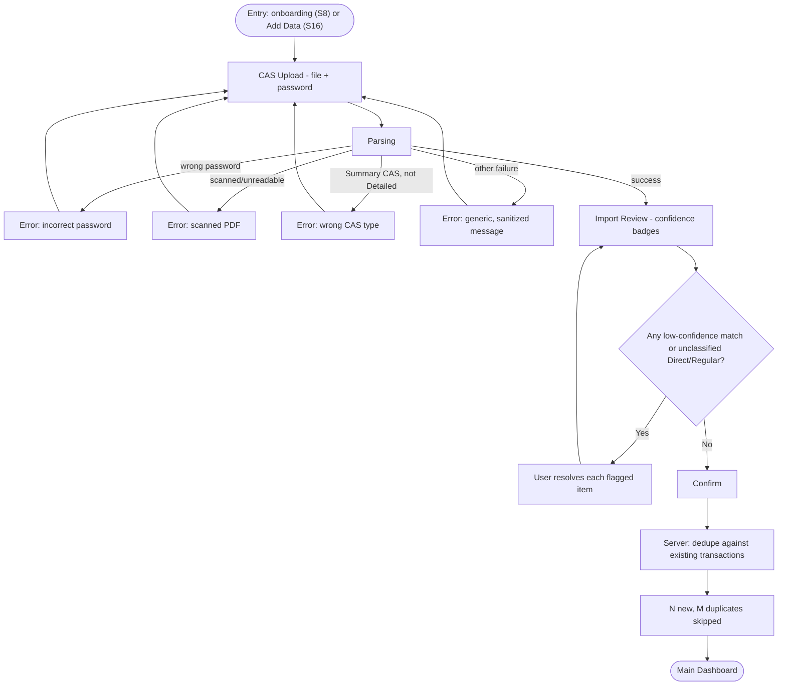

# App Flow: Unifolio

## Purpose

This document connects the four PRDs' user stories into actual navigable flows —
screen to screen, including branches, error states, and where each user story lives.
It's the missing link between "what each module must do" (the PRDs) and "how the
database and TDD need to model it" (next). No visual/interaction design here — that's
the Design Brief/Schema's job — this is structure only: what screen leads to what, and
why.

## Screen Inventory

| ID | Screen | Module / PRD | Entry Points |
|---|---|---|---|
| S0 | Phone Entry | Onboarding (PRD-02) | From S23 |
| S1 | OTP Verify | Onboarding (PRD-02) | From S0 |
| S2 | Trust Primer | Onboarding (PRD-02) | First login only, after S1 |
| S3 | Q1 — Name | Onboarding (PRD-02) | After S2; revisitable via back-nav per FR-7a |
| S4 | Q2 — Investing Behavior | Onboarding (PRD-02) | After S3; skippable/revisitable per FR-7/FR-7a |
| S5 | Q3 — Purpose | Onboarding (PRD-02) | After S4; skippable/revisitable per FR-7/FR-7a |
| S6 | Q4 — Household | Onboarding (PRD-02) | After S5 |
| S7 | Add Family Member(s) | Onboarding (PRD-02) | From S6 if "Family too" |
| S8 | CAS Upload | Import (PRD-01) | From S6 ("Just me") or S25 ("Family too", added v1.2); also from S16 (ongoing) |
| S9 | Import Parsing (loading) | Import (PRD-01) | From S8 |
| S10 | Import Review | Import (PRD-01) | From S9 on success |
| S11 | Import Error | Import (PRD-01) | From S9 on failure (wrong password / scanned / wrong CAS type / generic) |
| S12 | Import Confirmed (payoff) | Import (PRD-01) | From S10 on confirm |
| S13 | Main Dashboard (per-member) | Main Dashboard (PRD-03) | Switch from S14; drill-down view; **also the default** for users with no family members set up (no aggregate to default to) |
| S14 | Main Dashboard (family aggregate) | Main Dashboard (PRD-03) | From S12; **default landing** for returning users who have family members set up |
| S15 | Fund Detail | Main Dashboard (PRD-03) | Tap a holding on S13/S14 |
| S16 | Add Data (re-entry to import) | Main Dashboard (PRD-03) | From S13/S14 nav, routes to S8 |
| S17 | Distributor Comparison | Main Dashboard (PRD-03) | From S15, when a scheme has multiple ARNs |
| S18 | Analytics Dashboard (per-member) | Analytics (PRD-04) | Nav from S13 |
| S19 | Analytics Dashboard (family aggregate) | Analytics (PRD-04) | Nav from S14 |
| S20 | Fund Score Detail | Analytics (PRD-04) | Tap a fund's score on S18/S19 |
| S21 | Empty State — No Holdings Yet | Main Dashboard (PRD-03) | Reached instead of S13/S14 if no import completed |
| S22 | Family Member Placeholder | Main Dashboard (PRD-03) | Within S14, per member with no CAS yet |
| S23 | Landing (Sign Up / Log In) | Onboarding (PRD-02) | **App launch, no session (added v1.2)** — the true first screen, supersedes S0 in that role; both buttons lead to S0 |
| S24 | Family CAS Upload | Import (PRD-01) / Onboarding (PRD-02) | **Added v1.2.** From S7, once family setup is done — one independent upload card per member added at S7 |
| S25 | Upload My CAS? (Now / Later) | Onboarding (PRD-02) | **Added v1.2.** From S24, once every member's card is Uploaded or explicitly skipped |
| S26 | Parse Queue | Import (PRD-01) / Onboarding (PRD-02) | **Added v1.2.** From S25 ("Later"), or after S8/S9 completes a queued upload reached via S24/S25 ("Now") — lists every queued-but-not-yet-parsed file with a single "Parse Files" action |

## Primary Flow

## Sub-flow: Onboarding Questionnaire (PRD-02 detail)

*Note: per PRD-02 FR-7/FR-7a, every step here is resumable and (aside from Q4's family
branch) skippable **and revisitable** via back-navigation — the diagram shows the
intended forward path, not a one-way gate. Added v1.2: Q4's "Family too" branch no
longer lands directly on CAS Upload — it now goes through Family CAS Upload (S24),
detailed in its own sub-flow below, since PRD-02 v1.3 resolved the "before or after own
import" open question that way.*

## Sub-flow: Family CAS Upload (PRD-02 detail, added v1.2)

*Per FR-10, every member's card/upload/status is independent — this diagram shows one
member's path through `MemberChoice`, but each member takes it separately and none of
their state is shared. Per FR-13, "Review + Confirm" here is not a new screen — it's
PRD-01's existing S10 (Import Review) and S12 (Import Confirmed), invoked once per
queued file, never combined across members.*

## Sub-flow: CAS Import / Review / Confirm (PRD-01 detail)

## Navigation Shell (structural, not visual)

Post-onboarding, the app has one persistent navigation surface reachable from every
authenticated screen (per PRD-03/04's shared nav needs):
- **Dashboard** (S13/S14) — default landing for returning users
- **Analytics** (S18/S19) — same per-member/family-aggregate split as Dashboard
- **Add Data** (S16) — always reachable, not buried in a settings menu, per PRD-01/03's
  Ongoing Data Addition requirement
- **Family/member switcher** — a persistent control, not a separate screen, since both
  Dashboard and Analytics need it identically

**Onboarding back-navigation (added v1.2, per PRD-02 FR-7a):** within the onboarding
flow specifically (S2-S26, before the user reaches the Dashboard), a back control must
be reachable from every step, including steps the user skipped. Skipping a question does
not remove it from the navigation history — the user can return to S3/S4/S5 (and, per
FR-10, to any individual family member's card in S24) and answer or change it later.
This is a property of the onboarding flow's own history stack, distinct from the
post-onboarding Navigation Shell described above.

Exact placement (footer tools, sidebar, etc. — mentioned in early product direction) is a
Design Schema/prototyping concern, not resolved here — this section only establishes
that these four things must always be reachable, structurally.

## Screen States

Every screen in the inventory above needs, at minimum, these states — called out here
because they affect flow (an error state routes back into the flow, an empty state is a
distinct screen, not a variant to gloss over):

| State | Applies To | Behavior |
|---|---|---|
| Loading | S9 (parsing), S13/S14/S18/S19 (data fetch) | Per Design Brief's "reveal, not pop-in" motion principle |
| Empty | S21 (no holdings), S22 (member placeholder) | Not an error — an invitation to act (Design Brief voice/tone principle) |
| Error | S11 (import failure) | Specific, actionable message per PRD-01's FR-12–14 |
| Stale data | S13/S14/S15 (old NAV), S18/S19 (old TER reference period) | Visually distinct per Design Schema's `color-warning` token, not presented as current |
| Gated/unresolved | S15 (unclassified Direct/Regular), S20 (insufficient history for score) | Labeled explicitly, never silently defaulted |
| Per-item status (added v1.2) | S24 (per-member card: Not Uploaded/Uploaded), S26 (per-queued-file: queued/parsing/done/failed) | Each item's state is independent — one member's/file's state never implies or changes another's, per FR-10/FR-12 |

## Traceability: User Stories → Screens

A sample of the mapping (full mapping should live in the eventual TDD/ticket breakdown,
not duplicated here in full) — enough to confirm every P0 story has a home:

| User Story | Screens |
|---|---|
| PRD-02 US-1 (understand data safety before sharing) | S2 |
| PRD-02 US-2 (family setup during onboarding) | S6, S7, S24, S25, S26 (added v1.2) |
| PRD-01 US-2 (see what was parsed before saving) | S10 |
| PRD-01 US-3 (low-confidence matches flagged) | S10 (Resolve branch) |
| PRD-03 US-4 (Direct/Regular visible on holdings) | S13, S14, S15 |
| PRD-03 US-9 (add data anytime post-onboarding) | S16 |
| PRD-04 US-5 (portfolio XIRR vs. benchmarks) | S18, S19 |
| PRD-04 US-7 (cap-wise/overlap) | Not mapped — deferred per PRD-04's standing reminder |

## Open Questions

Both open items from the initial draft are resolved:
- **Default landing**: family aggregate (S14) for returning users who have family
  members set up; per-member (S13) remains default for users without family set up
  (nothing to aggregate). Reflected in the Primary Flow diagram's `HasFamily` branch.
- **S17 (Distributor Comparison) entry point**: confirmed as drawn — reachable only from
  Fund Detail (S15) when a scheme has multiple ARNs, no separate standalone nav item.

None remaining from this pass.

## Appendix

### Related Documents
- PRD-01: CAS Parser v2 — Import flow detail
- PRD-02: Signup & Onboarding — Questionnaire flow detail
- PRD-03: Main Dashboard — Screen inventory, Add Data requirement
- PRD-04: MF Analytics Dashboard — Screen inventory
- Design Brief / Design Schema — motion and empty-state principles referenced in
  Screen States

### Revision History

| Version | Date | Author | Changes |
|---------|------|--------|---------|
| 1.0 | 2026-07-22 | Claude (PM partner) | Initial draft |
| 1.1 | 2026-07-22 | Claude (PM partner) | Default landing resolved to family aggregate (S14) for users with family set up, per-member (S13) as fallback for those without; S17 entry point confirmed as-drawn. Primary Flow diagram updated accordingly. |
| 1.2 | 2026-08-05 | Claude (PM partner), from team brainstorm relayed by Ayush | Added S23 (Landing: Sign Up/Log In) as the true first screen; added S24 (Family CAS Upload), S25 (Upload My CAS? Now/Later), S26 (Parse Queue) per PRD-02 v1.3's Family CAS Upload flow; updated Screen Inventory, Primary Flow diagram, and Onboarding Questionnaire sub-flow accordingly; added a new Family CAS Upload sub-flow diagram; added onboarding back-navigation note to Navigation Shell per FR-7a; added per-item status row to Screen States; updated Traceability for PRD-02 US-2 |
