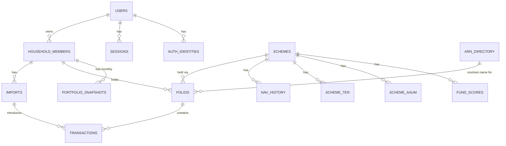

# Database Schema: Unifolio

## Purpose

Consolidates every data requirement from PRDs 1–4 and ADRs 1–4 into one schema,
targeting PostgreSQL per ADR-003. This is the last document before the TDD — the TDD
assumes this schema rather than re-deriving it.

## Design Principles (carried from upstream documents)

1. **Two clearly separated data domains**: *user data* (household members, folios,
   transactions, imports — private, per-user) and *reference data* (scheme master, NAV
   history, TER, AAUM, benchmark indices, ARN directory — public, shared platform-wide,
   never duplicated per user). This distinction was implicit across PRD-01/03/04 and made
   explicit here because it directly shapes table design: reference tables have no
   user/household foreign key at all.
2. **Imports are repeatable events, not a one-time onboarding artifact** — per PRD-01's
   Ongoing Data Addition and PRD-03's Add Data entry point (ADR discussion), the schema
   models `imports` as a table a household member can have many of, not a flag on the
   member record.
3. **No raw CAS PDF storage anywhere** — per ADR-004's final decision, there is no column
   or table for the source document, only its parsed output.
4. **`NUMERIC`, never `FLOAT`, for all money/units/NAV fields** — per PRD-01's Decimal-
   math constraint, carried through literally into column types.
5. **Family aggregate default (App Flow v1.1) is computed, not stored** — whether a
   household member's dashboard defaults to family-aggregate or per-member view
   depends on whether other household members exist, which is derivable from a simple
   count query. No `default_view` column is needed and one is deliberately not included,
   to avoid a piece of stored state silently going stale relative to the actual family
   composition.

## Entity Relationship Diagram

*Note: `OTP_REQUESTS` and `PENDING_IDENTITY_VERIFICATIONS` are standalone, transient tables
keyed on phone number or token hash, not yet tied to a `USERS` row at creation time. `SCHEMES`,
`NAV_HISTORY`, `SCHEME_TER`, `SCHEME_AAUM`, `BENCHMARK_INDEX_HISTORY`, `ARN_DIRECTORY`,
and `FUND_SCORES` are reference data — no household/user foreign key, shared
platform-wide, per Design Principle 1.*

## Entity Definitions

### `users`
The account holder — phone-number-authenticated, per PRD-02's auth decision.

| Column | Type | Notes |
|---|---|---|
| `id` | `UUID` PK | |
| `phone_number` | `VARCHAR` UNIQUE NOT NULL | Mandatory verified phone, per PRD-02 FR-2 (login resolution source of truth is `auth_identities`) |
| `email` | `VARCHAR` NULLABLE | Denormalized highest-precedence email claim (Google > Email) per PRD-02 |
| `created_at` | `TIMESTAMPTZ` | |
| `onboarding_step` | `VARCHAR` NULLABLE | For resume, per PRD-02 FR-8; null once complete |
| `onboarding_completed_at` | `TIMESTAMPTZ` NULLABLE | |
| `investor_type` | `ENUM('self_directed','advisor_assisted','mixed','beginner')` NULLABLE | Q2 answer, PRD-02 FR-4 — personalization only, never advice input |
| `primary_goal` | `ENUM('consolidated_view','understand_holdings','family_management','performance_comparison')` NULLABLE | Q3 answer, PRD-02 FR-5 |

### `household_members`
One row per person whose portfolio is tracked — **including the primary account holder**
(`relationship = 'self'`), so aggregation logic treats every member uniformly rather than
special-casing the account owner. This directly supports the App Flow's computed
family-aggregate-default logic (Design Principle 5).

| Column | Type | Notes |
|---|---|---|
| `id` | `UUID` PK | |
| `user_id` | `UUID` FK → `users.id` NOT NULL | Household owner (who's logged in) |
| `name` | `VARCHAR` NOT NULL | |
| `relationship` | `ENUM('self','spouse','parent','child','sibling','other')` NOT NULL | Fixed enum, not free text — keeps family-grouping/analytics consistent (no "Wife" vs "spouse" vs "Spouse" fragmentation). `'self'` for the account holder. |
| `relationship_other_label` | `VARCHAR` NULLABLE | Free-text only when `relationship = 'other'` — covers real cases (grandparent, in-law, etc.) without the enum sprawling |
| `created_at` | `TIMESTAMPTZ` | |

Partial unique index on `(user_id) WHERE relationship = 'self'` (migration 0011) enforces
at most one account-holder row per user; `create_household_member` also pre-checks this
and returns 409 rather than surfacing a raw constraint violation.

### `imports`
A single CAS upload-and-confirm event — repeatable per member, per PRD-01's Ongoing
Data Addition requirement.

| Column | Type | Notes |
|---|---|---|
| `id` | `UUID` PK | |
| `household_member_id` | `UUID` FK → `household_members.id` NOT NULL | |
| `status` | `ENUM('pending','confirmed','failed','not_started','requesting_cas','waiting_for_user','upload_started','password_required','validation_failed','processing','retry_pending','import_successful','import_failed','expired')` NOT NULL | Widened from the original 3-value set (migration 0003) to the full lifecycle-state machine (Updated-CAS-PRD FR-5); `pending`/`confirmed`/`failed` remain as legacy values, not removed — Postgres enums can't cheaply drop a value |
| `source_cas_type` | `ENUM('cams','kfintech')` NULLABLE | Set once parsing succeeds |
| `raw_parser_output` | `JSONB` NULLABLE | Full `casparser` output, per PRD-01 FR-4, for debugging — not the source PDF |
| `error_type` | `ENUM('wrong_password','scanned_pdf','wrong_cas_type','generic')` NULLABLE | Populated on failure, drives PRD-01 FR-12–14's specific messaging |
| `error_code` | `VARCHAR` NULLABLE | Added migration 0003 — machine-readable failure code alongside `error_type`, for lifecycle-state error surfacing |
| `error_message` | `VARCHAR` NULLABLE | Added migration 0003 — human-readable failure detail |
| `source_tab` | `VARCHAR` NULLABLE | Added migration 0003 — which CAS-request UI tab/flow this import originated from |
| `statement_from_date` | `DATE` NULLABLE | Added migration 0003 — CAS statement period start |
| `statement_to_date` | `DATE` NULLABLE | Added migration 0003 — CAS statement period end |
| `expires_at` | `TIMESTAMPTZ` NULLABLE | Added migration 0003 — lifecycle-state expiry (e.g. an unconfirmed CAS request going stale) |
| `new_transactions_count` | `INTEGER` NULLABLE | Populated on confirm, PRD-01 FR-9 |
| `duplicate_transactions_count` | `INTEGER` NULLABLE | Populated on confirm, PRD-01 FR-9 |
| `uploaded_at` | `TIMESTAMPTZ` NOT NULL | |
| `confirmed_at` | `TIMESTAMPTZ` NULLABLE | |

**Note on PAN**: the CAS PDF password is the user's PAN, but per PRD-01's constraint the
*password itself* is never stored. The investor-info PAN parsed *from inside* the CAS
(FR-2) is a separate question — see Open Questions below on whether/how it's persisted,
since this wasn't fully pinned down at the PRD stage and matters for encryption design.

### `schemes` (reference data)
Master scheme list — AMFI/`mfapi.in`-sourced, shared across all users, not duplicated
per household.

| Column | Type | Notes |
|---|---|---|
| `id` | `UUID` PK | |
| `amfi_code` | `VARCHAR` UNIQUE NOT NULL | |
| `isin` | `VARCHAR` NULLABLE | Not all schemes have one uniformly populated |
| `name` | `VARCHAR` NOT NULL | |
| `amc_name` | `VARCHAR` NOT NULL | PRD-04 FR-1 (AMC allocation) |
| `sebi_category` | `VARCHAR` NOT NULL | PRD-04 FR-2/FR-3 (category allocation, ranking) |
| `plan_name_variant` | `ENUM('direct','regular','unresolved')` NULLABLE | Scheme-name-pattern signal feeding PRD-01 FR-5, distinct from the per-folio classification below |

### `folios`
A specific holding: one household member's position in one scheme, via one folio
number (a scheme can have multiple folios per member if bought through different
distributors — see PRD-03 FR-11).

| Column | Type | Notes |
|---|---|---|
| `id` | `UUID` PK | |
| `household_member_id` | `UUID` FK → `household_members.id` NOT NULL | |
| `scheme_id` | `UUID` FK → `schemes.id` NOT NULL | |
| `folio_number` | `VARCHAR` NOT NULL | |
| `arn_code` | `VARCHAR` NULLABLE | PRD-01 FR-7/FR-8 — captured per folio, not collapsed across folios |
| `plan_type` | `ENUM('direct','regular','unclassified')` NOT NULL DEFAULT `'unclassified'` | Resolved per PRD-01 FR-5/FR-6, combining `schemes.plan_name_variant` and this folio's `arn_code` presence |
| `has_coverage_gap` | `BOOLEAN` NOT NULL DEFAULT `false` | Added migration 0003 — flags a folio with a detected transaction-history coverage gap (Updated-CAS-PRD FR-7) |
| `coverage_gap_details` | `JSONB` NULLABLE | Added migration 0003 — detail payload for the flagged gap |
| UNIQUE | `(household_member_id, scheme_id, folio_number)` | Prevents duplicate folio rows on re-import |

### `transactions`
Every parsed transaction line — the ledger everything else (holdings, XIRR, cash flow,
SIP detection) is computed from. **Partitioned by `RANGE (date)`, yearly**, from MVP
launch — not deferred. Postgres requires the partition key in every unique constraint on
a partitioned table, which is why `id` alone can no longer be the sole primary key (see
below); the dedupe constraint already includes `date` so it partitions cleanly as-is.

| Column | Type | Notes |
|---|---|---|
| `id` | `UUID` | Generated, not globally unique alone once partitioned — see composite PK |
| `folio_id` | `UUID` FK → `folios.id` NOT NULL | |
| `import_id` | `UUID` FK → `imports.id` NOT NULL | Which import introduced this row — enables audit/debugging without needing the source PDF |
| `type` | `ENUM('purchase','purchase_sip','redemption','switch_in','switch_out','dividend_payout','dividend_reinvest','segregation','stt','stamp_duty','misc','opening_balance')` NOT NULL | Per PRD-01 FR-3; `opening_balance` added migration 0003 (Updated-CAS-PRD FR-7's coverage-gap opening-balance row). On Postgres this column is `VARCHAR` + `CHECK (type IN (...))`, not a native enum type — migration 0001's `_create_transactions_postgres()` deliberately avoids a separate `CREATE TYPE` lifecycle for the partitioned table; the CHECK constraint was widened for `opening_balance` by migration 0010, not 0003 (0003's own attempted `ALTER TYPE` for this column was dead code, since no native type ever existed here) |
| `date` | `DATE` NOT NULL | Partition key |
| `amount` | `NUMERIC(14,2)` NOT NULL | |
| `units` | `NUMERIC(14,3)` NOT NULL | |
| `nav` | `NUMERIC(10,4)` NOT NULL | |
| `raw_description` | `VARCHAR` NULLABLE | Preserves original text for `misc`-typed rows, per PRD-01 FR-3 |
| PRIMARY KEY | `(id, date)` | Composite because `date` (the partition key) must be part of every unique index on a partitioned table — `id` alone remains the practical row identifier for foreign-key references from elsewhere if ever needed |
| UNIQUE | `(folio_id, date, amount, units, type)` | **The dedupe key** — PRD-01 FR-9, PRD-03's re-upload edge case. Already includes `date`, so it partitions cleanly with no redesign needed. (`type` added v1.2: `amount`/`units` are stored as positive magnitudes, so a same-day purchase and redemption of equal size would otherwise collide and one be dropped as a false duplicate) |
| Partitions | `transactions_2020` ... `transactions_2026`, `transactions_default` | Yearly range partitions; a `DEFAULT` partition catches anything outside the defined ranges (e.g., a very old transaction from a long-held fund) rather than failing the insert — new yearly partitions get added routinely as time passes, a small recurring ops task rather than a redesign |

### `nav_history` (reference data)
NAV per scheme per date — covers the *full scheme universe*, not just what any user
holds, per PRD-04's category-ranking requirement (FR-3/FR-4) and PRD-03's monthly
snapshot backfill (FR-8). **Partitioned by `RANGE (date)`, yearly, from MVP launch** —
this is genuinely the largest table in the schema even before any real users exist,
since it's reference data spanning the entire scheme universe (thousands of schemes ×
years of daily NAV), not something that grows only with adoption.

| Column | Type | Notes |
|---|---|---|
| `scheme_id` | `UUID` FK → `schemes.id` | |
| `date` | `DATE` | Partition key |
| `nav` | `NUMERIC(10,4)` NOT NULL | |
| PRIMARY KEY | `(scheme_id, date)` | Already includes the partition key, partitions cleanly with no redesign |
| Partitions | `nav_history_2015` ... `nav_history_2026`, `nav_history_default` | Same yearly-range approach as `transactions`; a wider historical range here since `mfapi.in`'s backfill (PRD-03 FR-8) reaches further back than any user's transaction history |

### `scheme_ter` (reference data)
| Column | Type | Notes |
|---|---|---|
| `scheme_id` | `UUID` FK → `schemes.id` | |
| `reference_period` | `DATE` | Month the TER applies to, per AMFI's disclosure cadence (PRD-04 Research) |
| `ter_value` | `NUMERIC(5,2)` NULLABLE | Percentage. Made nullable migration 0009 — `NULL` means "checked this scheme against this period's AMFI feed, found no usable TER" (e.g. a matured FMP no longer in AMFI's feed), distinct from no row at all ("never checked"); avoids re-triggering a full AMFI rescan forever for a scheme that will never match |
| PRIMARY KEY | `(scheme_id, reference_period)` | |

### `scheme_aaum` (reference data)
| Column | Type | Notes |
|---|---|---|
| `scheme_id` | `UUID` FK → `schemes.id` | |
| `reference_period` | `DATE` | Quarterly per PRD-04's AAUM research finding |
| `aaum_value` | `NUMERIC(18,2)` NOT NULL | |
| PRIMARY KEY | `(scheme_id, reference_period)` | |

### `benchmark_index_history` (reference data)
| Column | Type | Notes |
|---|---|---|
| `index_name` | `ENUM('nifty_50','nifty_500','nifty_largemidcap_250','nifty_midcap_150')` | Per PRD-04's confirmed index mapping |
| `date` | `DATE` | |
| `value` | `NUMERIC(12,2)` NOT NULL | |
| PRIMARY KEY | `(index_name, date)` | |

### `arn_directory` (reference data)
| Column | Type | Notes |
|---|---|---|
| `arn_code` | `VARCHAR` PK | |
| `distributor_name` | `VARCHAR` NULLABLE | Null until resolved, per PRD-03 FR-11b's graceful fallback |
| `status` | `ENUM('active','suspended','invalid','unresolved')` NOT NULL DEFAULT `'unresolved'` | Per PRD-03 FR-11c |
| `last_checked_at` | `TIMESTAMPTZ` NULLABLE | |

### `portfolio_snapshots`
Month-end value per household member — backfillable from `transactions` + `nav_history`
per PRD-03 FR-8, so this table can be populated retroactively, not just going forward.

| Column | Type | Notes |
|---|---|---|
| `household_member_id` | `UUID` FK → `household_members.id` | |
| `snapshot_month` | `DATE` | Stored as the month's last day |
| `total_value` | `NUMERIC(18,2)` NOT NULL | |
| `computed_at` | `TIMESTAMPTZ` | |
| PRIMARY KEY | `(household_member_id, snapshot_month)` | |

### `fund_scores` (reference data — fund-level, not per-user)
The scorer (PRD-04 FR-5–FR-7) is computed per scheme within its category, not per user
— a fund's score is the same for every user who holds it. Portfolio-level scores (FR-6)
are an AUM-weighted roll-up computed on read from a member's holdings plus this table,
not separately stored, since they'd otherwise go stale independently of the underlying
fund scores.

| Column | Type | Notes |
|---|---|---|
| `scheme_id` | `UUID` FK → `schemes.id` | |
| `computed_at` | `TIMESTAMPTZ` | |
| `risk_adjusted_tier` | `INTEGER` NOT NULL | 1–5, per PRD-04 FR-5a's percentile bucketing |
| `cost_adjustment` | `NUMERIC(3,2)` NOT NULL | Signed nudge value, per FR-5b |
| `final_score` | `NUMERIC(5,2)` NOT NULL | |
| PRIMARY KEY | `(scheme_id, computed_at)` | Keeps score history rather than overwriting, allowing "score changed over time" to be answerable later without a design change |

### `auth_identities`
Stores one row per linked authentication identity per user (Phone OTP, Email OTP, Google). Login resolution matches on `(provider, provider_subject)`.

| Column | Type | Notes |
|---|---|---|
| `id` | `UUID` PK | |
| `user_id` | `UUID` FK → `users.id` NOT NULL | |
| `provider` | `ENUM('phone_otp','email_otp','google','email_password')` NOT NULL | `email_password` kept in the enum but unused going forward (Postgres can't cheaply drop an enum value) — password-based auth was removed migration 0008; every live identity today is `phone_otp`, `email_otp`, or `google` |
| `provider_subject` | `VARCHAR` NOT NULL | Method-specific subject (normalized phone, normalized email, or Google `sub`) |
| `email` | `VARCHAR` NULLABLE | Verified email associated with this identity (if any) |
| `identifier_verified_at` | `TIMESTAMPTZ` NOT NULL | When ownership of this identifier was proven |
| `last_used_at` | `TIMESTAMPTZ` NOT NULL | Updated on each login |
| `created_at` | `TIMESTAMPTZ` NOT NULL | |
| UNIQUE | `(provider, provider_subject)` | Prevents duplicate identity claims across accounts |

`password_hash` and `email_confirmed_at` (present in v1.3) were dropped by migration 0008
when password-based auth was removed in favor of email+OTP — see
`Docs/orchestration/remove-password-auth-handoff.md`.

### `pending_identity_verifications`
Holds an independently-verified identity temporarily during the mandatory phone-gate signup or step-up account-linking flow.

| Column | Type | Notes |
|---|---|---|
| `id` | `UUID` PK | |
| `token_hash` | `VARCHAR` UNIQUE NOT NULL | SHA-256 hash of the bearer token returned in `phone_required` / `link_required` |
| `provider` | `ENUM('phone_otp','email_otp','google','email_password')` NOT NULL | Never `phone_otp` in practice — a phone-first verification completes signup on its own, without a pending record |
| `provider_subject` | `VARCHAR` NOT NULL | |
| `email` | `VARCHAR` NULLABLE | |
| `email_verified` | `BOOLEAN` NOT NULL | True only if provider proved email ownership |
| `matched_user_id` | `UUID` FK → `users.id` NULLABLE | Non-null for step-up linking to existing account |
| `expires_at` | `TIMESTAMPTZ` NOT NULL | 10-minute TTL |
| `used_at` | `TIMESTAMPTZ` NULLABLE | |
| `created_at` | `TIMESTAMPTZ` NOT NULL | |

`password_hash` (present in v1.3) was dropped by migration 0008 alongside password auth.

`password_reset_tokens` and `email_confirmation_tokens` (both present in v1.3) no longer
exist — `email_confirmation_tokens` was dropped outright by migration 0007 when email+OTP
replaced link-based email confirmation, and `password_reset_tokens` was dropped by
migration 0008 when password auth was removed entirely (both tables backed a mechanism
that was deleted, not toggled off).

### `otp_requests`
Foundational schema for PRD-02's phone+OTP auth (FR-2) and the email+OTP signup flow
(migration 0007) — transient, short-lived records, not a full auth/security spec
(rate-limiting policy, lockout rules, etc. remain a future Auth/Security PRD per PRD-02's
FR-2a note).

| Column | Type | Notes |
|---|---|---|
| `id` | `UUID` PK | |
| `phone_number` | `VARCHAR` NULLABLE | Not yet necessarily tied to a `users` row — OTP is requested before an account is confirmed to exist |
| `email` | `VARCHAR` NULLABLE | Added migration 0007, for the email+OTP signup flow's inline confirmation step |
| CHECK | exactly one of `phone_number`/`email` set | `ck_otp_requests_exactly_one_identifier`, migration 0007 — phone and email OTPs share this one table |
| `otp_hash` | `VARCHAR` NOT NULL | Hashed, never the raw OTP |
| `expires_at` | `TIMESTAMPTZ` NOT NULL | Short-lived (5 min), per standard OTP practice |
| `verified_at` | `TIMESTAMPTZ` NULLABLE | |
| `attempt_count` | `INTEGER` NOT NULL DEFAULT `0` | Rate-limiting tracker |
| `created_at` | `TIMESTAMPTZ` NOT NULL | |

### `sessions`
Foundational session record following successful auth verification.

| Column | Type | Notes |
|---|---|---|
| `id` | `UUID` PK | |
| `user_id` | `UUID` FK → `users.id` NOT NULL | |
| `session_token_hash` | `VARCHAR` NOT NULL | Hashed, never the raw token |
| `auth_method` | `ENUM('phone_otp','email_otp','google','email_password')` NOT NULL | Method that established this session |
| `created_at` | `TIMESTAMPTZ` NOT NULL | |
| `expires_at` | `TIMESTAMPTZ` NOT NULL | 30-day sliding TTL |
| `last_active_at` | `TIMESTAMPTZ` NOT NULL | |
| `device_info` | `VARCHAR` NULLABLE | Foundational only — full device-management UX is future Auth/Security PRD scope |

## Data Classification & Security

| Data | Classification | Handling |
|---|---|---|
| `transactions`, `folios`, `portfolio_snapshots` | Sensitive (financial) | Standard RDS encryption at rest; no special masking needed, these are the user's own numbers |
| Parsed PAN (extracted from CAS investor info) | Highly sensitive | **Not persisted at all** — used transiently in memory during the active parse/review session for masked display (`ABCDE****F`), then discarded exactly like the source PDF. No PAN column exists anywhere in this schema. |
| `phone_number` | Sensitive (PII, also the auth credential) | Standard encryption at rest; rate-limit any lookup path |
| Reference tables (`schemes`, `nav_history`, `scheme_ter`, etc.) | Public data | No special handling — this is all already-public AMFI/NSE data |
| CAS PDF | N/A — not stored | Per ADR-004, confirmed final |

## Indexing Notes

- `transactions(folio_id, date)` — supports the holdings-table and XIRR queries that
  dominate PRD-03/04's read patterns.
- `nav_history(scheme_id, date)` — supports both current-NAV lookups and the historical
  range scans PRD-03's monthly snapshot backfill needs.
- `household_members(user_id)` — supports the family-aggregate query (Design
  Principle 5's computed default) with a simple existence/count check.
- `household_members(user_id) WHERE relationship = 'self'` (unique, migration 0011) —
  enforces one account-holder row per user; doubles as the existence check the
  application-layer 409 guard also performs before insert.

## What This Document Doesn't Cover

- **Full auth/security policy** (rate-limiting rules, lockout thresholds, session-expiry
  policy specifics, device-management UX) — `otp_requests` and `sessions` above are the
  foundational tables so login works at MVP, but the policy layer on top of them remains
  the future Auth/Security PRD's job, per PRD-02's FR-2a note.
- Caching layer design (e.g., Redis) on top of this schema for hot read paths — an
  implementation detail for the TDD, not a schema-level decision.
- Ongoing partition-maintenance automation (adding next year's partition ahead of time)
  — an operational runbook item for the TDD, not a schema design question.

## Open Questions

Both items from the initial draft are resolved:
- **PAN persistence**: not stored anywhere — confirmed transient-only, discarded like the
  source PDF (see Data Classification & Security).
- **`relationship` field shape**: fixed enum (`self`/`spouse`/`parent`/`child`/`sibling`/`other`)
  plus a free-text fallback label for `'other'` — structured enough for consistent
  family-grouping logic, flexible enough not to force awkward edge cases into the wrong
  bucket.

None remaining from this pass.

## Appendix

### Related Documents
- PRD-01, PRD-02, PRD-03, PRD-04 — source of every column and constraint above
- ADR-003 (RDS/PostgreSQL), ADR-004 (S3 scope, no PDF storage)
- App Flow: Unifolio — source of the computed-default-view design principle

### Revision History

| Version | Date | Author | Changes |
|---------|------|--------|---------|
| 1.0 | 2026-07-22 | Claude (PM partner) | Initial draft |
| 1.1 | 2026-07-22 | Claude (PM partner) | PAN confirmed never persisted; `relationship` changed to structured enum + other-label fallback; `transactions` and `nav_history` now partitioned by `RANGE(date)`, yearly, from MVP launch (not deferred); added foundational `otp_requests` and `sessions` tables for PRD-02's phone+OTP auth |
| 1.2 | 2026-08-06 | Claude (PM partner) | `transactions` dedupe key widened to `(folio_id, date, amount, units, type)` — with amounts/units normalized to positive magnitudes, equal-magnitude same-day purchase+redemption pairs were no longer sign-distinguishable and collided under the 4-column key; matches migration 0002 |
| 1.3 | 2026-08-17 | Claude (PM partner) | Updated for multi-method auth (migrations 0004-0006): added `auth_identities`, `pending_identity_verifications`, `password_reset_tokens`, `email_confirmation_tokens`; added `sessions.auth_method`; narrowed `otp_requests` back to phone-only; updated `users.phone_number` and ERD to reflect `auth_identities` as auth source of truth |
| 1.4 | 2026-09-02 | Claude (PM partner) | Reconciled against migrations 0003, 0007-0010 (this doc had gone stale by 3-4 migrations, caught by the sqlite-postgres-migration-compliance-audit): `imports.status` widened to the full 14-value lifecycle enum, added `imports.error_code`/`error_message`/`source_tab`/`statement_from_date`/`statement_to_date`/`expires_at`; added `folios.has_coverage_gap`/`coverage_gap_details`; `transactions.type` gained `opening_balance` (and noted it's a `VARCHAR`+CHECK column on Postgres, never a native enum type); `scheme_ter.ter_value` made nullable with a documented meaning; dropped `password_reset_tokens` and `email_confirmation_tokens` entirely (removed by migrations 0007/0008) and `password_hash`/`email_confirmed_at` from `auth_identities`/`pending_identity_verifications` (removed by 0008); documented `otp_requests.email` and its exactly-one-identifier CHECK (added back by 0007) |
| 1.5 | 2026-09-02 | Claude (PM partner) | F3 (compliance audit): `household_members` gained a partial unique index on `(user_id) WHERE relationship = 'self'` (migration 0011), enforcing one account-holder row per user — a gap this doc had never specified even before the code caught up; documented in both the `household_members` entity and Indexing Notes |
