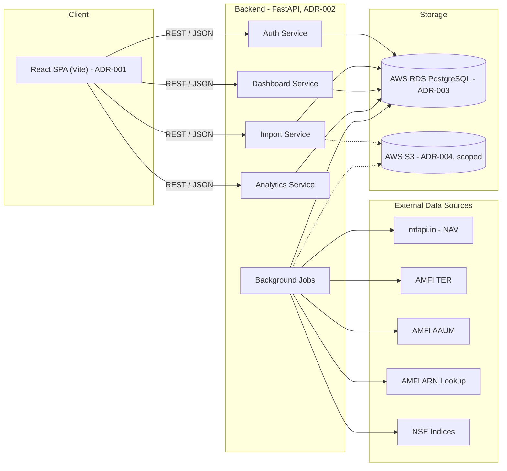
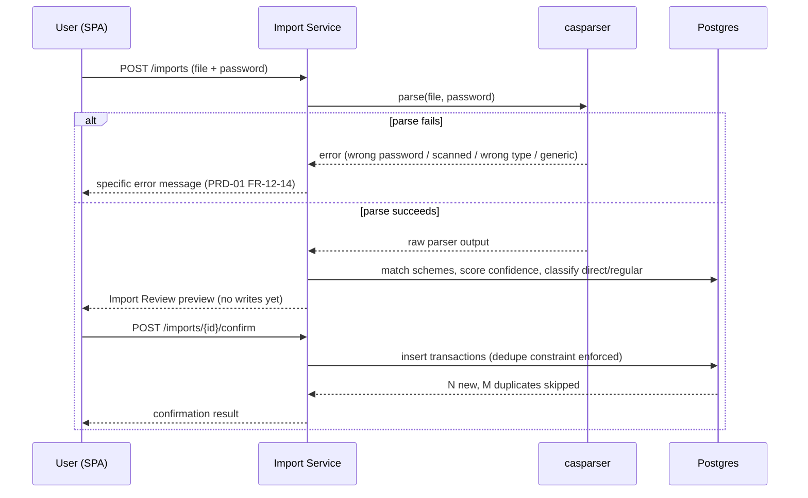
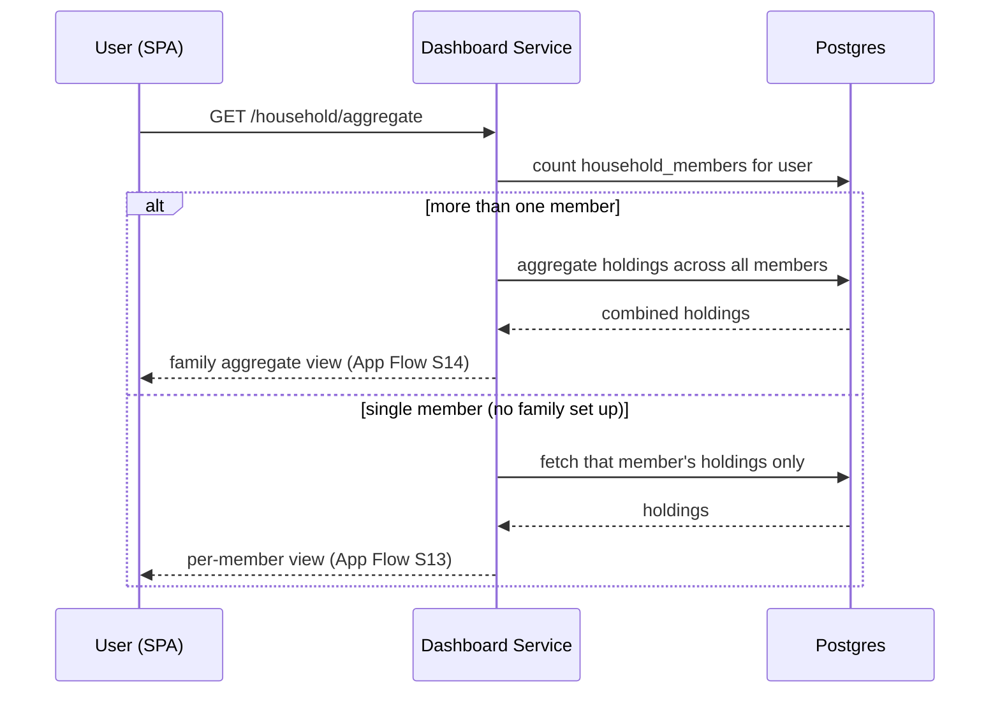

# Technical Design Document: Unifolio MF MVP

## Purpose

This is the build-ready technical spec, synthesizing everything decided upstream. It
does not re-derive decisions already made — it references them and adds what's still
missing: system architecture, API surface, external-integration mechanics, background
jobs, deployment, non-functional requirements, and testing strategy. Read alongside,
not instead of: the four PRDs, the ADR set, the App Flow document, and the Database
Schema.

## System Architecture

Four logical services within one FastAPI application (not four separate deployments —
consistent with ADR-001's monolith-appropriate-at-this-team-size reasoning, applied
identically to the backend): **Auth**, **Import**, **Dashboard**, **Analytics**, plus a
**Background Jobs** component handling all external reference-data refresh. `Import`
writes to S3 only for the scoped exceptions in ADR-004 (never the raw PDF); `Jobs` writes
reference data to both RDS (structured, queryable) and S3 (raw cached payloads,
per ADR-004's cache-layer rationale).

## Component Design

### Auth Service
Owns: `otp_requests`, `sessions` (Database Schema). Endpoints: request OTP, verify OTP
(creates session), refresh session. No password anywhere, per PRD-02 FR-2. Foundational
only — full policy (rate-limiting, lockout) is the deferred Auth/Security PRD's job; this
service implements the base flow that PRD unblocks against.

### Import Service
Owns: `imports`, `folios`, `transactions`, `schemes` (writes on first-encounter). Implements
PRD-01's full two-phase parse/confirm flow: upload → `casparser` invocation → confidence
scoring against `schemes` → Import Review payload → confirm → dedupe-constrained
insert into `transactions`. Also implements PRD-01/03's Ongoing Data Addition — the same
endpoints serve both onboarding's first import and the dashboard's Add Data re-entry
(App Flow S8, reached from both S6/S7 and S16).

### Dashboard Service
Owns: read paths over `folios`/`transactions`/`portfolio_snapshots`, plus write path for
`portfolio_snapshots` (computed, not user-submitted). Implements PRD-03's holdings
table, allocation summary, SIP detection, cash flow, family aggregate (computed default
per App Flow's Design Principle 5), and distributor comparison (reading `arn_directory`,
never blocking on it per PRD-03 FR-11b).

### Analytics Service
Owns: read paths over `nav_history`/`scheme_ter`/`scheme_aaum`/`benchmark_index_history`/
`fund_scores`, computing PRD-04's category ranking, category-average comparison,
benchmark XIRR, weighted TER, and scorer display on read (no per-user analytics tables
— see Database Schema's `fund_scores` design note on why portfolio-level scores are
computed, not stored).

### Background Jobs
Not user-facing. Scheduled and on-demand jobs refreshing reference data — see
Background Jobs section below for the full list, cadence, and automation approach per
source.

## API Surface (representative, not exhaustive)

Full OpenAPI spec is an implementation artifact, not reproduced here — this is the
shape, grouped by service, enough to confirm nothing from the PRDs is missing an
endpoint home.

| Endpoint | Method | Service | PRD Reference |
|---|---|---|---|
| `/auth/otp/request` | POST | Auth | PRD-02 FR-2 |
| `/auth/otp/verify` | POST | Auth | PRD-02 FR-2 |
| `/imports` | POST | Import | PRD-01 (upload) |
| `/imports/{id}/parse` | POST | Import | PRD-01 FR-9 (preview, no DB write) |
| `/imports/{id}/confirm` | POST | Import | PRD-01 FR-9–FR-11 |
| `/household-members` | GET/POST | Dashboard | PRD-02 FR-5, App Flow S7 |
| `/household-members/{id}/holdings` | GET | Dashboard | PRD-03 FR-1–FR-3 |
| `/household-members/{id}/cash-flow` | GET | Dashboard | PRD-03 FR-7 |
| `/household-members/{id}/snapshots` | GET | Dashboard | PRD-03 FR-8 |
| `/household/aggregate` | GET | Dashboard | PRD-03 FR-9, App Flow S14 default |
| `/funds/{scheme_id}/distributor-comparison` | GET | Dashboard | PRD-03 FR-11 |
| `/analytics/household-members/{id}/allocation` | GET | Analytics | PRD-04 FR-1–FR-2 (built 2026-08-10: granular `by_category` + re-exposed `by_amc`; distinct route/prefix from Dashboard's pre-existing `/household-members/{id}/allocation` coarse `by_asset_class`/`by_amc` view — the two are intentionally separate, not a collision) |
| `/analytics/household/aggregate/allocation` | GET | Analytics | PRD-04 FR-1–FR-2 (family aggregate, built 2026-08-10) |
| `/funds/{scheme_id}/category-rank` | GET | Analytics | PRD-04 FR-3–FR-4 |
| `/funds/{scheme_id}/score` | GET | Analytics | PRD-04 FR-5–FR-7 |
| `/household-members/{id}/benchmark-comparison` | GET | Analytics | PRD-04 FR-8–FR-9 |

## Key Flows (sequence)

### CAS Import (first-time or ongoing — same flow, per App Flow)

### Dashboard Load (family aggregate default)

## External Integrations

| Source | Data | Refresh Cadence | Automation Approach | Cache Target |
|---|---|---|---|---|
| `mfapi.in` | NAV (current + historical, full scheme universe) | Daily | Direct API calls (existing integration, already built per PRD-01) | `nav_history` (Postgres) |
| AMFI TER page | Scheme-wise TER | Monthly (per AMFI's disclosure cadence) | **Resolved, concretely** (live-verified 2026-08-10): `GET /api/populate-ter-month?year=<FY>` (e.g. `"2025-2026"`) lists months with data; `GET /api/populate-te-rdata-revised?MF_ID=All&Month=<MM-YYYY>&strCat=-1&strType=-1&page=N&pageSize=N` returns `Scheme_Name` (plan-generic), `R_TER`/`D_TER`. No shared join key with local `schemes` — matched by fuzzy name (stdlib `difflib`, same idiom as PRD-01's scheme matching). Full request/response detail in `Docs/superpowers/plans/2026-08-10-phase-4-analytics-backend-design.md`. | `scheme_ter` (Postgres) |
| AMFI AAUM page | Scheme-wise AAUM | Quarterly | **Resolved, concretely** (live-verified 2026-08-10): `GET /api/average-aum-schemewise?strType=Typewise&MF_ID=0` cascades financial-year → period → scheme-wise data; each scheme row carries a clean `AMFI_Code`, directly joinable to local `schemes.amfi_code` (no fuzzy matching needed, unlike TER). Full detail in the Phase 4 design doc above. | `scheme_aaum` (Postgres) |
| AMFI ARN lookup | Distributor name/status per ARN | On-demand (first time an ARN is seen), not scheduled | **Resolved, concretely, and built** (Phase 3, PRD-03 FR-11a): `GET /api/distributor-agent?strOpt=ALL&search=<bare ARN digits>&page=1&pageSize=1` — see `backend/app/services/dashboard/arn_lookup.py`. | `arn_directory` (Postgres) |
| NSE Indices (niftyindices.com) | Nifty 50/500/LargeMidcap250/Midcap150 historical levels | Daily | **Resolved, concretely** — corrected 2026-08-10: the endpoint below was live-verified; an earlier version of this row cited `Backpage.aspx/getHistoricaldatatabletoString`, which is now stale/dead (niftyindices.com moved off the `.aspx` path — confirmed via the site's own JS bundle). The current, live endpoint is `POST /BackPage/getHistoricaldatatabletoString` (no `.aspx`; requires a browser `User-Agent`, the site drops requests without one), JSON body `{"cinfo": "{\"name\":...,\"startDate\":\"DD-MMM-YYYY\",\"endDate\":\"DD-MMM-YYYY\",\"indexName\":...}"}`, returning `{HistoricalDate, OPEN, HIGH, LOW, CLOSE}` rows. `Trading_Index_Name` mapping and full detail in the Phase 4 design doc above. | `benchmark_index_history` (Postgres) |

All five integrations write into Postgres reference tables directly (per Database
Schema's reference-data design), not S3 — S3's role per ADR-004 is for *raw cached
payloads* if a source's fetch is expensive enough to warrant not re-fetching on retry, an
implementation optimization, not a data-of-record location. The structured, queryable
copy always lives in Postgres.

**On "TBD" no longer meaning unresolved**: all five integrations now have a confirmed,
research-backed automation *method*. What remains is implementation (writing the
actual scraper/endpoint-caller code), not figuring out *whether* it's possible — that
uncertainty is what's been closed out here.

## Background Jobs

| Job | Frequency | Failure Handling |
|---|---|---|
| NAV refresh (`mfapi.in`, full scheme universe) | Daily | Retry with backoff; stale-NAV labeling (PRD-03 FR-3) is the user-facing fallback if a day's refresh fails entirely |
| TER refresh (AMFI) | Monthly | Same stale-data labeling pattern (PRD-04 edge case) |
| AAUM refresh (AMFI) | Quarterly | Same pattern |
| Benchmark index refresh (NSE) | Daily | Same pattern |
| ARN name resolution | On-demand, triggered by new ARN appearing in an import | Falls back to raw ARN code display (PRD-03 FR-11b) — never blocks |
| Monthly portfolio snapshot computation | Monthly (also backfillable on-demand per PRD-03 FR-8) | Missing months show as unavailable, not zero/error (PRD-03 edge case) |
| Fund score computation | Monthly (aligned with TER refresh, since cost is an input) | Funds with insufficient history skip scoring, not a failure (PRD-04 edge case) |

**Mechanism (ADR-006, Accepted)**: AWS EventBridge Scheduler triggering scheduled ECS
Fargate `RunTask` calls, sharing the same FastAPI codebase's job modules, for all six
scheduled jobs in the table above (the four external-source refreshes plus the two
internally-computed ones — monthly snapshots and fund scores). ARN resolution stays
on-demand, triggered directly by the Import Service rather than through EventBridge —
confirmed correctly scoped, no change from the original design. See ADR-006 for full
context, consequences (including a documented Fargate capacity-transient mitigation
pattern), and alternatives considered (Lambda, a dedicated task queue).

## Deployment Architecture (ADR-005, Accepted)

Formalized as ADR-005, not a proposal anymore — and the research done to formalize it
surfaced something that changes the original default meaningfully:

**AWS App Runner stopped accepting new customers as of April 30, 2026** and is now in
maintenance mode heading toward sunset. The original "App Runner + fallback to ECS
Fargate" default in this document's earlier draft would have had the team building on a
service unavailable to new adopters. Corrected:

- **Backend (FastAPI)**: **ECS Express Mode** (Fargate-backed) — AWS's own recommended
  App Runner successor, launched re:Invent 2025, delivering the same single-resource
  deploy simplicity while running on real ECS/Fargate underneath. Standard ECS Fargate
  (full manual configuration) remains the fallback if Express Mode's abstraction proves
  limiting.
- **Frontend (React/Vite static build)**: S3 + CloudFront — unaffected by the App Runner
  finding, unchanged from the original proposal.
- **Database**: RDS for PostgreSQL, per ADR-003, single instance at MVP scale (no read
  replica yet — premature at current volume).
- **Background jobs**: EventBridge Scheduler + ECS Fargate `RunTask`, per ADR-006 (see
  Background Jobs section above and ADR-006 itself for full detail).
- **Secrets**: AWS Secrets Manager for DB credentials, any API keys.

See ADR-005 for full context, consequences, and alternatives considered.

## Non-Functional Requirements

Consolidated from the PRDs' own success metrics, not new targets invented here:

| Requirement | Target | Source |
|---|---|---|
| Dashboard load time | Under 2 seconds, ≤50 holdings | PRD-03 |
| CAS parse success rate | ≥98% | PRD-01 |
| Gain/loss calculation accuracy | 100% match on known-answer fixtures | PRD-01/03/04 (the shared "what does 100% mean" question — resolved as: 100% of *what's computed* matches hand-verified fixtures; 100% of *real-world CAS files* parsing perfectly is a different, unbounded claim not made here) |
| Direct/Regular classification accuracy | ≥99% where signal is present | PRD-01 |
| AMFI scheme-match confidence auto-accept | ≥90% of schemes | PRD-01 |

**Security**: PAN never persisted (confirmed, Database Schema); CAS PDF never
persisted (confirmed, ADR-004); phone number and financial data encrypted at rest via
RDS; session tokens and OTPs stored hashed, never raw (Database Schema).

**Scalability**: `transactions` and `nav_history` partitioned by year from MVP launch
(Database Schema) — deliberately not deferred, since `nav_history`'s reference-data
volume is large from day one regardless of user count.

## Testing Strategy

- **Unit tests**: `calc.py`'s Decimal-safe math (existing, per PRD-01), scheme-matching
  confidence scoring, Direct/Regular classification logic, dedupe-key behavior.
- **Known-answer fixtures**: hand-verified CAMS (and KFintech, once a fixture is
  available per PRD-01's flagged dependency) CAS files with known expected parse
  output — the concrete backing for the "100% accuracy" NFR above.
- **Integration tests**: full parse→review→confirm flow against a test database,
  including the dedupe-constraint behavior on re-upload.
- **Background job tests**: mocked external-source responses (AMFI/NSE/`mfapi.in`)
  verifying stale-data fallback behavior when a source is unavailable, not just the
  happy path.

## Risks (consolidated)

Every individual PRD/ADR already carries its own risk table — this section only flags
risks that span multiple documents, which is where the highest-leverage attention
should go:

| Risk | Spans | Mitigation |
|---|---|---|
| Automation methods for AMFI TER/AAUM and NSE Indices are now confirmed feasible, but not yet implemented and not yet tested against real responses at production frequency | PRD-04, this TDD | Downgraded from "unresolved research question" to "known implementation task" — still worth prioritizing early in the build (not last) given three of five integrations feed the same Analytics Dashboard feature set, and each individually has a stale-data fallback but a simultaneous cluster failing on launch week would still meaningfully degrade that dashboard |
| ECS Express Mode (ADR-005) is newer (November 2025) than the App Runner path it replaces — less battle-tested in the wild | This TDD, ADR-005 | Acknowledged in ADR-005's consequences; worth a light documentation/tooling check closer to actual implementation, not a reason to delay the decision now |
| Cap-wise composition and stock-level overlap remain deferred | PRD-03, PRD-04 | Standing reminder already in place; no change needed here, just restated for visibility at the point of build |

## Appendix

### Related Documents
- PRD-01, PRD-02, PRD-03, PRD-04 — full functional requirements
- ADR-001 through ADR-006 — technology stack and deployment/scheduling decisions
  this TDD builds on
- App Flow: Unifolio — screen/navigation structure the API surface serves
- Database Schema: Unifolio — full entity definitions

### Revision History

| Version | Date | Author | Changes |
|---------|------|--------|---------|
| 1.0 | 2026-07-22 | Claude (PM partner) | Initial draft |
| 1.1 | 2026-07-22 | Claude (PM partner) | Deployment architecture formalized as ADR-005 (Accepted) — corrected from the original App Runner proposal to ECS Express Mode after research found App Runner closed to new customers as of April 30, 2026. Background job scheduling formalized as ADR-006 (Accepted) — EventBridge Scheduler + ECS Fargate confirmed as current AWS practice. All three previously-"TBD" external integrations (AMFI TER, AMFI AAUM, NSE Indices) resolved to a confirmed automation method — endpoint reverse-engineering, directly precedented by existing open-source scrapers against the same sites. Risks table updated accordingly. |
