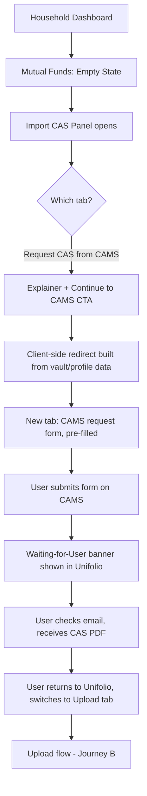
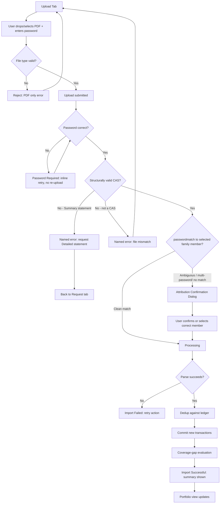
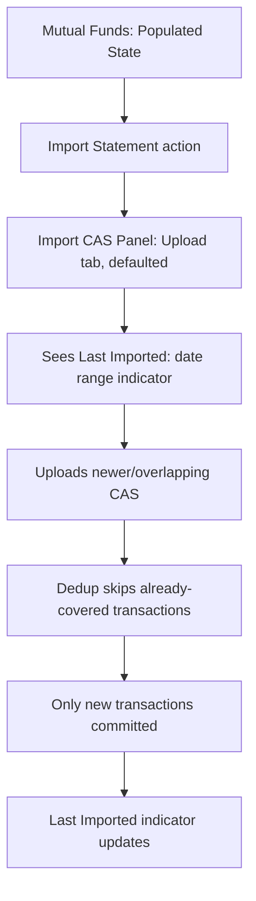
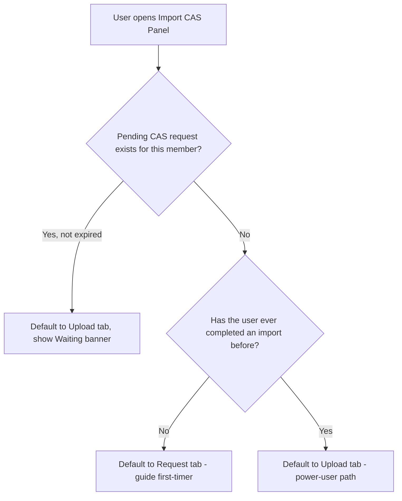
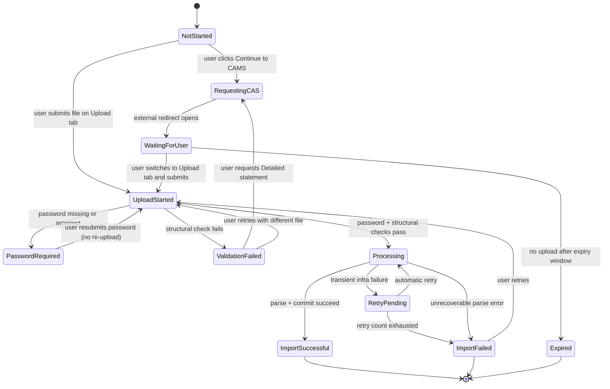
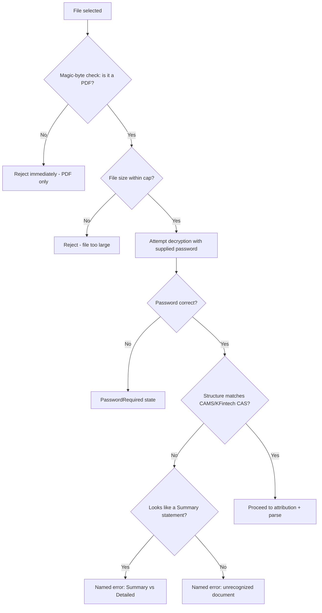
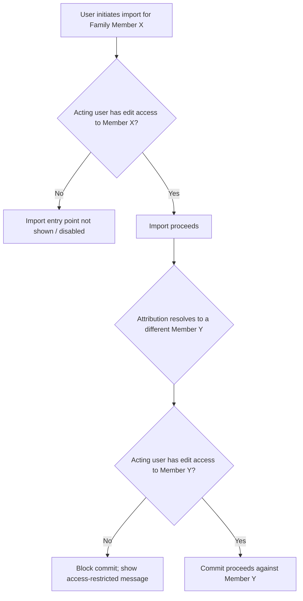
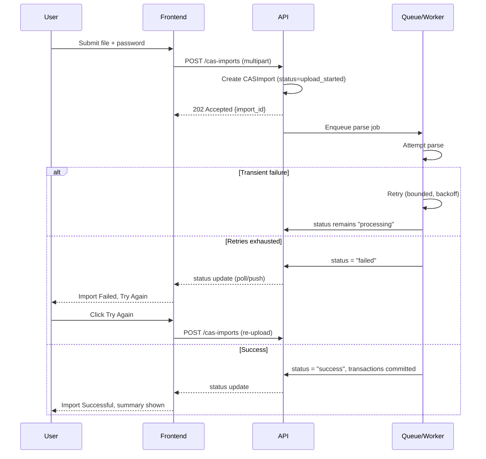
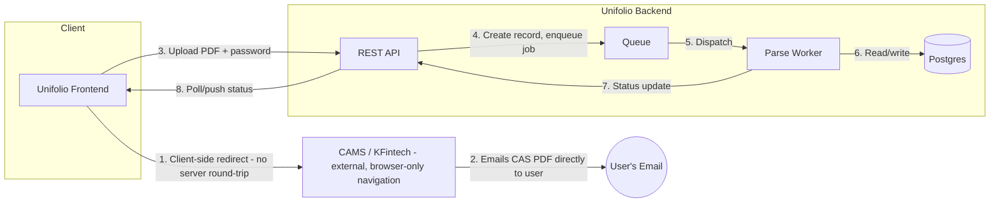
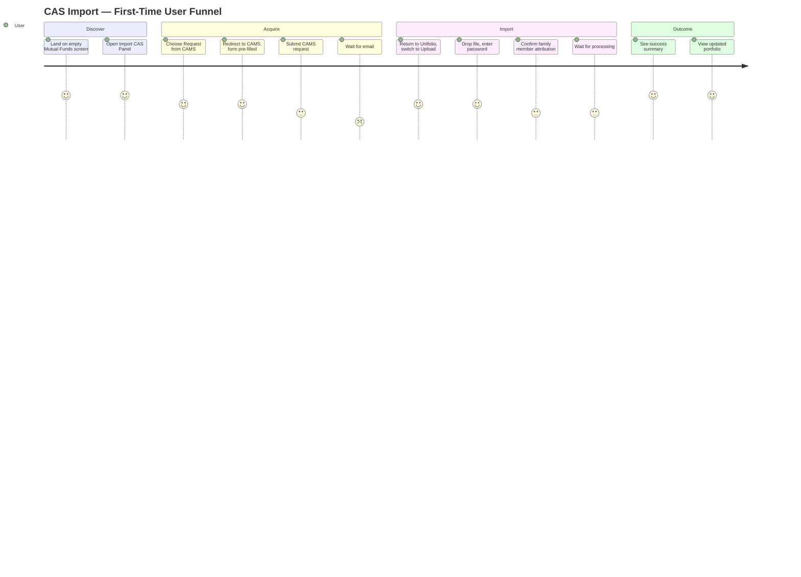

# CAS Import — Application Flow

**System:** Mutual Fund Consolidated Account Statement (CAS) Import
**Product:** Unifolio
**Companion document:** `01-CAS-PRD.md`
**Audience:** Product, UX, Frontend Engineering, Backend Engineering, QA

---

## Overview

This document describes the observable behaviour of the CAS Import experience — screens, transitions, states, and system interaction points — independent of implementation. It complements `01-CAS-PRD.md`, which defines requirements; this document defines how those requirements manifest as an application a user navigates.

The experience spans two on-ramps (request a CAS from CAMS, or upload one already in hand) that converge on a single upload → validate → process → commit pipeline, with a family-member attribution step and a post-commit coverage-gap check layered on top.

---

## Navigation Hierarchy

```
Household Dashboard
└── Mutual Funds
    ├── Empty State (no accounts yet)
    │   └── Import CAS Panel
    │       ├── Tab: Request CAS from CAMS
    │       │   ├── Explainer + "Continue to CAMS" CTA
    │       │   └── Waiting State ("Waiting for User")
    │       └── Tab: Upload Existing CAS
    │           ├── Dropzone + Password field
    │           ├── Family Member Attribution (conditional)
    │           ├── Processing State
    │           └── Result State (Success / Failure)
    └── Populated State (≥1 account)
        ├── Portfolio Summary (Current Value / Invested / P&L / XIRR)
        ├── Family Accounts List (per-member cards)
        │   └── Member Detail
        │       ├── Folio List
        │       │   └── Folio Detail (transactions, coverage-gap indicator)
        │       └── Import History
        └── "Import Statement" action → re-enters Import CAS Panel
```

The Import CAS Panel is not a routed page — it is a modal/panel overlay reachable from either the empty state or the "Import Statement" action, and its two tabs are local component state, not distinct URLs. This is a deliberate choice: an import is a bounded task, not a destination.

---

## Complete Screen List

| Screen / Surface | Purpose | Entry points |
|---|---|---|
| Mutual Funds — Empty State | First-time entry point for a family member with no imported holdings | Household Dashboard → Mutual Funds (no accounts) |
| Mutual Funds — Populated State | Portfolio analytics once ≥1 account exists | Household Dashboard → Mutual Funds (accounts exist) |
| Import CAS Panel — Request Tab | Explains and initiates the CAMS request redirect | Empty state CTA; "Import Statement" action |
| Import CAS Panel — Upload Tab | Dropzone + password + submit | Empty state CTA; "Import Statement" action; return from Request tab |
| Waiting-for-User Banner | Persistent reminder of a pending CAMS request | Auto-shown after redirect; visible across the panel until resolved |
| Attribution Confirmation Dialog | Confirms/corrects which family member an upload belongs to | Triggered mid-upload when passwordmatch is ambiguous or absent |
| Processing State | Shown while the uploaded file is validated and parsed | After successful upload submission |
| Password Retry Prompt | Inline retry for a wrong/missing password | Triggered by `PasswordRequired` state |
| Validation Failure State | Named error for structurally invalid or Summary-type CAS | Triggered by `ValidationFailed` state |
| Import Result — Success | Confirms completion, summarizes transactions added/skipped | Triggered by `ImportSuccessful` state |
| Import Result — Failure | Generic but specific failure messaging with retry | Triggered by `ImportFailed` state |
| Coverage Gap Indicator | Persistent flag on an affected folio | Shown after post-import evaluation flags a gap |
| Import History List | Chronological list of past import attempts | Member Detail → Import History |
| Add/Edit Family Member | Captures PAN/name/email needed for prefill and attribution | Triggered when a required profile field is missing |

---

## User Journeys

### Journey A — First-Time User, No CAS in Hand



### Journey B — Upload Existing CAS



### Journey C — Returning User, Periodic Re-Import



---

## Screen-to-Screen Transitions

| From | Trigger | To |
|---|---|---|
| Mutual Funds Empty State | User clicks primary CTA | Import CAS Panel (Upload tab, default) |
| Mutual Funds Populated State | User clicks "Import Statement" | Import CAS Panel (Upload tab, default; Request tab if a pending request exists) |
| Import CAS Panel: Request Tab | User clicks "Continue to CAMS" | External CAMS tab/window opens; panel shows Waiting-for-User banner |
| Import CAS Panel: Request Tab | User manually switches tabs | Import CAS Panel: Upload Tab |
| Import CAS Panel: Upload Tab | File + password submitted, password wrong | Password Retry Prompt (same screen, inline) |
| Import CAS Panel: Upload Tab | File + password submitted, structurally invalid | Validation Failure State |
| Import CAS Panel: Upload Tab | File + password valid, passwordambiguous | Attribution Confirmation Dialog |
| Attribution Confirmation Dialog | User confirms/selects member | Processing State |
| Import CAS Panel: Upload Tab | File + password valid, passwordclean match | Processing State |
| Processing State | Parse + commit succeeds | Import Result — Success |
| Processing State | Parse fails unrecoverably | Import Result — Failure |
| Import Result — Success | Auto-dismiss or user closes | Mutual Funds Populated State (updated) |
| Import Result — Failure | User clicks "Try again" | Import CAS Panel: Upload Tab (file cleared) |
| Any screen in panel | User closes panel without completing | Mutual Funds (state unchanged; pending request, if any, persists per its own lifecycle) |

---

## Decision Trees

### Decision Tree — Which Tab Should Be Default on Open?



### Decision Tree — Attribution Resolution

```mermaid
flowchart TD
    A[CAS parsed, passwords(s) extracted] --> B{Single passwordfound?}
    B -->|Yes| C{passwordmatches an existing family member?}
    C -->|Yes, matches currently selected member| D[Auto-attribute, no dialog]
    C -->|Yes, matches a different member| E[Show mismatch confirmation dialog]
    C -->|No match found| F[Show Add New Family Member fallback]
    B -->|No, multiple PANs found| G[Show per-folio-group attribution dialog]
```

---

## State Diagram — CAS Import Lifecycle

This is the authoritative state machine for a single CAS import attempt, for one family member, regardless of which tab originated it.



### State Notes

| State | User-visible? | Notes |
|---|---|---|
| `NotStarted` | Implicit (empty/populated panel view) | No record created yet. |
| `RequestingCAS` | Yes | Momentary; transitions immediately to `WaitingForUser`. |
| `WaitingForUser` | Yes | Persistent banner; no timeout visible to user, but expires internally after 7 days. |
| `UploadStarted` | Yes (as "Uploading…") | Very brief; file is being read/transmitted. |
| `PasswordRequired` | Yes | Inline, specific error; recoverable without re-upload. |
| `ValidationFailed` | Yes | Named, specific error distinguishing Summary-vs-Detailed from generic mismatch. |
| `Processing` | Yes (progress indicator) | Includes parse, dedup, coverage-gap evaluation. |
| `RetryPending` | No (internal only) | Surfaced to the user as continued "Processing." |
| `ImportSuccessful` | Yes | Terminal; shows added/skipped transaction summary. |
| `ImportFailed` | Yes | Terminal; generic-but-specific-where-possible message + retry action. |
| `Expired` | No (banner simply disappears) | Data-hygiene state; user can start fresh at any time. |

---

## Loading States

| Context | Behaviour |
|---|---|
| Panel initial open | Skeleton/placeholder for the tab content while family-member and pending-request context loads. |
| File upload in progress | Determinate progress bar tied to upload byte progress (not parse progress). |
| Processing (parse + dedup + coverage check) | Indeterminate progress with staged labels ("Reading statement…", "Checking for duplicates…", "Finalizing…") rather than a single unlabeled spinner, so a multi-second wait doesn't read as hung. |
| Attribution dialog resolving | Brief loading state while PAN-match lookup completes (typically sub-second; a spinner is acceptable given the short duration). |
| Import History list | Skeleton rows while historical records load; paginated if the list exceeds a reasonable page size. |

---

## Empty States

| Surface | Empty-state copy pattern | Primary action |
|---|---|---|
| Mutual Funds (no accounts) | "No mutual fund holdings yet — Import a CAS PDF to see holdings" with two-step framing | Opens Import CAS Panel |
| Import History (no prior imports) | "No imports yet for [Member Name]" | Links back to the import panel |
| Family Accounts list (no members configured) | "Add a family member to get started" | Opens Add Family Member flow, which gates entry to import entirely |

---

## Validation Flows



Each rejection point produces a distinct, structured error code consumed by the frontend to render a specific message — no validation failure is allowed to fall through to a generic "something went wrong."

---

## Permission Flows



Permission checks are re-evaluated at commit time, not only at import initiation — this matters specifically for the attribution-mismatch path (FR-4), where the resolved family member may differ from the one the user started with.

---

## Error Flows

| Error class | Where surfaced | Message pattern | Recovery |
|---|---|---|---|
| Non-PDF file | Upload tab, immediately | "PDF only — please upload a CAS statement in PDF format." | Select a different file. |
| File too large | Upload tab, immediately | "This file is too large. Please contact support if your statement exceeds [X]MB." | Contact support / verify file. |
| Wrong password | Upload tab, post-submit | "Incorrect password. CAMS protects your PDF with the password you set when requesting it." | Retry password, same file. |
| Summary statement uploaded | Upload tab, post-submit | "This looks like a Summary statement. Please request a Detailed statement instead." | Link to Request tab. |
| Unrecognized file | Upload tab, post-submit | "This doesn't look like a CAS statement. Please check the file and try again." | Select a different file. |
| Attribution ambiguity | Modal dialog | "This looks like [Name]'s statement — import for [Name] instead?" | Confirm or select correct member. |
| Transient processing failure | Processing state (internal retry) | No user-facing error during retry window; only shown if retries exhaust. | Automatic; escalates to Import Failed if unresolved. |
| Unrecoverable import failure | Import Result — Failure | "We couldn't complete this import. Please try again, or contact support if this continues." | Retry action; link to help. |
| Permission denied on commit | Attribution dialog / commit step | "You don't have access to import data for [Name]." | Contact household administrator. |

---

## Retry Flows



Password retry does not re-enter this sequence from the top — it uses a dedicated `PATCH /cas-imports/{id}/password` call against the already-uploaded file, avoiding a full re-upload for what is the single most common recoverable error.

---

## Background Processing

| Process | Trigger | Behaviour |
|---|---|---|
| Parse job | Enqueued on successful upload (post-validation) | Runs in an isolated worker; extracts transactions; writes to staging before commit. |
| Coverage-gap evaluation | Enqueued immediately after successful transaction commit | Scans affected folios for unmatched redemptions; sets/clears gap flags. |
| Pending-request expiry scan | Scheduled (daily) | Marks `PendingCASRequest` rows older than the expiry window as `Expired`. |
| Stale `Processing` reconciliation | Scheduled (every few minutes) | Detects imports stuck in `Processing` past a timeout and transitions them to `RetryPending` or `ImportFailed`. |

None of these processes block the user interface; all status changes they produce are reflected asynchronously via the polling/push mechanism described below.

---

## Notifications

| Event | Channel | Timing |
|---|---|---|
| Import reaches terminal success/failure state | In-app (always); email/push (if user has navigated away from the panel) | Immediate on state transition |
| Pending CAS request created | None at creation | — |
| Pending CAS request idle for 2 hours | Optional push/email nudge | +2 hours after `RequestingCAS` |
| Coverage gap detected | In-app flag on folio (always); digest notification (optional, household administrators) | On detection; digest on a recurring cadence |
| Pending request expired | None (silent reclassification) | — |

---

## Offline Behaviour

Unifolio is a server-backed application; the CAS Import feature requires network connectivity to submit and process files. Offline handling is limited to graceful degradation:

- If connectivity is lost mid-upload, the upload is treated as failed (see Retry Flows) and the user is prompted to retry once connectivity is restored — no partial upload state is retained client-side.
- If connectivity is lost while viewing a `Processing` state, the frontend falls back to a "reconnecting…" indicator and resumes polling/reconnects to the push channel once connectivity returns; the underlying import continues processing server-side regardless of client connectivity.
- The Import CAS Panel does not queue an offline submission for later replay — this is an explicit non-goal, since a stale password or file re-selected later after connectivity issues risks silent staleness.

---

## Data Synchronization

- Import status is synchronized to the client via a poll-or-push mechanism (short-interval polling for v1; upgradeable to a websocket/SSE channel without changing the state machine contract).
- Portfolio views (holdings, folio lists, coverage-gap flags) subscribe to the same underlying data and refresh reactively when an import reaches `ImportSuccessful`, without requiring a manual page reload.
- The "Last Imported" indicator (see `01-CAS-PRD.md`, FR-9) updates as part of the same reactive refresh, not a separately-timed poll.

---

## API Interaction Points

| Action | Endpoint (indicative) | Notes |
|---|---|---|
| Create pending CAS request | `POST /cas-imports/pending` | Called on "Continue to CAMS" click. |
| Submit file + password | `POST /cas-imports` (multipart) | Creates `CASImport` row; enqueues parse job. |
| Resubmit password only | `PATCH /cas-imports/{id}/password` | Avoids re-upload for password retry. |
| Poll import status | `GET /cas-imports/{id}` | Used for status polling; push-channel equivalent optional. |
| Confirm/correct attribution | `PATCH /cas-imports/{id}/attribution` | Sets the resolved `familyMemberId` before commit proceeds. |
| List import history | `GET /family-members/{id}/cas-imports` | Powers the Import History surface. |
| List/resolve coverage gaps | `GET /family-members/{id}/coverage-gaps`, `POST /folios/{id}/opening-balance` | Powers the coverage-gap indicator and its resolution flow. |

---

## System Interaction Points



The CAMS interaction (steps 1–2) is explicitly a client-side browser navigation and a third-party email delivery — Unifolio's backend is never in that data path, consistent with `01-CAS-PRD.md`'s FR-2 security requirements.

---

## User Journey Diagram — End-to-End (Funnel View)



This funnel view is the basis for the time-in-state and drop-off metrics defined in `01-CAS-PRD.md` (FR-5, FR-8 Success Metrics) — each labeled step corresponds to a measurable transition in the state diagram above.
