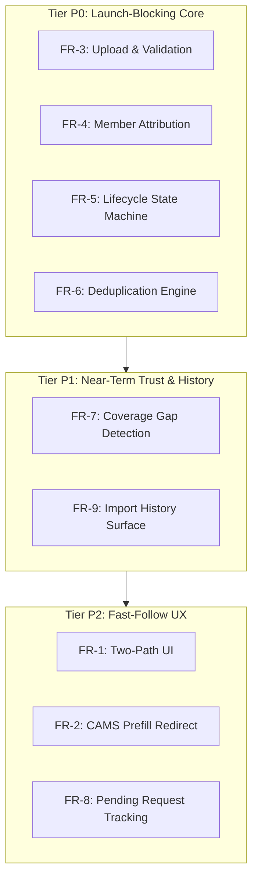

# CAS Import Update Plan — Architecture, Schema & TDD Roadmap

**Documents Analyzed:**
- `Docs/PRDs/Updated-CAS-PRD.md` (supersedes/extends PRD-01/PRD-02)
- `Docs/PRDs/Updated-CAS-App-Flow.md` (supersedes/extends prior app flow)
- Current codebase: `backend/app/services/import_/`, `backend/app/models/`, `backend/app/api/imports.py`, `frontend/src/features/import/`, `frontend/src/features/onboarding/`

---

## 1. Functional Requirements Gap Analysis (FR-1 through FR-9)

| Requirement | Priority | Current Status | Description & What Needs to be Built |
|---|---|---|---|
| **FR-1: Two-Path CAS Acquisition** | P2 | **Partially Implemented** | `UploadForm.tsx` handles direct PDF upload. Net-new: Tabbed container ("Request CAS from CAMS" ↔ "Upload Existing CAS"), persistent 2-step indicator ("Step 1: Get Statement" → "Step 2: Upload"), state preservation across tabs, empty vs. populated layout adaptation. |
| **FR-2: CAMS Prefill Redirect** | P2 | **Net-New** | Client-side redirect constructor prefilling Statement type: Detailed, time duration of 10 years and folio listing: with zero folios. Never prefills password/date. Pop-up blocker fallback link. Triggers `WaitingForUser` status banner. |
| **FR-3: Upload Existing CAS** | P0 | **Partially Implemented** | `casparser` wrapper, `summary_cas`/`demat_cas`/`wrong_password` error classification exist. Net-new: Magic-byte PDF validation, 25MB cap, async ingestion endpoint (`POST /cas-imports`), in-place password retry without re-upload (`PATCH /cas-imports/{id}/password`), structured error responses. |
| **FR-4: Family Member Attribution** | P0 | **Partially Implemented** | Household member ownership checks and manual confirmation exist. Net-new: Automatic member matching against name/email profile, mismatch detection dialog ("This looks like [Name]'s statement — import for [Name] instead?"), multi-member CAS handling, `PATCH /cas-imports/{id}/attribution`. |
| **FR-5: Lifecycle & Status Tracking** | P0 | **Net-New** | Formal 11-state lifecycle engine (`NotStarted` → `RequestingCAS` → `WaitingForUser` → `UploadStarted` → `PasswordRequired` → `ValidationFailed` → `Processing` → `RetryPending` → `ImportSuccessful` / `ImportFailed` → `Expired`). Enforced transition table, `GET /cas-imports/{id}` status polling. |
| **FR-6: Deduplication & Idempotence** | P0 | **Largely Implemented** | 5-column fingerprint `(folio_id, date, amount, units, type)` exists in DB `UniqueConstraint` and `confirm_import` loop. Net-new: Wire to the new lifecycle pipeline and expose `added` vs `skipped` summary in result payloads. |
| **FR-7: Coverage Gap Detection** | P1 | **Net-New** | Post-import ledger evaluation detecting redemptions/switch-outs exceeding prior purchases. `has_coverage_gap` flag on folios, `GET /household-members/{id}/coverage-gaps`, manual opening balance resolution `POST /folios/{id}/opening-balance` with new `OPENING_BALANCE` transaction type. |
| **FR-8: Pending Request Management** | P2 | **Net-New** | `POST /cas-imports/pending` initiating `WaitingForUser` status, persistent waiting banner on import screen, 7-day auto-expiry logic, superseding duplicate pending requests. |
| **FR-9: Import History Surface** | P1 | **Partially Implemented** | `Import` table stores counts and upload timestamp. Net-new: Extraction of CAS statement period `(statement_from_date, statement_to_date)`, `GET /household-members/{id}/cas-imports` endpoint, history table UI and "Last Imported: [date range]" indicator. |

---

## 2. State Machine Mapping

The updated lifecycle in `Updated-CAS-App-Flow.md` defines 11 explicit states.

### State Transitions Table

```
[*] ──> NotStarted
NotStarted ──(user clicks Continue to CAMS)──> RequestingCAS ──> WaitingForUser
NotStarted ──(user submits file)──> UploadStarted
WaitingForUser ──(user submits file)──> UploadStarted
WaitingForUser ──(7-day timeout)──> Expired ──> [*]

UploadStarted ──(password incorrect/missing)──> PasswordRequired
PasswordRequired ──(user resubmits password)──> UploadStarted

UploadStarted ──(file not CAS or is Summary)──> ValidationFailed
ValidationFailed ──(user requests Detailed CAS)──> RequestingCAS
ValidationFailed ──(user selects different file)──> UploadStarted

UploadStarted ──(checks pass)──> Processing
Processing ──(transient error)──> RetryPending ──> Processing
RetryPending ──(retries exhausted)──> ImportFailed ──> [*]
Processing ──(parse error)──> ImportFailed ──> [*]
Processing ──(parse + dedup + gap check succeed)──> ImportSuccessful ──> [*]

ImportFailed ──(user retries)──> UploadStarted
ImportSuccessful ──> [*]
```

### Mapping Existing DB Enum to New Lifecycle

| New `ImportStatus` Enum Value | UI / API State | Description |
|---|---|---|
| `REQUESTING_CAS = "requesting_cas"` | Requesting CAS | Momentary state when CAMS redirect initiates |
| `WAITING_FOR_USER = "waiting_for_user"` | Waiting for User | CAMS request submitted, waiting for email PDF |
| `UPLOAD_STARTED = "upload_started"` | Uploading... | File received, undergoing initial inspection |
| `PASSWORD_REQUIRED = "password_required"` | Password Required | Decryption failed; awaits password resubmission |
| `VALIDATION_FAILED = "validation_failed"` | Validation Failed | Non-CAS or Summary-only statement rejected |
| `PROCESSING = "processing"` | Processing | Parsing, scheme resolution, deduplication, gap check |
| `RETRY_PENDING = "retry_pending"` | Processing (internal retry) | Transient failure retry loop |
| `IMPORT_SUCCESSFUL = "import_successful"` | Import Successful | Terminal: transactions committed, summary available |
| `IMPORT_FAILED = "import_failed"` | Import Failed | Terminal: unrecoverable failure |
| `EXPIRED = "expired"` | Expired | Terminal: pending request exceeded 7-day TTL |

---

## 3. Data Model Changes

### 3.1 `Import` Model (`backend/app/models/imports.py`)
- Update `status` to use new 10-state `ImportStatus` enum.
- Add `statement_from_date: Mapped[date | None]`.
- Add `statement_to_date: Mapped[date | None]`.
- Add `error_code: Mapped[str | None]` (e.g. `wrong_password`, `summary_cas`, `unreadable_pdf`, `demat_cas`, `parse_failed`).
- Add `error_message: Mapped[str | None]`.
- Add `source_tab: Mapped[str | None]` (`request` | `upload`).
- Add `expires_at: Mapped[datetime | None]`.

### 3.2 `Folio` Model (`backend/app/models/folio.py`)
- Add `has_coverage_gap: Mapped[bool] = mapped_column(Boolean, default=False, nullable=False)`.
- Add `coverage_gap_details: Mapped[dict | None] = mapped_column(JSON().with_variant(postgresql.JSONB(), "postgresql"))`.

### 3.3 `TransactionType` Enum (`backend/app/models/enums.py`)
- Add `OPENING_BALANCE = "opening_balance"` (required for FR-7 manual opening balance entries).

### 3.4 Database Migration
- Migration `0003_cas_import_lifecycle_and_coverage_gaps.py`:
  - Expands PostgreSQL / SQLite `import_status` enum type with new values.
  - Adds new columns to `imports` and `folios`.
  - Adds `opening_balance` to `transaction_type` enum.
  - Adds index on `imports(household_member_id, uploaded_at)` for sub-second history retrieval.

---

## 4. Conflicts, Ambiguities & Proposed Resolutions

| Item | Ambiguity / Conflict | Proposed Resolution |
|---|---|---|
| **1. In-place Password Retry vs. Zero Raw PDF Persistence** | PRD-03 requires `PATCH /cas-imports/{id}/password` without re-uploading, while ADR-004 prohibits permanent raw PDF storage. | On `wrong_password`, buffer the encrypted file bytes in a short-lived (15 min TTL) encrypted in-memory cache keyed by `import_id`. When password is provided, decrypt and immediately purge the buffer. If expired, return 410 Gone requesting re-upload. |
| **2. Async Queue Architecture vs. Local Monolith** | PRD describes a queue worker architecture (`Q` -> `Worker`) with `202 Accepted` and status polling. | Use FastAPI `BackgroundTasks` / async task runner within the FastAPI monolith for dev. `POST /cas-imports` responds with `202 Accepted` and `import_id`. Background task processes parse, dedup, and gap check, updating the DB record. Status is polled via `GET /cas-imports/{id}`. |
| **3. Attribution & PAN Matching vs. ADR-004 (No PAN persistence)** | FR-4 mentions password/PAN matching against stored family member PANs, but ADR-004 strictly forbids storing PAN in Unifolio DB. | Perform attribution matching using investor name and email extracted from the CAS against `HouseholdMember.name` and `User.email`. Never persist plaintext PAN. If ambiguous, trigger the confirmation dialog. |
| **4. Compatibility with Existing Onboarding Flows** | Existing onboarding tests rely on `/imports/parse` and `/imports/confirm`. | Keep `/imports/parse` and `/imports/confirm` as synchronous wrappers around the new core engine, while building the full `/cas-imports` RESTful lifecycle routes. Zero regression on existing 156 backend tests. |

---

## 5. TDD Implementation Plan by Priority Tier



### Tier P0: Launch-Blocking Core (FR-3, FR-4, FR-5, FR-6)
1. **Migration 0003**: Schema updates (`ImportStatus`, `TransactionType.OPENING_BALANCE`, `Import` columns, `Folio` coverage gap columns).
2. **State Machine (`backend/app/services/import_/state_machine.py`)**:
   - Strictly enforced transition matrix with `InvalidStateTransitionError`.
   - Comprehensive unit tests covering all 11 states and every valid/invalid edge.
3. **Core Lifecycle Service & Endpoints (`backend/app/api/cas_imports.py`)**:
   - `POST /cas-imports` (multipart file + password + member_id): Magic-byte validation, 25MB check, creates `upload_started`/`processing` record, starts background worker, returns 202.
   - `GET /cas-imports/{id}`: Polls current state, error details, and transaction counts.
   - `PATCH /cas-imports/{id}/password`: In-place password retry against cached encrypted buffer.
   - `PATCH /cas-imports/{id}/attribution`: Assigns/updates confirmed `household_member_id`.
4. **Attribution Engine (`backend/app/services/import_/attribution.py`)**:
   - Exact/fuzzy name & email match against household members.
   - Single-match auto-attribution vs. mismatch detection vs. multi-member CAS flag.
5. **Deduplication Integration**:
   - 5-column composite fingerprint check with `added` vs `skipped` summary counts.
6. **Frontend P0 Components**:
   - Update `UploadForm.tsx` with instant validation and inline password retry.
   - `AttributionModal.tsx` for mismatch confirmation.
   - State-machine driven `ImportLifecycleView.tsx` with real-time polling.

### Tier P1: Near-Term Integrity & Transparency (FR-7, FR-9)
1. **Coverage Gap Engine (`backend/app/services/import_/coverage_gap.py`)**:
   - Chronological folio unit ledger evaluation: detects any redemption/switch-out where preceding cumulative purchased units are insufficient.
   - Updates `Folio.has_coverage_gap` and `coverage_gap_details`.
   - Endpoints: `GET /household-members/{id}/coverage-gaps` and `POST /folios/{id}/opening-balance`.
2. **Import History Service**:
   - Extracts statement date range `(statement_from_date, statement_to_date)` from CAS metadata.
   - Endpoint: `GET /household-members/{id}/cas-imports`.
3. **Frontend P1 Components**:
   - `CoverageGapBanner.tsx` and `OpeningBalanceModal.tsx`.
   - `ImportHistoryList.tsx` and "Last Imported: [date range]" badge on Dashboard.

### Tier P2: Fast-Follow Experience (FR-1, FR-2, FR-8)
1. **Two-Path Tabbed Container (`ImportModal.tsx`)**:
   - "Request CAS from CAMS" ↔ "Upload Existing CAS" tabs with 2-step framing.
2. **CAMS Prefill Redirect Module (`camsRedirect.ts`)**:
   - Client-side redirect assembler with configurable URL mapping.
   - Pop-up detection and fallback manual link.
3. **Pending Request Tracking**:
   - `POST /cas-imports/pending` creating `WaitingForUser` status.
   - 7-day auto-expiry check.
   - Persistent "Waiting for CAS email" banner with auto-tab defaulting.
