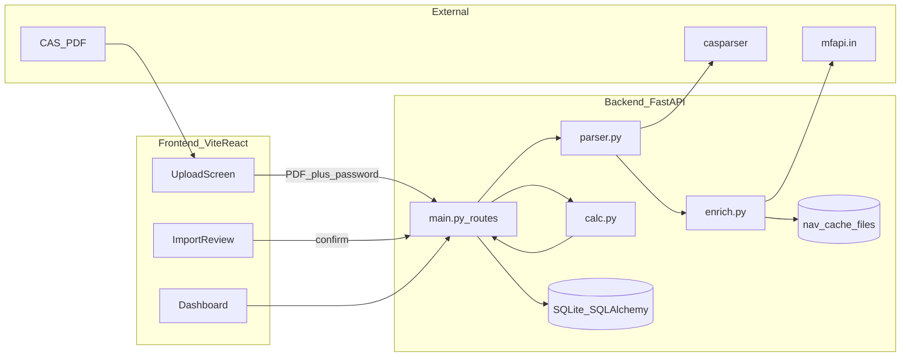
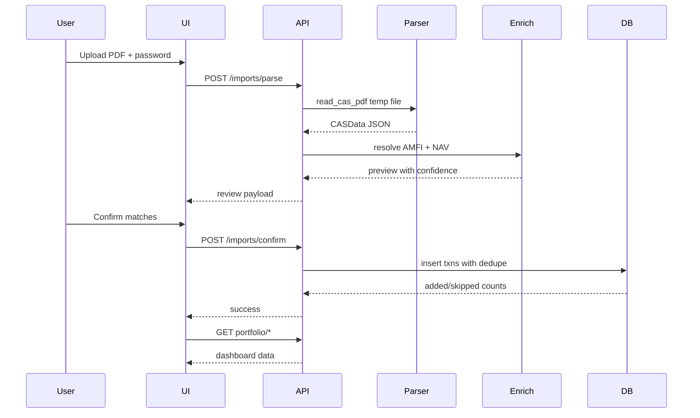

# MF Portfolio Import Prototype (CAS-first)

## Context

Workspace `[D:\WealthOS\CAS Parsers](D:\WealthOS\CAS Parsers)` is empty — full greenfield scaffold per your spec under `mf-import/`. No auth; single implicit portfolio (SQLite prototype, Postgres-portable schema).

**Approved extra frontend dep (per your choice):** `recharts` (+ standard Vite/React toolchain).

**Implicit backend deps** (standard FastAPI stack — confirm before adding anything else):
`uvicorn`, `sqlalchemy`, `python-multipart`, `pytest`, `pytest-asyncio`, `aiosqlite` (or sync SQLite for simplicity).

**Fuzzy scheme matching:** stdlib `difflib.SequenceMatcher` only — no `rapidfuzz`.

---

## Architecture




### Two-phase import (MProfit differentiator)

1. `**POST /api/imports/parse**` — upload PDF + password → parse in temp dir → enrich NAV metadata → return **preview** (no DB writes except optional session id in memory/temp).
2. User reviews schemes, confirms low-confidence AMFI matches.
3. `**POST /api/imports/confirm**` — dedupe + persist transactions → return `{added, skipped}`.

Password never stored; PDF deleted in `finally` block. PAN never logged; API masks as `ABCDE****F`.

---

## Project layout

```
mf-import/
  backend/
    app/
      main.py          # FastAPI app, CORS, routes
      parser.py        # casparser wrapper + normalization
      enrich.py        # mfapi.in client + disk cache
      calc.py          # pure Decimal math
      models.py        # SQLAlchemy ORM
      schemas.py       # Pydantic DTOs (money as str)
      db.py            # engine, session, init
      decimal_utils.py # quantize helpers (units 3, amt 2, nav 4)
    tests/
      test_calc_xirr.py
      test_calc_fifo.py
      test_calc_valuation.py
      test_parser_normalize.py  # uses fixture JSON once CAS available
    requirements.txt
    pyproject.toml or pytest.ini
  frontend/
    src/
      App.tsx
      api/client.ts
      pages/Upload.tsx, Review.tsx, Dashboard.tsx
      components/...
    package.json
  README.md
```

---

## Phase 1 — Scaffold + `calc.py` + tests (FIRST)

Write `[backend/app/calc.py](mf-import/backend/app/calc.py)` as **pure functions** with typed inputs/outputs using `Decimal` and `date`. No DB, no HTTP.


| Function                                                          | Responsibility                                                                                                                            |
| ----------------------------------------------------------------- | ----------------------------------------------------------------------------------------------------------------------------------------- |
| `quantize_units/amount/nav`                                       | Enforce 3/2/4 decimal places via shared helpers                                                                                           |
| `build_cashflows(transactions, terminal_value, as_of)`            | Purchases negative, redemptions/dividends positive, terminal MV inflow                                                                    |
| `xirr(cashflows)`                                                 | Newton-Raphson on NPV derivative; bisection on `[-0.9999, 10]` if NR fails; return `None` for single flow, all-same-sign, non-convergence |
| `compute_holdings(transactions)`                                  | Net units per scheme+folio                                                                                                                |
| `fifo_cost_basis(transactions)`                                   | Remaining lots + avg cost                                                                                                                 |
| `fifo_realized_gains(transactions, scheme_category, nav_history)` | STCG/LTCG buckets; debt post-2023-04-01 slab label; equity grandfathering (Jan 31 2018 NAV substitute when beneficial)                    |
| `value_at_dates(unit_events, nav_series)`                         | Daily/weekly portfolio MV timeline                                                                                                        |
| `allocation_by_category(holdings, categories)`                    | equity/debt/hybrid/other weights                                                                                                          |


### Known-answer pytest fixtures

**XIRR** — hand-verified SIP series (e.g. monthly `-5000` × 12 + terminal `65000` on day 365 → assert ~8–12% band against spreadsheet, tolerance `0.0001`).

**FIFO** — 4-transaction fixture:

- Buy 100 @ 10 (2024-01-01)
- Buy 50 @ 12 (2024-06-01)
- Sell 80 @ 15 (2025-01-01) → matches first lot partially
- Assert STCG/LTCG split, realized gain = `Decimal('...')` computed by hand

**Edge cases:** `xirr([])`, single cashflow, all-negative → `None` (UI shows `"—"`).

Commit: `feat(calc): add Decimal XIRR, FIFO, and valuation pure functions with tests`

---

## Phase 2 — Data model + parser wrapper

### SQLAlchemy models (`[models.py](mf-import/backend/app/models.py)`)

Postgres-portable: `Numeric(precision, scale)` everywhere — **never `Float`**.


| Table          | Key fields                                                                                                         |
| -------------- | ------------------------------------------------------------------------------------------------------------------ |
| `imports`      | filename, imported_at, schemes_found, txns_added, txns_skipped, raw_json, status                                   |
| `schemes`      | name, isin, amfi_code (nullable until confirmed), category, match_confidence, match_status (`confirmed`/`pending`) |
| `folios`       | folio_number, amc, pan_masked                                                                                      |
| `transactions` | scheme_id, folio_id, date, type (enum), description, amount, units, nav, dedupe_hash                               |
| `investor`     | name, email, pan_masked (single row for prototype)                                                                 |


**Dedupe key:** SHA256 of `(folio, scheme_name_or_id, date, amount, units)` — unique index on `dedupe_hash`.

### Parser (`[parser.py](mf-import/backend/app/parser.py)`)

Wrap `casparser.read_cas_pdf(path, password)` → reject non-MF demat CAS early if `NSDLCASData`.

**Transaction type mapping** (casparser → canonical):


| casparser                                  | ours                          |
| ------------------------------------------ | ----------------------------- |
| `PURCHASE`, `PURCHASE_SIP`                 | same                          |
| `REDEMPTION`, `SWITCH_*`                   | same                          |
| `DIVIDEND_*`, `SEGREGATION`                | same                          |
| `STT_TAX`                                  | `STT`                         |
| `STAMP_DUTY_TAX`                           | `STAMP_DUTY`                  |
| `TDS_TAX`, `GIFT_*`, `REVERSAL`, `UNKNOWN` | `MISC` (preserve description) |


**Error classification** (human messages in `[schemas.py](mf-import/backend/app/schemas.py)`):

- Wrong password → "Incorrect PDF password. CAMS/KFintech CAS passwords are usually your PAN in uppercase."
- `cas_type == SUMMARY` → "This is a Summary CAS. Request a **Detailed** CAS from camsonline.com → Statements → CAS."
- Parse exception mentioning encryption/image → "PDF appears scanned or unreadable. Download the original email PDF, not a photo/scan."
- Generic casparser error → pass through sanitized message

Store full parser output as JSON on import record for debugging.

Commit: `feat(parser): casparser wrapper, txn normalization, and SQLAlchemy schema`

---

## Phase 3 — NAV enrichment + cache

`[enrich.py](mf-import/backend/app/enrich.py)`:

- **Scheme list cache:** `GET https://api.mfapi.in/mf` → `backend/.cache/schemes.json` (TTL 24h)
- **NAV history cache:** `GET /mf/{code}` and `/latest` → `.cache/nav/{code}.json` (TTL until next calendar day IST)
- httpx async client with timeout + graceful degradation
- **Resolve AMFI code:**
  1. Use casparser `amfi` if present → confidence `1.0`
  2. Else fuzzy-match normalized scheme name vs cached list → `SequenceMatcher.ratio()`
  3. `>= 0.92` → auto-suggest but still flag if `< 0.98` for review; `< 0.92` → `pending` — **never auto-save without confirm**
- Parse `meta.scheme_category` for allocation donut (map to equity/debt/hybrid/other via keyword rules)

Commit: `feat(enrich): mfapi.in client with disk cache and fuzzy scheme matching`

---

## Phase 4 — API routes

`[main.py](mf-import/backend/app/main.py)` endpoints:


| Method | Path                               | Purpose                                 |
| ------ | ---------------------------------- | --------------------------------------- |
| POST   | `/api/imports/parse`               | Upload multipart; return preview DTO    |
| POST   | `/api/imports/confirm`             | Persist after review; return counts     |
| POST   | `/api/schemes/{id}/confirm-match`  | User picks correct AMFI code            |
| GET    | `/api/portfolio/summary`           | totals + XIRR                           |
| GET    | `/api/portfolio/holdings`          | sortable list                           |
| GET    | `/api/portfolio/allocation`        | category weights                        |
| GET    | `/api/schemes/{id}`                | drill-down: txns + NAV series + markers |
| GET    | `/api/portfolio/valuation-history` | value-at-date series                    |
| GET    | `/api/imports`                     | import history                          |


**Money serialization:** Pydantic `field_serializer` → all `Decimal` fields as strings in JSON responses.

**CORS:** allow Vite dev origin (`http://localhost:5173`).

Wire `calc.py` in service layer after fetch from DB; recompute on read for prototype (acceptable for SQLite scale).

Commit: `feat(api): two-phase import flow and portfolio endpoints`

---

## Phase 5 — Frontend (Vite + React + Recharts)

Minimal clean UI — no design system required; simple CSS modules or Tailwind only if you approve Tailwind (otherwise plain CSS).

### Screens

1. **Upload** (`[Upload.tsx](mf-import/frontend/src/pages/Upload.tsx)`)
  - PDF file input + password field
  - Helper text: camsonline.com → Statements → CAS → Detailed → all-to-date
  - Processing spinner → navigate to Review
2. **Import Review** (`[Review.tsx](mf-import/frontend/src/pages/Review.tsx)`) — *differentiator*
  - Parsed investor (masked PAN), folio/scheme counts
  - Table of schemes with confidence badge; dropdown to fix low-confidence matches (calls mfapi search or cached list)
  - Confirm / Cancel buttons
3. **Dashboard** (`[Dashboard.tsx](mf-import/frontend/src/pages/Dashboard.tsx)`)
  - Summary cards: current value, invested, gain, XIRR (`"—"` when null)
  - Sortable holdings table (client-side sort)
  - Recharts `PieChart` allocation donut
  - Recharts `LineChart` value-at-date + per-scheme NAV chart with buy/sell scatter markers
  - Import history panel
  - Tax gains section with disclaimer banner (estimate only, ₹1.25L LTCG note, debt post-Apr-2023 label)
4. **Empty/error states** — dedicated components per error code from API

Commit: `feat(frontend): upload, review, and portfolio dashboard`

---

## Phase 6 — README + dev workflow

`[README.md](mf-import/README.md)`:

- Python 3.11+ venv setup, `pip install -r requirements.txt`
- `uvicorn app.main:app --reload` from `backend/`
- `npm run dev` from `frontend/`
- How to request Detailed CAS (CAMS + KFintech)
- Note: place test PDF locally (gitignored); never commit CAS files
- `.gitignore`: `*.pdf`, `.cache/`, `*.db`, `.env`

---

## Testing strategy


| Layer       | Tests                                                                                                       |
| ----------- | ----------------------------------------------------------------------------------------------------------- |
| `calc.py`   | Known-answer XIRR, FIFO, valuation (no external deps)                                                       |
| `parser.py` | Normalization unit tests with saved JSON fixture (after you provide CAS); optional live PDF test gitignored |
| API         | 1–2 integration tests with fixture JSON + in-memory SQLite                                                  |
| Frontend    | Manual for prototype; optional smoke test later                                                             |


**Your action item:** Request Detailed CAS from camsonline.com (and KFintech if possible). Place in `backend/tests/fixtures/` (gitignored) for parser integration tests.

---

## Commit sequence (logical increments)

1. `chore: scaffold mf-import backend and frontend`
2. `feat(calc): Decimal XIRR, FIFO, valuation with pytest fixtures`
3. `feat(db): SQLAlchemy models and dedupe strategy`
4. `feat(parser): casparser wrapper and error mapping`
5. `feat(enrich): mfapi.in cache and scheme resolution`
6. `feat(api): two-phase import and portfolio routes`
7. `feat(frontend): upload, review, dashboard with Recharts`
8. `docs: README with CAS setup instructions`

---

## Key implementation notes

- **Never use float** for money — parse mfapi NAV strings with `Decimal`; casparser already returns `Decimal` in v1.3 models.
- **XIRR cashflow sign convention:** purchases/outflows negative; redemptions + current market value positive (terminal dated `as_of`).
- **Grandfathering:** for equity lots purchased before `2018-02-01`, compare FIFO cost vs NAV on `2018-01-31` from cached history; use higher as cost basis for LTCG estimate.
- **Re-upload overlapping CAS:** dedupe reports `"12 new, 48 duplicates skipped"` — no double-counting.
- **NSDL/CDSL demat CAS:** out of v1 scope — return clear message if detected.




