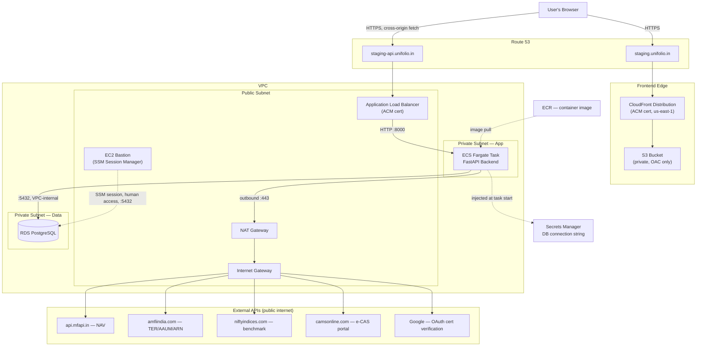

# AWS Go-Live Readiness Report

**Cloud engineer handoff document — living single source of truth.** Originally a read-only application/infrastructure assessment; now expanded with the exact target AWS architecture, Terraform strategy, connectivity design, private-networking design, staging-vs-production feasibility, and a phased implementation plan for the cloud engineer who will execute this. No infrastructure has been created and no code has been changed in the course of producing this document — it remains planning only.

| | |
|---|---|
| Immediate target | A working **staging URL by Friday** (today is Monday; deadline moved from Wednesday to Friday — 2 extra working days) |
| Scale assumption | Sized for **~1,000 monthly active users** — informs RDS/ECS sizing in §8 and elevates the single-instance constraint's priority, see §15 |
| Later target | Full production go-live, once staging is validated — **not the same bar**, see §15 |
| Governing docs | ADR-001–006, `Docs/PRDs/TDD-Unifolio.md`, `Docs/PRDs/Migration-Plan-SQLite-to-Postgres.md` |
| Prior audit on file | `AWS Readiness/sqlite-postgres-migration-compliance-audit.md` |
| Launch blockers (full detail) | `Docs/orchestration/aws-golive-launch-blockers.md` — see §4 |
| Assessment date | 2026-08-31 |
| Method | 9 parallel read-only codebase investigations + direct doc review + direct grep verification for this update |

**Findings at a glance:** 13 Blockers · 10 Critical · 8 Important · 12 Post-launch items (application/codebase level — see §4–§7). Infrastructure-design corrections are tracked separately in §3, since they're architecture-clarification items, not code defects.

## Contents

1. [Current state](#1-current-state)
2. [Target architecture identified from the migration rules](#2-target-architecture-identified-from-the-migration-rules)
3. [Proposed AWS architecture — critical assessment](#3-proposed-aws-architecture--critical-assessment)
4. [Launch blockers](#4-launch-blockers) — full detail now in `aws-golive-launch-blockers.md`
5. [Critical pre-launch tasks](#5-critical-pre-launch-tasks)
6. [Recommended pre-launch tasks](#6-recommended-pre-launch-tasks)
7. [Post-launch improvements](#7-post-launch-improvements)
8. [AWS infrastructure required](#8-aws-infrastructure-required)
9. [Terraform strategy](#9-terraform-strategy)
10. [Database migration plan](#10-database-migration-plan)
11. [Connectivity & request flow](#11-connectivity--request-flow)
12. [Private networking & internet access](#12-private-networking--internet-access)
13. [Environment variables & secrets checklist](#13-environment-variables--secrets-checklist)
14. [Security checklist](#14-security-checklist)
15. [Feasibility of Friday staging](#15-feasibility-of-friday-staging)
16. [Deployment sequence](#16-deployment-sequence)
17. [Testing & verification before go-live](#17-testing--verification-before-go-live)
18. [Quick-reference parallel timeline](#18-quick-reference-parallel-timeline)
19. [Inputs / decisions required from our team](#19-inputs--decisions-required-from-our-team)
20. [Responsibility split](#20-responsibility-split)
21. [Should we move to AWS now or wait until development is complete?](#21-should-we-move-to-aws-now-or-wait-until-development-is-complete)
22. [Cloud engineer implementation plan](#22-cloud-engineer-implementation-plan)

---

## 1. Current state

This section exists so the cloud engineer does not need to independently re-investigate the repository — everything here is already confirmed.

### 1a. Application / codebase readiness

The application layer itself is in genuinely good shape: the domain logic (CAS parsing, holdings/allocation/analytics computation, Decimal-safe money handling, PAN masking, no raw PDF retention) is careful and well-tested, and the migration-compliance audit already on file for this repo (`AWS Readiness/sqlite-postgres-migration-compliance-audit.md`) confirms the Alembic/schema discipline is solid. What's missing is almost entirely the *deployment* layer.

**Already exists (application side):**
- A working FastAPI backend with four logical services (Auth, Import, Dashboard, Analytics) in one app, per ADR-002.
- A working React/Vite SPA frontend, env-driven for its API base URL and Google OAuth client ID (not hardcoded).
- A working, linear, batch-mode-correct Alembic migration chain (`0001`–`0009`) — confirmed in the prior compliance audit.
- Real, working Google OAuth ID-token verification server-side (`app/services/auth/google_oauth.py`) against Google's public keys.
- A full backend test suite (578 tests: 576 SQLite-fast, 2 real-Postgres-marked) and a frontend test suite, both wired into CI (`.github/workflows/ci.yml`).
- A `docker-compose.yml` providing a local Postgres 16 container for dev/functional-test parity.

**Does not exist yet (application side):**
- No Dockerfile anywhere in the repository.
- No CI/CD deployment automation — `.github/workflows/ci.yml` runs tests only, nothing deploys anywhere.
- No real SMS or email OTP delivery provider (only a `"stub"` mode — **deliberately kept for staging**, since staging has no real users/data; see §4 for the one code fix this still requires, and §15/§21 for why this does not carry forward to production).
- No security headers middleware, no structured logging, no error-tracking SDK.
- No automated step anywhere that runs `alembic upgrade head` against a real deployment target — only CI's ephemeral test container.

**Known blockers:** the full list, with exact file:line evidence, is in §4. In summary: an OTP flow whose stub-mode guard currently hard-fails against Postgres (needs a small environment-flag fix so staging can deliberately keep using stub mode, per the team's decision — see §4); an app that crashes on container boot (Playwright/Chromium launched but never installed); CORS hardcoded to localhost; the server binding to loopback instead of `0.0.0.0`; a hard architectural ceiling of **exactly one running backend instance** until seven in-process caches are fixed (one of which is a real financial-data correctness bug under 2+ instances); a DB enum/constraint drift that will break CAS import on the first real Postgres migration; and one of two live CAS-upload endpoints having no size/content validation.

**Assumptions and constraints this document carries forward:**
- The app must move to AWS RDS PostgreSQL "before or at MVP launch, never after real user data starts flowing" (ADR-003) — this is a hard gate the team has already accepted, independent of the AWS staging/production question.
- The single-instance ceiling above is treated as an *accepted, temporary operational constraint* for launch (pin ECS to one task, no auto-scaling), not something this document proposes fixing before staging — fixing it properly (Redis/DB-backed shared state) is post-launch work per §7.
- Development is ongoing elsewhere in the codebase (e.g. a Phase 2 stocks/demat integration is planned per `Docs/superpowers/plans/2026-08-26-phase-2-stocks-demat-import-backend.md`) — this is relevant to §21's "move now vs. wait" analysis.

### 1b. AWS / infrastructure readiness

**Already exists (infrastructure side):** nothing. Confirmed by exhaustive search: no VPC, no RDS instance, no ECS cluster or service, no S3 bucket, no CloudFront distribution, no ACM certificate, no Route 53 hosted zone record, no Secrets Manager secret, no IAM role beyond whatever exists by default on the AWS account, no Terraform/CDK/CloudFormation/Pulumi file anywhere in the repository, no ECR repository, no EC2 instance.

**Does not exist yet (infrastructure side):** everything in §8, §9, §11, and §12 below — this is the entire scope of the buildout.

**What this document assumes is still undecided** (and needs an answer before work starts — see §19 for the full list): which AWS account this deploys into, who has access to it, the AWS region, whether a domain/Route 53 hosted zone already exists, and whether the team is willing to pay for a NAT Gateway or wants the cheaper public-subnet alternative described in §12.

---

## 2. Target architecture identified from the migration rules

Drawn directly from ADR-001 through ADR-006 and the TDD (all Accepted, dated 2026-07-22) — this is the destination, not a proposal.

| Layer | Decision | Source |
|---|---|---|
| Frontend | React SPA (Vite), no Next.js, no micro-frontends. Static build → **S3 + CloudFront**. | ADR-001, ADR-005 |
| Backend | FastAPI, one application, four logical services (Auth/Import/Dashboard/Analytics), not four deployments. Runs on **Amazon ECS Express Mode** (Fargate-backed); standard ECS Fargate is the documented fallback. | ADR-002, ADR-005 |
| Database | **AWS RDS for PostgreSQL**, single instance at MVP scale, no read replica yet. Migration off SQLite must happen before real user data exists — a hard gate, not a soft target. | ADR-003, Migration Plan |
| Object storage | **AWS S3 (scoped)** — cached reference-data payloads and future exports only. The raw CAS PDF is never retained anywhere, permanently decided. | ADR-004 |
| Background jobs | **EventBridge Scheduler → ECS Fargate RunTask** for four periodic jobs (NAV daily, TER monthly, AAUM quarterly, benchmark daily). Not yet built in code. | ADR-006 |
| Secrets | **AWS Secrets Manager** for DB credentials and any API keys. | TDD §Deployment Architecture |

> "AWS RDS PostgreSQL migration + full AWS deployment... Not started... a launch gate, not a soft target." — *DEFERRED_FEATURES.md*, Infrastructure & Deployment table

Two things the target docs are explicit about *not* requiring for this launch: a read replica or connection-pooling layer (ADR-003 calls this "a future tuning knob, not a launch blocker"), and full auth/security policy — rate-limiting, lockout, device management — which PRD-02 explicitly defers to a dedicated future Auth/Security PRD.

**Note on the ADRs' silence on some of this document's newer requirements:** the ADR set does not mention an EC2 bastion, a Terraform requirement, or an explicit private-networking design — those weren't decided when the ADRs were written. §3, §9, and §12 below extend the ADR-set's architecture consistently with its own stated principles (managed services, team-size-appropriate operational load, ECS Express Mode) rather than inventing something new; nothing here contradicts an existing Accepted ADR.

---

## 3. Proposed AWS architecture — critical assessment

The team proposed this pipeline: **EC2 → ECR → ECS**, with EC2 as a jump/bastion server and ECR as the container-image registry feeding the deployment. (Earlier drafts of this document referred to "EC3" — a typo for ECR — while that was being confirmed; noted here once, for traceability, and not repeated below.)

### ECR's role: the container-image registry

**ECR — Elastic Container Registry** is the Docker image registry ECS pulls container images from. It is not a "repository maintenance" host in the sense of running build tooling itself — it's a storage/distribution layer: something else (CI, or a developer's machine for the first manual cut) builds the image and pushes it in; ECS then pulls from it on deploy. That distinction matters for the next question.

### Is EC2 being used correctly in this design?

**Partially — depends on what it's actually for.** Two different things could be meant by "EC2 as jump/bastion server," and only one of them is correct:

- **Correct use: EC2 as a break-glass access point for humans to reach RDS.** If ECS and RDS both sit in private subnets (§12's recommended design), a developer or the cloud engineer occasionally needs to run `psql` directly against the database, or manually run `alembic upgrade head` before deployment automation exists. A small EC2 instance in the public subnet, reachable only by the operator, that can then reach RDS's private endpoint, is a legitimate and common pattern for this. **Recommendation: use AWS Systems Manager Session Manager instead of traditional SSH** — no open port 22, no key-pair management, full IAM-based access control, and a CloudTrail audit log of every session. This is strictly more secure than a classic SSH bastion and costs nothing extra (Session Manager is free; you still pay for the small EC2 instance itself, or a Fargate task can serve the same purpose without an always-on EC2 box at all).
- **Incorrect use: EC2 as a build server or "deployment operations" host.** If the intent was to build Docker images on this EC2 instance and push them to the registry by hand each time, that's the wrong tool for a repeatable pipeline — it recreates what CI/CD exists to do, with none of the auditability, and becomes a single point of failure and drift (whoever's laptop or EC2 instance happens to have the right local state). **Recommendation:** build images via CI (GitHub Actions is the natural fit given this repo already lives on GitHub) — with the Friday deadline's extra 2 days, CI/CD is now realistically in scope for the initial cut itself (§9), not just a fast-follow; if it still isn't ready in time, build manually from a developer's own machine or a throwaway Cloud Shell session — not from a persistent "deployment" EC2 box that becomes a hidden dependency.

### The corrected pipeline

```
GitHub repository
   │  (git push / PR merge)
   ▼
CI build (GitHub Actions, now realistically in scope given the Friday deadline — see §9; manual as the fallback)
   │  docker build → docker push
   ▼
ECR (container image registry)
   │  ECS pulls the image on deploy
   ▼
ECS Fargate service (runs the FastAPI backend)
   │
   ▼
Application Load Balancer  →  (reached by CloudFront/the frontend, and by users' browsers for API calls)
```

The **EC2 bastion sits off to the side of this pipeline entirely** — it has no role in how code reaches production. Its only job is giving a human a network path into the private subnets for manual database work. Conflating it with the build/deploy pipeline (as "EC2 → ECR → ECS" can read, if taken as one sequential flow) is the thing to correct: **the bastion is not a step code passes through on its way to ECS.** ECR sits between a build step and ECS; the bastion sits off to the side, connected only to RDS.

### What's missing from the proposed three-component list

EC2, ECR, ECS, S3, and RDS describe compute, registry, and storage, but the pipeline as stated omits several things it cannot function without:

- **An explicit build step feeding ECR** — naming ECR as the registry doesn't say what builds the image and pushes it in. That's either CI (recommended — see below) or a developer's machine for the first manual cut; it should never be the bastion EC2 instance (see the redundancy note below).
- **An Application Load Balancer** — ECS Express Mode provisions one automatically, but it's worth naming explicitly since it's where HTTPS termination and health checks live (§11).
- **Secrets Manager** — not mentioned at all in the proposed list, but required for `DATABASE_URL` to reach ECS without a plaintext credential in the task definition.
- **VPC networking** (subnets, route tables, NAT/IGW, security groups) — §12 covers this in full; none of it is implied by "EC2 → ECR → ECS" as stated.
- **CloudFront** — S3 alone can host a static site, but per ADR-005 the frontend is meant to sit behind CloudFront (HTTPS, CDN, the SPA-fallback rewrite rule needed for `/print/analytics` and `/mobile` — see the prior report's findings).

### Is anything redundant?

Not among the five named components themselves, once EC2 is correctly scoped to bastion-only. The redundancy risk is specifically the *build-server* interpretation of EC2 described above — that would duplicate what CI/CD + ECR already do between them, and should be avoided rather than designed around.

### Access and IAM boundaries per component

| Component | Needs access to | Should never be reachable by |
|---|---|---|
| EC2 bastion | RDS (private endpoint, port 5432) via Session Manager | The public internet on any inbound port; should have no inbound security group rule at all if using SSM |
| ECR | Pushed to by CI (or a developer's authenticated CLI); pulled from by ECS's task execution role | Public/anonymous access — keep the repository private |
| ECS task execution role | Pull from ECR, write to CloudWatch Logs, read the specific Secrets Manager secret(s) it needs | Broad `*` permissions on unrelated services |
| ECS task role (the app's own runtime identity) | RDS (via security group, not IAM), nothing else at launch | S3 write access is not needed today (no app code writes to S3) — don't grant it speculatively |
| ALB | Internet on 443 (and 80, redirecting to 443) | Nothing beyond routing to the ECS target group |
| RDS | Only the ECS task's security group, on 5432; the bastion's security group, on 5432 | The public internet, under any circumstance — see §11 |

---

## 4. Launch blockers

**Moved to its own file for focused tracking: `Docs/orchestration/aws-golive-launch-blockers.md`.** It holds the full list of items that must be resolved before real users touch this system — 11 blockers plus one staging-non-blocking item (Google Sign-In's Client ID/Privacy Policy), each with what's implemented, what's missing, why it matters, and whether/how it's completable in the timeline. Every `§4` reference elsewhere in this report points there.

In summary, so this section still stands on its own as a quick scan: the OTP stub-mode guard needs an environment-flag fix before staging can even boot auth (§4.1); no Dockerfile exists and the app crashes on startup because Playwright's Chromium is never installed; CORS is hardcoded to localhost; the app can only safely run as exactly one ECS instance until seven in-process caches are fixed; a DB enum/constraint drift will break CAS import on the first real Postgres migration; one of two CAS-upload endpoints has no size/content validation; zero AWS infrastructure exists; frontend build-time env vars are unset; no domain/HTTPS/certificates are configured; no automated migration-run step exists; and RDS backup/retention hasn't been configured. See the linked file for the full detail on each.

---

## 5. Critical pre-launch tasks

Not launch-blocking in the sense of "the app won't run" — but shipping without these is a materially worse, riskier launch.

| Task | Why it matters | Severity |
|---|---|---|
| Add basic security headers middleware (HSTS, X-Content-Type-Options, X-Frame-Options, a baseline CSP) | Currently zero security headers exist anywhere. | Critical |
| Wire AWS Secrets Manager for the RDS connection string | Avoids plaintext DB credentials in the ECS task definition's env vars. | Critical |
| Add a DB-connectivity check to `/health` (or a separate `/ready`) | Today it's an unconditional 200 — an ALB health check would report healthy even with the database completely unreachable. | Critical |
| Fix the swallowed exception in the analytics PDF-export route | `api/analytics.py:224-236` catches any exception, discards it (`from None`), and has no logging import — a real rendering failure produces zero server-side record. | Critical |
| Add failure logging to `nse_indices_client.py` and `arn_lookup.py` | Both silently swallow external-API failures with no log line; `amfi_ter_client.py` already has the fix pattern to copy — a prior incident there was undiagnosable until this exact gap was closed once. | Critical |
| Pin backend dependency versions / generate a lockfile before building the production image | `requirements.txt` is entirely `>=` with no lockfile — what gets built could differ from what's tested. | Critical |
| Explicitly size the SQLAlchemy connection pool against the chosen RDS instance class | Defaults (5 + 10 overflow) are unconfigured; combined with a small RDS instance this is worth a deliberate choice, not an accident. | Critical |
| Lock down security groups: ALB→internet:443 only, ECS task←ALB SG only, RDS←ECS task SG only:5432 | Default/broad security groups are a common, avoidable misconfiguration. | Critical |
| Remove the dead `passlib[bcrypt]` dependency | Unused leftover from removed password auth; passlib is largely unmaintained. Low effort, reduces attack surface. | Important |
| Execute the full smoke-test plan (§17) against the real deployed environment before opening to real users | The only way to catch what static analysis can't. | Critical |

---

## 6. Recommended pre-launch tasks

Strongly recommended, genuinely optional for the staging timeline — do these if time allows, otherwise carry them into the days immediately after.

- **Add a DB-level uniqueness constraint on the `household_members` "self" row** — currently unenforced at any level (DB, index, or app code); a known open item, confirmed still unaddressed.
- **Fix `compute_holdings`'s per-folio N+1 query pattern** — the NAV lookup in the same function was already batched; the transaction fetch was not.
- **Decide how a held scheme with no NAV should surface** — currently silently dropped from holdings/allocation/category-ranking with no error or degraded-state indicator.
- **Resolve the two overlapping CAS-import surfaces** (`imports.py`'s legacy parse/confirm flow vs. `cas_imports.py`'s newer lifecycle flow) — both are live simultaneously; confirm with the team whether one should be retired.
- **Confirm the TDD's documented `distributor-comparison` endpoint** — it could not be located in the actual registered routes; likely renamed or restructured, but worth an explicit confirmation rather than an assumption.
- **Align `folios.coverage_gap_details`'s migration DDL with its model declaration** — a minor type-declaration mismatch flagged in the prior compliance audit, functionally low-risk today.
- **Add a basic rate limit on OTP/auth endpoints per source IP** — the existing per-identifier throttle doesn't stop one actor hitting many different identifiers; low-urgency only because no real SMS/email provider exists yet to make this cost-exploitable.

---

## 7. Post-launch improvements

Safe to defer. Doing these right, rather than fast, is the correct call.

- **Move the seven in-process caches to a shared store** (Redis, or DB-backed) — this is what actually unlocks horizontal scaling and removes the single-task constraint from §4.
- **Build ADR-006's EventBridge Scheduler background jobs** — NAV/TER/benchmark currently self-heal via on-demand fetch (slower first request, not broken); this replaces that stand-in with the designed mechanism.
- **Wire `scheme_aaum`'s `refresh_aaum_data` into a real caller** — currently dormant, zero production callers; harmless until a feature actually needs AAUM data.
- **Build a real SMS provider integration** (AWS SNS, Twilio, or similar) and a real email provider (Postmark, per the existing design spec) — this is what permanently closes the OTP account-takeover surface, rather than the launch workaround of disabling it.
- **Implement the deferred Auth/Security PRD** — rate-limiting, lockout thresholds, device management — explicitly scoped as future work by PRD-02, not this launch.
- **Refresh `Database-Schema-Unifolio.md` to v1.4** — currently stale by 3–4 migrations, per the prior compliance audit.
- **Fully codify infrastructure in Terraform** with zero manually-created resources remaining — see §9's import strategy.
- **Add structured (JSON) logging, request correlation IDs, and an error-tracking SDK** (e.g. Sentry) — today's logging is sparse, unstructured, and inconsistent across services.
- **Revisit connection pooling** (PgBouncer or RDS Proxy) once real concurrent load exists — ADR-003 already calls this "a future tuning knob, not a launch blocker."
- **Run the deferred `category_ranking.py` `EXPLAIN ANALYZE` check** once Postgres is genuinely live, per the Migration Plan's own deferred-optimization section.
- **Consider an RDS read replica** once real traffic patterns justify it.
- **Everything already tracked in `DEFERRED_FEATURES.md`** (cap-wise composition, stock overlap, MFCentral/AA import, etc.) — unrelated to this AWS migration, already correctly out of scope.

---

## 8. AWS infrastructure required

Concretely, what needs to exist — sized for an MVP, not over-provisioned, per ADR-003/005's own team-size framing. Updated to include the components §3 identified as missing from the original proposal.

| Component | Purpose | Notes |
|---|---|---|
| VPC + subnets (2 AZs) | Network isolation | Public subnets for the ALB (and NAT Gateway, if used); private subnets for ECS tasks and RDS. See §12 for the full design. |
| Internet Gateway | Lets public-subnet resources reach the internet | Required regardless of the NAT decision. |
| NAT Gateway (or the public-subnet alternative) | Lets private-subnet ECS tasks reach the external APIs they depend on | See §12 — this is a real cost/design decision, not a formality. |
| RDS for PostgreSQL | Primary database (ADR-003) | Staging: `db.t4g.small`. **Production, sized for ~1,000 MAU: `db.t4g.medium`** (2 vCPU / 4GB) — a read-heavy portfolio-tracking workload at this scale doesn't need more than that, but `small`'s burstable-credit ceiling is worth not relying on once real usage is continuous rather than test traffic. Single instance either way (no read replica yet, per ADR-003), automated backups enabled with an explicit retention window, private subnet, **not publicly accessible** — see §11. Set the SQLAlchemy pool explicitly (`pool_size=10, max_overflow=20`) rather than leaving the unconfigured default (5+10) — comfortably inside `db.t4g.medium`'s connection ceiling even with headroom for a second ECS task once §4's cache fix lands. |
| ECR repository | Holds the built backend container image | Private repository; pulled by the ECS task execution role only. |
| ECS Express Mode service (Fargate) | Backend API (ADR-005) | **Desired count = 1, auto-scaling disabled** per the single-instance constraint in §4 — this is a correctness constraint, not a capacity one; raw throughput for ~1,000 MAU is not the limiting factor (see the capacity note below). Staging task size: 0.5 vCPU / 1GB. **Production task size: 1 vCPU / 2GB** — modest headroom for concurrent requests at this user count, still a single task until the cache rewrite lands. Container image from a new Dockerfile (§4). |
| Application Load Balancer | Routes HTTPS traffic to the ECS task | Express Mode provisions this automatically per ADR-005's design; needs an ACM certificate for the API domain. |
| EC2 bastion (or an SSM-enabled equivalent) | Human operational access to RDS's private endpoint | Correctly scoped per §3 — not part of the deploy pipeline. Can be a small `t3.micro`, stopped when not in use. |
| S3 bucket (frontend) | Static hosting for the Vite build | Distinct from ADR-004's optional reference-data-cache S3 usage — this one is required for the frontend regardless. Private bucket, accessed only via CloudFront Origin Access Control — never public. |
| CloudFront distribution | CDN + HTTPS in front of the S3 bucket (ADR-005) | Needs a 404→`/index.html` (200) custom error response — required even though the app has no client-side router, because `/print/analytics` and `/mobile` are real cold-entry paths read via `window.location`. |
| ACM certificates | HTTPS for both the ALB and CloudFront | CloudFront's certificate must be issued in `us-east-1` regardless of the app's primary region. Start DNS validation early — it has non-trivial latency. |
| Route 53 (or existing DNS) | Domain records for the frontend and API subdomain | e.g. `staging.unifolio.in` → CloudFront, `staging-api.unifolio.in` → ALB. |
| AWS Secrets Manager | RDS master credentials | Recommend `manage_master_user_password = true` on the RDS resource so RDS/Secrets Manager generates and owns the credential — Terraform (and everyone else) never sees the plaintext. No other secrets are currently needed. |
| IAM roles | ECS task execution role (pull image, write logs, read secrets) + task role (RDS access) | Least-privilege, scoped to exactly what's needed — see §3's access table. |
| CloudWatch Logs | Container stdout/stderr capture | Works out of the box once containerized; expect sparse/unstructured logs per §5's observability findings — budget for that gap operationally (an engineer watching closely post-launch) rather than assuming rich logs will be there. |

**Explicitly not required for this launch:** S3 for reference-data caching (ADR-004's optional optimization — Postgres alone is sufficient at launch scale), EventBridge Scheduler + background-job infrastructure (ADR-006 — not built in code yet, self-healing on-demand fetches cover this gap adequately for launch), and any auto-scaling configuration (actively harmful given §4's single-instance constraint).

### Capacity note: ~1,000 monthly active users

**Raw throughput is not the concern at this scale — availability is.** A portfolio-tracking app's traffic pattern (check-in periodically, not continuously) means 1,000 MAU likely translates to low tens of concurrent requests at peak, well within what a single 1 vCPU / 2GB Fargate task can serve. The sizing bumps above are headroom, not a response to a load problem.

**The actual scale-relevant risk is the single-instance constraint (§4) itself.** At internal-testing volumes, one ECS task with no failover is an acceptable, deliberate trade-off. At ~1,000 MAU, one task with no failover means a single task crash or a routine ECS-managed replacement (which *does* happen even at `desiredCount=1` — Fargate can and will replace an unhealthy task) is a real, user-visible outage, not a theoretical edge case. This changes §7's prioritization: **the in-process-cache rewrite that allows a second task to run safely should move from "post-launch, whenever" to "required before this environment is trusted with real, ongoing user traffic"** — it doesn't have to happen before Friday's staging cutover, but it should happen before staging becomes the de facto production environment for 1,000 real users, not sometime indefinitely later. NAT Gateway data-processing costs at this scale remain negligible (a few GB/month of outbound API calls, dwarfed by the Gateway's fixed hourly charge) — not a factor in this sizing.

---

## 9. Terraform strategy

### What should be managed through Terraform

Everything in §8, with one deliberate exception: the *value* of secrets (RDS master password, if not using `manage_master_user_password`) should never be a literal in Terraform state or `.tfvars`. Terraform should manage the *existence and shape* of the Secrets Manager secret; the value is either RDS-generated (recommended) or injected out-of-band.

The ECS **task definition** deserves a specific split: Terraform should manage the ECS *cluster* and *service* (the long-lived shape), but once a CI/CD pipeline exists, the pipeline — not Terraform — should register new task-definition revisions on every deploy (each deploy is a new container image tag, not an infrastructure change). Trying to make every deploy a `terraform apply` couples app releases to infra changes unnecessarily; this is a common and correct split, not a shortcut.

### Recommended structure

```
infra/
  modules/
    networking/    (VPC, subnets, IGW, NAT, route tables, base security groups)
    database/      (RDS instance, subnet group, parameter group)
    ecr/           (container registry)
    backend/       (ECS cluster, service, task definition scaffold, ALB, target group, IAM roles)
    frontend/      (S3 bucket, CloudFront distribution, OAC)
    dns/           (ACM certificates, Route 53 records)
  envs/
    staging/
      main.tf       (calls the modules above with staging-sized inputs)
      backend.tf    (remote state config — staging's own state file)
      terraform.tfvars
    production/
      main.tf       (calls the same modules with production-sized inputs)
      backend.tf    (production's own, separate state file)
      terraform.tfvars
```

**Environment separation: use separate state files per environment (via distinct backend configs), not Terraform workspaces sharing one state file.** Workspaces are a common footgun at this scale — it's easy to `terraform apply` against the wrong workspace by accident, and a mistake in staging's state can't accidentally touch production's if they're fully separate files from the start.

### Remote state

An S3 bucket (versioned, encrypted) plus a DynamoDB table for state locking. This has a bootstrapping chicken-and-egg problem — Terraform can't create the backend it's about to store its own state in — so create the state bucket and lock table **once, manually**, via the console or a one-off CLI script (not part of the ongoing Terraform config), before anything else.

### Secrets handling

- Never commit real values in `.tfvars` files. Mark sensitive variables `sensitive = true` so Terraform doesn't print them in plan/apply output, and source actual values from environment variables (`TF_VAR_...`) at apply time, or from a `.tfvars` file that's gitignored.
- For the RDS master password specifically: use `manage_master_user_password = true` on the `aws_db_instance` resource. This lets RDS generate and manage the credential directly in Secrets Manager — Terraform's state file never contains the plaintext at all, which is the cleanest answer to "how do secrets stay out of state."
- Application secrets the ECS task needs (currently just the DB connection string) should be referenced in the task definition via `secrets` (pulling from Secrets Manager at container-start time), not `environment` (which would be plaintext in the task definition, visible to anyone who can read it via the console/API).

### What needs to be configured before Terraform can be applied

1. AWS account access for whoever runs `terraform apply` (an IAM user or role with the necessary permissions — see §19 and §20).
2. The AWS region decision.
3. The state bucket + lock table (bootstrapped manually, above).
4. A decision on whether staging gets its own AWS account or is a set of resources in a shared account, distinguished by naming/tagging — for this timeline, the shared-account approach with a consistent `staging-` prefix and tag is the pragmatic choice; separate accounts (AWS Organizations) is the more correct long-term answer but is its own multi-day setup task, not appropriate to add here.

### Is Terraform realistically achievable by Friday? (updated — deadline moved from Wednesday to Friday, +2 working days)

**Revised conclusion: with the deadline now Friday (four working days from Monday, not two) and AI-assisted authoring (Claude Code or similar drafting the Terraform module boilerplate for the cloud engineer to review, adapt, and apply), full Terraform-first — the whole stack, no manual detour — becomes the recommended *primary* plan, not the "not realistic" call this section made against the original Wednesday deadline.** The reasoning changed because the constraint that made it infeasible before (roughly 3–4 days of work squeezed into 2) no longer applies at 4 days. It is still tight, not comfortable — see the checkpoint below.

**Why AI-assisted authoring changes the estimate, and why it doesn't change all of it:** writing the ~7 modules' boilerplate (VPC/subnet/route-table/security-group resource blocks, the standard ECS-behind-ALB pattern, S3-behind-CloudFront-via-OAC, ACM+Route53 validation) is exactly the kind of well-documented, pattern-heavy work an AI coding assistant drafts quickly — this compresses the "write modules" step from the original 2–3 days to roughly **1–1.5 days** (the cloud engineer still has to review every value against the actual account/region/domain and validate correctness, that part doesn't compress). What does **not** compress: the first real `terraform apply` against live AWS and debugging whatever it surfaces (ACM validation lag, ECS Express Mode's own rough edges, NAT Gateway routing) — that's bound by AWS's own provisioning latency, not by how fast the config was written, and still costs roughly **1 day**. CI/CD setup (GitHub Actions, OIDC role, build/push/deploy) adds **1–1.5 days**, and a validation pass **0.5–1 day**. Revised total: **roughly 3.5–5 days**, most of it parallelizable across the tracks in §18/§22 (infra, code, database, and CI/CD all run concurrently, not stacked end to end) — which is why this now plausibly fits inside 4 working days rather than needing 5–7 sequentially.

**Recommendation: Terraform-first for the whole stack, with a hard checkpoint at end-of-day Tuesday.** If, by then, the networking + database + backend (ECS/ALB) modules haven't successfully applied, fall back to the manual-then-import strategy below for whatever's left (S3/CloudFront/ACM/Route53 are the easiest to provision manually and reconcile afterward) — protect the Friday date over the purity of "no manual steps," and reconcile the rest on the original post-launch timeline instead.

**If the fallback triggers, this is what's safe to create manually** (each is easy to reconcile into Terraform afterward, since they're independently identifiable, non-networking resources):
- The ECR repository.
- The S3 bucket and CloudFront distribution.
- The RDS instance (capture its exact identifier, instance class, and subnet group when created) — though per below, this should already be Terraform-owned by the Tuesday checkpoint in the primary plan.
- The Secrets Manager secret.
- IAM roles (capture their exact names/ARNs).

**Should be Terraform-first even in the fallback** (networking drift is the most expensive thing to reconcile later, because CIDR ranges, route table associations, and security group rules interact with everything else):
- The VPC, subnets, route tables, Internet Gateway, and NAT Gateway.

If genuinely no time exists to write even the networking module first, the last-resort fallback is: create the networking manually too, but **document the exact CIDR blocks, subnet IDs, and route table IDs as they're created** — a short markdown table captured in real time — so the subsequent `terraform import` has no guesswork.

### How Terraform takes ownership without drift (if the fallback triggers)

For every manually-created resource: write the Terraform resource block to match what was actually created (exact name, size, settings), run `terraform import <resource_address> <real_resource_id>`, then run `terraform plan` and confirm it shows **zero changes**. A non-empty plan after import means the written config doesn't actually match reality yet — fix the config, not the infrastructure, until the plan is clean. Do this resource-by-resource, not all at once, and do it **before** starting any production-environment work — reconciling drift gets harder, not easier, the longer manually-created infrastructure exists un-codified.

### AI-assisted implementation — what it does and doesn't help with

Given Claude Code (or a similar assistant) is available to help execute this plan: it's genuinely useful for drafting Terraform module boilerplate, writing the code-level blocker fixes in §4 (CORS/host-bind/upload-validation/OTP-guard — all small, well-specified changes), drafting the Dockerfile, and reviewing `terraform plan` output for anything that looks wrong before `apply`. It does **not** hold AWS credentials, run `terraform apply` itself, or shorten AWS's own resource-provisioning latency (RDS creation, ACM validation, NAT Gateway setup, ECS service stabilization) — a human with real AWS access still executes and waits out every one of those steps. Treat AI assistance as compressing the *authoring* time in the estimate above, not the *AWS-side waiting* time — the responsibility split in §20 is unchanged by this: Claude Code still never provisions infrastructure or touches credentials.

### If the full bar (Terraform + NAT + CI/CD) is hit by Friday

Then there's nothing further to reconcile — the "earliest realistic date" question below becomes moot, since the fully-correct version *is* the Friday launch. The table below is retained as the fallback-path estimate, for the scenario where the Tuesday checkpoint above triggers the manual detour instead.

### Earliest realistic date for the "fully correct" version — fallback-path estimate only

If the Tuesday checkpoint triggers the manual fallback for some resources, here's when full Terraform ownership catches up afterward, assuming staging still goes live Friday (2026-09-04):

| Work item | Effort, dedicated focus | Notes |
|---|---|---|
| Write Terraform modules for whatever was created manually (typically S3/CloudFront/ACM/Route53, per the fallback list above) | 0.5–1 working day (down from 2–3, with AI-assisted drafting and a smaller manual scope than the original all-manual fallback) | Networking and RDS should already be Terraform-owned under the checkpoint plan — only the remainder needs import. |
| `terraform import` of the manually-created resources, reconciling to a zero-diff plan | 0.5–1 day | Faster if the manual provisioning step captured exact resource IDs/settings as it happened. |
| Finish CI/CD if not already done | 1–1.5 days | |
| Validation pass: confirm `terraform plan` shows zero drift everywhere, confirm the CI/CD pipeline deploys cleanly, re-run the §17 smoke tests | 0.5–1 day | |

**Total: roughly 2.5–4.5 focused working days** — noticeably shorter than the original all-manual fallback's 5–7 days, because under the Tuesday-checkpoint plan most of the stack (networking, database, likely ECS/ALB) is already Terraform-owned by the time the fallback triggers; only the remainder needs reconciling. Expect this closed out within the week following the Friday launch, not the "following week" the original all-manual estimate required.

**What this estimate does not include:** the rest of §7/§22 Phase 7's production-hardening list — a real SMS/email OTP provider, the in-process-cache rewrite that removes the single-ECS-task constraint (now materially more important given the ~1000 monthly-active-user target, see §8 and §15), structured logging/error tracking, ADR-006's background jobs. Those are separate, larger efforts with their own timelines, not bounded by "when is the infrastructure layer Terraform-correct." Full production readiness in every sense this document covers is a longer horizon than the Terraform/NAT/CI-CD milestone above.

---

## 10. Database migration plan

This is a fresh-schema cutover, not a data migration — there is no production SQLite data to transfer, exactly as the Migration Plan's own runbook anticipates. Sequencing matters: the enum-drift fix must land *before* the first real migration run.

1. **Write and merge the ImportStatus/TransactionType enum-widening migration** (§4's finding) — this must exist before step 5.
2. **Test that migration end-to-end against the local Docker Postgres container** (`docker compose up postgres`) — closes the "never verified against a real Postgres instance outside CI" gap the prior compliance audit flagged.
3. **Provision the RDS instance** (§8) — can happen in parallel with steps 1–2.
4. **Point Alembic at the RDS connection string** via AWS Secrets Manager, per the TDD's secrets-handling note — not a plaintext env var. In practice: run the migration from the EC2 bastion (or a one-off ECS/Fargate task with network access to RDS), fetching the connection string from Secrets Manager at run time.
5. **Run `alembic upgrade head` against the fresh RDS instance** — this creates every table including the partitioned `transactions`/`nav_history` tables. Verify partitioning genuinely happened (not silently created as plain tables) per the Migration Plan's own Validation section.
6. **Accept empty reference-data tables on day one** — `nav_history`, `scheme_ter`, and `benchmark_index_history` self-heal via on-demand fetch-and-cache (confirmed working, slower first request only). `scheme_aaum` will stay empty with no self-heal — acceptable, since no feature currently reads it.
7. **Point the deployed backend's `DATABASE_URL` at RDS** (via Secrets Manager) and deploy.
8. **Smoke-test the full CAS import → dashboard → analytics flow** against the live RDS instance before opening to real users — not just a schema check, a real functional pass (§17).
9. **Confirm RDS automated backups are enabled with an explicit retention window** — don't assume the default is sufficient; check it directly in the console/CLI.

---

## 11. Connectivity & request flow

**User → Frontend → Backend → Database**, end to end:

1. A user's browser resolves the frontend domain via **Route 53**, which points at **CloudFront**.
2. CloudFront serves the static React/Vite build from its **S3** origin (private bucket, reached only via Origin Access Control — the bucket itself is never public).
3. The React app, running in the browser, makes API calls to the backend domain (a separate subdomain, e.g. `staging-api.unifolio.in`) — this is **cross-origin** from CloudFront's domain, which is exactly why the CORS fix in §4 is a blocker, not a nice-to-have.
4. That backend domain resolves via Route 53 to the **Application Load Balancer**, which terminates HTTPS (using its own ACM certificate) and forwards plain HTTP to the **ECS Fargate task** over the VPC's internal network.
5. The ECS task talks to **RDS** over the VPC's internal network only (port 5432), using a connection string it received from **Secrets Manager** at container start — never a value baked into the image or a plaintext task-definition env var.
6. For the handful of features that need it (Google Sign-In verification, on-demand NAV/TER/AAUM/benchmark fetches, the CAMS e-CAS portal flow — see §12), the ECS task also makes **outbound** HTTPS calls to the public internet, via the NAT Gateway (or the alternative described in §12).

### Where each piece fits

- **ALB:** the only thing the public internet ever talks to on the backend side. Terminates HTTPS, health-checks the ECS task, forwards traffic. Sits in a public subnet.
- **CloudFront:** the only thing the public internet ever talks to on the frontend side. Terminates HTTPS, serves cached static assets, and (via its custom error response) rewrites unknown paths back to `index.html` so client-side "routes" like `/print/analytics` and `/mobile` work on a cold load.
- **DNS/domains:** two subdomains are the cleanest split — one for the frontend (→ CloudFront), one for the API (→ ALB). This avoids CloudFront needing to proxy API traffic through to the ALB, which is possible but adds unnecessary complexity for this stage.
- **CORS:** the backend's `allow_origins` must explicitly include the frontend's real domain (both are on the same top-level domain but different subdomains, which still counts as a different origin to the browser). This is §4's CORS blocker — fix it to read from an env var so staging and production can each set their own value.
- **Secrets to ECS:** via the task definition's `secrets` block, which references the Secrets Manager ARN — Fargate injects the resolved value as an environment variable inside the container at launch, without it ever appearing in the task definition itself or in any log of task-definition contents.
- **Should RDS ever be publicly accessible? No — never.** RDS should have `publicly_accessible = false`, sit in a private subnet with no route to an Internet Gateway, and its security group should allow inbound only from the ECS task's security group (for the app) and the bastion's security group (for humans). There is no legitimate reason for RDS to be reachable from the public internet at any point in this architecture, staging included.
- **Encryption-at-rest keys (2026-09-08, cloud engineer):** both RDS and Secrets Manager encrypt at rest by default using an AWS-managed key (`aws/rds`, `aws/secretsmanager`) — free, zero setup, but you can't see or control its key policy, can't restrict which IAM principals may `kms:Decrypt` with it beyond AWS's own defaults, and its usage doesn't show up as a distinctly named key in CloudTrail. Given this product holds PAN-linked financial data (the same reasoning already behind the compliance-audit work — see `AWS Readiness/sqlite-postgres-migration-compliance-audit.md`), use a **customer-managed KMS key (CMK)** for both instead: one Terraform-provisioned `aws_kms_key` for RDS storage encryption (referenced via `kms_key_id` on the `aws_db_instance`), and one for Secrets Manager (referenced via `kms_key_id` on each `aws_secretsmanager_secret`) — can be the same CMK for both, or split if a stricter audit trail per-service is wanted. The key policy must explicitly grant `kms:Decrypt`/`kms:GenerateDataKey` to the ECS task execution role, or the task fails to start (it can't decrypt the `DATABASE_URL` secret injected via the task definition's `secrets` block). Provision the CMK(s) in Phase 1 (§22) alongside the other foundational resources, since Phase 2 (RDS) and Phase 3 (Secrets Manager wiring) both need it to already exist.

### Security group relationships

```
Internet
   │ :443
   ▼
[ALB security group]  — inbound 443/80 from 0.0.0.0/0, outbound to ECS SG only
   │ :8000
   ▼
[ECS task security group]  — inbound 8000 from ALB SG only, outbound: all traffic (see note below)
   │ :5432
   ▼
[RDS security group]  — inbound 5432 from ECS SG and Bastion SG only, no other inbound, no outbound needed

[Bastion security group]  — no inbound (SSM-based access, not SSH), outbound: all traffic (see note below)
```

**Egress decision (2026-09-08, cloud engineer):** ECS task SG and Bastion SG both use unrestricted egress (`0.0.0.0/0`, all protocols/ports) rather than the narrowly-scoped egress (443-only / 5432-only) this section originally specified. This is a deliberate change from an earlier draft of this same section — flagging the conflict explicitly rather than silently overwriting it: the narrow version is a stricter, more defensible security posture on paper, but scoped egress is easy to break in practice (missing a rule for ECR image pulls, CloudWatch Logs, Secrets Manager, SSM's control channel for the bastion, or any of the four external NAV/TER/benchmark/CAMS hosts silently fails the request with no obvious error) and, since **ingress** is the actual enforced boundary here (ALB is the only public entry point; ECS only accepts from the ALB SG; RDS only accepts from ECS+Bastion SGs — none of that changes), the marginal security benefit of also restricting egress is small — a compromised container can already exfiltrate over the same port 443 that's open regardless. Standard practice for this stage; revisit stricter egress (or an explicit VPC-endpoint/proxy allowlist) for production if a compliance requirement demands it. RDS SG and ALB SG egress are unaffected by this — RDS still needs no outbound rule at all, and the ALB's egress stays scoped to the ECS SG only.

### Architecture / data-flow diagram



---

## 12. Private networking & internet access

### Does the ECS backend require outbound internet access?

**Yes — confirmed directly against the codebase, not assumed.** A grep across the backend for outbound HTTP calls turns up exactly these external hosts:

| External host | Feature | Trigger |
|---|---|---|
| `api.mfapi.in` | NAV data (dashboard holdings, on-demand per scheme) | Every dashboard/holdings view for a scheme not already cached |
| `www.amfiindia.com` | TER, AAUM, ARN-name lookup (analytics) | On-demand, first analytics view of the day per category |
| `www.niftyindices.com` | Benchmark index history (analytics) | On-demand, first benchmark comparison per index/date-range |
| `www.camsonline.com` | CAMS e-CAS mailback portal request initiation (CAS import) | User-triggered, when a user requests their CAS via the CAMS portal flow |
| Google's OAuth certificate endpoint (via the `google-auth` library) | Google Sign-In ID-token verification | **Every single Google Sign-In**, since the backend must fetch Google's public keys to verify the token's signature |

### Is this continuous, or only for specific operations?

**On-demand, not continuous background traffic** — none of ADR-006's scheduled background jobs exist in code yet (confirmed in the prior audit), so there's no always-running polling loop hitting these hosts. But "on-demand" here means **unpredictable and frequent in practice**: any time a user signs in via Google, or views a dashboard/analytics page for data not already cached, the backend needs to reach one of these hosts right then, synchronously, as part of serving that request.

### What breaks if outbound internet is unavailable?

- **Google Sign-In fails completely if outbound internet is unavailable** — for staging, sign-in still works via stub-mode phone/email OTP (a purely internal, DB-backed flow with no external dependency), so this specifically isn't a total-outage risk for staging the way it would be if Google were the only enabled method. It remains the one dependency that turns "outbound internet is nice to have" into "outbound internet is required" for whichever sign-in methods are actually enabled — confirm this explicitly for whatever the production auth decision ends up being.
- NAV/TER/benchmark on-demand fetches fail — dashboards fall back to whatever's already cached in Postgres (nothing, on a brand-new database) or show a degraded/empty state; not a crash, but a materially broken first-user experience.
- The CAMS e-CAS portal-initiated import path fails; the direct file-upload CAS import path is unaffected (it doesn't call any external service).

### Recommended network design for staging

Given the above, **the ECS task needs a real, working path to the public internet even though it sits in a private subnet.** Two viable designs:

**Option A — NAT Gateway (recommended, more correct security posture):**
- Public subnets: the ALB, the NAT Gateway, and the bastion.
- Private subnets: the ECS task and RDS.
- Route table for the private app subnet sends `0.0.0.0/0` to the NAT Gateway; the NAT Gateway (in the public subnet) sends it onward to the Internet Gateway.
- RDS's private subnet has no route to the internet at all — it never needs one, and shouldn't have one.
- **Cost:** roughly $32–40/month baseline for the NAT Gateway itself, plus data-processing charges per GB. Not free, but standard for this pattern.

**Option B — Public subnet with a locked-down security group (cheaper, weaker isolation, acceptable for staging under time/cost pressure):**
- Run the ECS task in a public subnet with a public IP assigned, reachable via the Internet Gateway directly (no NAT Gateway needed).
- Lock the task's security group so **inbound** is allowed only from the ALB's security group — the task has a public IP but nothing can reach it directly except through the ALB, and outbound to the internet works via the Internet Gateway with no NAT cost.
- **The meaningful difference from Option A:** the task is *technically publicly addressable* (it has a real public IP, even though the security group blocks unsolicited inbound) rather than genuinely unreachable from the internet by network topology alone. This is a real, if modest, security posture downgrade — acceptable as a deliberate, named staging shortcut (see §15/§19), not something to carry into production.

**Option C — fck-nat (chosen for staging, 2026-09-07):** a self-hosted NAT alternative — a small EC2 instance (e.g. `t4g.nano`) running the open-source [fck-nat](https://github.com/AndrewGuenther/fck-nat) AMI in the public subnet, with the private subnet's route table pointing `0.0.0.0/0` at it instead of a managed NAT Gateway.
- Keeps Option A's actual security posture (ECS task and RDS stay genuinely private, no public IP on the app tier) — unlike Option B, this isn't a downgrade, just a cheaper implementation of the same topology.
- **Cost:** the EC2 instance itself (a `t4g.nano` is a few $/month) plus normal EC2 data-transfer rates — no NAT Gateway hourly charge and no per-GB NAT data-processing fee, which is where AWS's own NAT Gateway pricing hurts most for a low-traffic staging environment.
- Trade-off versus a managed NAT Gateway: it's a single EC2 instance you patch/manage rather than a fully-managed AWS service — no built-in HA across AZs unless you build it (an ASG + failover script, or accept single-AZ risk for staging), and it depends on a third-party AMI rather than an AWS-owned one. Acceptable for staging; revisit for production once real traffic/uptime requirements are known.

**Decision (2026-09-07):** fck-nat is the confirmed approach for staging, replacing Option A's NAT Gateway — chosen specifically to avoid the NAT Gateway cost-approval step in §19 for an environment where the traffic volume doesn't justify it. Terraform module planning (§22 Phase 1) should provision the fck-nat EC2 instance + route table wiring, not a managed NAT Gateway resource, for staging. Re-evaluate Option A (real NAT Gateway) for production once uptime/HA requirements are concrete.

**RDS never needs outbound internet access at all** — it only receives connections, from the ECS task and the bastion; it never initiates a call to anything.

---

## 13. Environment variables & secrets checklist

### Backend (ECS task definition — via Secrets Manager where noted)

| Variable | Production value | Source |
|---|---|---|
| `DATABASE_URL` | Real RDS Postgres connection string | Secrets Manager (RDS-managed, per §9) |
| `FRONTEND_BASE_URL` | Real CloudFront/custom domain (needed for the PDF-export Playwright navigation — silently breaks that one feature if left at the `localhost:5173` default) | Task definition env |
| `GOOGLE_OAUTH_CLIENT_ID` | Real Client ID, only if Google Sign-In is being offered on staging too (optional per §4/§15) | Task definition env |
| `OTP_DELIVERY_MODE` | **`stub`, deliberately, for staging** — team decision per §4, since staging has no real users/data. Requires the environment-flag guard fix (§4) to be merged first, or this value hard-fails against RDS Postgres. **Must be resolved to a real provider (or a permanent no-phone/email-auth decision) before production.** | Decision, not just config |
| `ENVIRONMENT` *(new)* | `staging` (or `production`) — the new flag the OTP guard fix (§4) reads instead of inferring safety from the database dialect | Task definition env |
| `ALLOWED_ORIGINS` *(new)* | The real production/staging frontend domain(s), once the CORS fix from §4 is implemented | Task definition env |

### Frontend (baked at build time — must be set before the production `npm run build`)

| Variable | Production value |
|---|---|
| `VITE_API_BASE_URL` | Real backend domain (e.g. `https://staging-api.unifolio.in`) |
| `VITE_GOOGLE_OAUTH_CLIENT_ID` | Real Client ID, matching the backend's |

No third-party API keys are needed today — AMFI, NSE, and mfapi.in are all unauthenticated public endpoints; the Google OAuth flow is ID-token-verification-only and uses no client secret. The only secret this launch genuinely needs is the RDS connection string, and it can be entirely RDS-managed (§9) rather than something anyone has to type in.

---

## 14. Security checklist

- [ ] Apply the environment-flag fix to the OTP stub-mode guard so staging can deliberately run `otp_delivery_mode=stub` against RDS Postgres (§4) — without this, OTP is completely non-functional on staging, not just insecure.
- [ ] Confirm the OTP account-takeover exposure on staging is a recorded, accepted risk (no real user data) — not something to also accept for production (§4, §15, §21).
- [ ] Fix CORS to allow only the real production/staging origin(s), not localhost (§4).
- [ ] Bind the server to `0.0.0.0`, not `127.0.0.1` (§4).
- [ ] Build and smoke-test the Docker image, including `playwright install --with-deps chromium` (§4).
- [ ] Add file-size and magic-byte validation to `/imports/parse` (§4).
- [ ] Add security headers middleware — HSTS, CSP, X-Frame-Options, X-Content-Type-Options (§5).
- [ ] Enforce HTTPS end to end (ACM on both CloudFront and the ALB; redirect HTTP→HTTPS).
- [ ] Use Secrets Manager for the RDS connection string — never a plaintext env var (§5, §9).
- [ ] Lock down security groups to least privilege: ALB←internet:443, ECS←ALB only, RDS←ECS+bastion only (§5, §11).
- [ ] Fix the ImportStatus/TransactionType DB-constraint drift before the real Postgres cutover (§4/§10).
- [ ] Pin backend dependencies before building the production image (§5).
- [ ] Set ECS desired count to 1 with auto-scaling disabled; use a stop-then-start deploy strategy (§4).
- [ ] Register a real Google OAuth Client ID and publish a Privacy Policy page before relying on Google Sign-In (§4).
- [ ] Confirm RDS is not publicly accessible and sits in a private subnet with no internet route (§11).
- [ ] Use SSM Session Manager for bastion access, not open-port SSH (§3).
- [ ] If Option B (public-subnet ECS, no NAT) is used for staging, confirm the task's security group genuinely blocks all unsolicited inbound traffic — treat this as an explicitly-approved shortcut, not a default (§12, §19).

---

## 15. Feasibility of Friday staging

Today is Monday; the deadline moved from Wednesday to Friday (2 extra working days). The honest, specific answer — updated for the new deadline, ~1,000 MAU sizing target, and AI-assisted implementation — and see §9's "Earliest realistic date for the 'fully correct' version" for what's left over if the checkpoint below triggers the fallback:

### Is this achievable?

**A working staging URL by Friday is comfortably achievable. The fully correct, Terraform-owned, NAT-Gatewayed, CI/CD-deployed environment is now plausibly achievable by Friday too — tight, not comfortable — given the extra 2 days and AI-assisted Terraform authoring (§9).** This is a real change from the original Wednesday assessment, not a cosmetic date swap: the constraint that made "fully correct by the deadline" unrealistic before was squeezing ~3–4 days of work into 2; at 4 working days, with module-boilerplate authoring compressed by AI assistance, the arithmetic changes. §9 sets a concrete Tuesday-end-of-day checkpoint: if networking + database + backend Terraform hasn't successfully applied by then, fall back to manual provisioning for the remainder (S3/CloudFront/ACM/Route53) and reconcile afterward — protecting the Friday date over the purity of "no manual steps at all."

### What assumptions must hold

- **The auth decision for staging is already made: stub OTP for phone/email, since staging carries no real users or real user data** (§4) — the remaining work is applying the small environment-flag code fix so that decision actually functions against RDS Postgres, not re-debating the decision itself.
- **AWS account access for the cloud engineer exists by end of day Monday** — this is the single most common silent blocker: if the account/IAM-access question (§19) isn't resolved fast, nothing else in this timeline can start.
- **The NAT Gateway cost/design decision (§12) is made by Monday, ideally within the first few hours** — Option A (NAT Gateway) is now the primary plan given the Terraform-first approach, but confirm the cost is approved rather than assuming it.
- **The Tuesday-end-of-day Terraform checkpoint (§9) is actually honored** — if progress is behind by then, switch to the manual fallback immediately rather than continuing to push on the full-Terraform path and risking the Friday date itself.
- **AI-assisted authoring is used for the Terraform module boilerplate from the start** — this is where most of the schedule's slack comes from; treat it as part of the plan, not an optional nice-to-have.

### Biggest risks

1. **AWS account/IAM access takes longer than expected to arrange** — this is an organizational/approval risk, not a technical one, and it's the single most likely thing to eat a full day of the four available.
2. **ACM certificate DNS validation stalls** — if the domain's DNS isn't already on Route 53 (or wherever validation records need to go), this can silently sit unresolved for hours; start it the moment a domain is confirmed, on Monday, not Wednesday.
3. **ECS Express Mode's own newness bites during the Terraform apply** — per ADR-005's own risk note, this service has less community Terraform tooling maturity than an established one; budget real debugging time for this specific module, and treat it as the most likely place the Tuesday checkpoint fails.
4. **The Playwright/Chromium Dockerfile step is fiddly the first time** — getting the right base image and system dependencies for headless Chromium on Linux is a known source of first-attempt failures; budget real debugging time for this, don't assume the first `docker build` succeeds.
5. **Treating the Tuesday checkpoint as a suggestion rather than a hard decision point** — the entire feasibility case for hitting the full bar by Friday depends on actually falling back promptly if it's not on track, not on hoping it comes together anyway with two days left.

### What must be decided immediately (today)

- Merge the OTP guard's environment-flag fix (§4) — without it, staging's already-decided stub-OTP approach cannot actually run against Postgres.
- AWS account and IAM access for the cloud engineer.
- AWS region.
- Domain/DNS status (does a hosted zone already exist?) — needed today, not Wednesday, given ACM validation is now on the critical path for the full-bar attempt.
- NAT Gateway cost approval (Option A is now the primary plan, not just the eventual one).

*(The full list, with owners and urgency, is in §19.)*

### What can happen in parallel

See §18's timeline table and §22's phase plan — in short: code fixes, database migration work, and AWS infrastructure provisioning (via Terraform, per §9) can all start simultaneously the moment access exists, since none of them blocks the others until the deploy step itself.

### What can be deferred until after staging

Real SMS/email OTP providers, the in-process-cache rewrite, structured logging/error tracking, and everything else in §7 — none of these gate the Friday launch. Terraform/CI/CD are no longer automatically on this list given the deadline extension; per §9, they're now the primary plan, only falling back to "deferred" if the Tuesday checkpoint triggers it.

### Required for Friday staging, vs. required before production — explicitly distinguished

| | Staging (Friday) | Production (now sized for ~1,000 MAU) |
|---|---|---|
| Auth | **Stub OTP for phone/email is acceptable and is the confirmed plan** — staging has no real users or real user data, so the account-takeover exposure is a recorded, accepted risk. Needs only the environment-flag guard fix (§4) to function against Postgres. | Must be resolved before any real user touches the system — either a real SMS/email provider, or a permanent product decision to drop phone/email auth in favor of Google-only |
| Infrastructure provisioning | Terraform-first is the primary plan (§9); manual fallback for specific resources if the Tuesday checkpoint triggers it | Must be fully Terraform-owned, zero drift — should already be true by this point if Friday's plan succeeded |
| ECS instance count | 1, no auto-scaling | **1, no auto-scaling, until the in-process caches are fixed — and at ~1,000 MAU this is no longer a low-stakes deferral** (§8's capacity note): a single-task outage is now a real, user-visible incident, not a theoretical one. Prioritize the cache rewrite before staging is trusted as the ongoing home for 1,000 real users, even if it doesn't block Friday's cutover itself. |
| Networking | Option A (NAT Gateway) is the primary plan given the Terraform-first approach; Option B remains the fallback if cost approval or the checkpoint pushes toward manual provisioning | Option A (NAT Gateway, fully private) required |
| CI/CD | Now realistically in scope for the initial cut (§9) rather than deferred | Should exist — manual deploys to production are a real operational risk |
| Observability | Sparse logging + active human monitoring is acceptable, once | Needs structured logging + error tracking before real users depend on it |
| Database backups | A sane default retention window is enough (staging data is disposable) | Needs a deliberate, reviewed retention/recovery policy — real user financial data is at stake |
| RDS sizing | `db.t4g.small` is sufficient | `db.t4g.medium` recommended at ~1,000 MAU (§8) |
| RDS constraint fix (ImportStatus/TransactionType) | Required — staging is exactly where this should be caught | Required (would already be fixed by the time production happens, if staging is done first) |

---

## 16. Deployment sequence

The logical order dependencies resolve to, independent of clock time (§18 and §22 map this onto the actual timeline).

1. **Merge the OTP guard's environment-flag fix** (§4) so staging's confirmed stub-OTP approach actually works against RDS Postgres — this gates the auth flow entirely and cannot be deferred.
2. **Fix the code-level blockers** (CORS, host bind, upload validation) and **write the Dockerfile** (including Playwright/Chromium) — these can proceed in parallel with AWS provisioning since neither depends on the other.
3. **Write and test the enum-widening database migration** against local Docker Postgres — in parallel with the above.
4. **Provision AWS infrastructure** (VPC, RDS, S3, CloudFront, ACM, Route 53, Secrets Manager, IAM) — start immediately, since ACM validation and RDS provisioning both have real latency.
5. **Build and push the container image** to ECR once the Dockerfile and code fixes are merged.
6. **Run the database migration against the real RDS instance** once both RDS exists and the migration fix is ready.
7. **Deploy the ECS service** (desired count 1, no auto-scaling) with all environment variables/secrets wired.
8. **Build the frontend** with real production env vars and upload to S3; invalidate CloudFront.
9. **Cut over DNS** once ACM certificates are validated.
10. **Run the full smoke-test plan** (§17) against the live environment.
11. **Go/no-go review**, then open to real users (staging: open to the internal team; production: open to real customers — see §15's distinction).

---

## 17. Testing & verification before go-live

- Full backend test suite (578 tests) green against the SQLite fast job — a sanity baseline before touching AWS at all.
- The 2 Postgres-marked functional tests green against a real Postgres instance matching the RDS engine version.
- The new enum-widening migration applied and verified against local Docker Postgres *before* it ever touches real RDS.
- Container boots cleanly under the real task definition — confirm the Playwright/Chromium launch succeeds on a cold start, not just locally.
- ALB/ECS health check passes consistently (and, once implemented, the DB-connectivity-aware version of it).
- End-to-end smoke test against the real deployed domain: sign in (Google) → CAS import → confirm → dashboard holdings/allocation → analytics (score/category-rank/benchmark) → PDF export.
- Specifically re-verify the CAS password-retry flow and PDF export succeed reliably with exactly one ECS task running — these are the two flows §4 identified as breaking under 2+ tasks; confirming they work at all under the correct (single-task) configuration is the real acceptance test.
- Load the real frontend domain in a browser and confirm zero CORS errors in the console for auth, import, dashboard, and analytics calls.
- Confirm Google Sign-In works end to end against the real Client ID and the real domain (including the "Authorized JavaScript origins" registration in Google Cloud Console).
- Sign up as a brand-new user with zero prior data and confirm the dashboard renders a sane empty state, not an error, given empty reference-data tables on day one.
- Verify the CloudFront 404→`/index.html` rewrite by loading `/print/analytics?token=...` and `/mobile` directly (cold, not via in-app navigation).
- Confirm RDS automated backups are actually enabled and the retention window is what was intended — check directly, don't assume.
- From the bastion, confirm outbound internet access works from the private app subnet (or the locked-down public subnet, if Option B was used) — test against one real external host (e.g. `curl -I https://api.mfapi.in`).

---

## 18. Quick-reference parallel timeline

*(Updated for the Friday deadline and Terraform-first plan. §22 below is the fuller phase-by-phase version of the same plan, written for the cloud engineer to execute against directly — use whichever format suits the moment.)*

Six parallel tracks across 5 working days (Monday–Friday). Tasks in the same column can genuinely run at the same time. Tasks in the same row are sequential within that track. Cross-track dependencies are called out explicitly where they exist. **Tuesday end-of-day is a hard checkpoint** (§9/§15): if the AWS infrastructure track hasn't gotten networking + database + backend Terraform successfully applied by then, switch that track to the manual fallback for the remainder immediately.

### Monday — Kickoff

| Track | Tasks |
|---|---|
| Auth decision | **Already decided:** stub OTP (phone/email) for staging, no real provider needed yet — see §4. Google Sign-In remains optional/available if wanted, no urgency on it. |
| Backend code | Fix CORS to read an env-driven origin list · Fix host bind (`127.0.0.1`→`0.0.0.0`) · Add size/magic-byte validation to `/imports/parse` · Pin `requirements.txt`; drop dead `passlib`/`bcrypt` · Add the `ENVIRONMENT` flag and fix the OTP stub-mode guard to read it instead of the DB dialect (§4) — Claude Code (or similar) can draft all of these fixes for review |
| Database | Write the ImportStatus/TransactionType enum-widening migration |
| AWS infrastructure | Bootstrap the Terraform state backend (S3 + DynamoDB, manual, one-time) · AI-assisted drafting of the networking and database Terraform modules · Confirm domain/DNS status and request ACM certificates the moment a domain is confirmed — **today, not later** |
| Frontend | Confirm build script (`tsc -b && vite build`) runs clean locally |
| Testing & cutover | Preparation — write the smoke-test checklist from §17 |

### Tuesday — Checkpoint day

| Track | Tasks |
|---|---|
| Auth decision | Confirm the phone/email OTP UI stays enabled in the frontend (no hiding needed for staging) · Optionally register a Google OAuth Client ID and add specific tester Google accounts to the consent screen's "Testing" mode if Google Sign-In is also wanted on staging (no Privacy Policy page needed at that stage — §4) |
| Backend code | Write Dockerfile incl. `playwright install --with-deps chromium` · Add security headers middleware · Add DB-connectivity check to `/health` · Fix swallowed exception in PDF-export route; add logging to NSE/ARN clients · Build & test image locally |
| Database | Test the migration against local Docker Postgres · *(needs RDS from Infra track)* Run migration against real RDS once available |
| AWS infrastructure | Apply the networking + database Terraform modules against the real AWS account · AI-assisted drafting of the backend (ECS/ALB) module continues in parallel · **End of day: hit the checkpoint — if networking/database/backend Terraform isn't successfully applying, switch to manual provisioning for S3/CloudFront/ACM/Route53 (and backend, if needed) starting tomorrow** |
| Frontend | Wire `VITE_API_BASE_URL` / `VITE_GOOGLE_OAUTH_CLIENT_ID` into the build step · Add `.env` to `frontend/.gitignore` (preventive) |
| Testing & cutover | Waiting on Backend + Infra |

### Wednesday — Deploy & wire together

| Track | Tasks |
|---|---|
| Auth decision | Verify Google Sign-In end to end against the real domain |
| Backend code | Push image to ECR · Deploy to ECS (desired count = 1, auto-scaling **off**) · Wire env vars/secrets |
| Database | Verify partitioning is genuinely applied (not silently plain tables) · Confirm RDS backup retention is set as intended |
| AWS infrastructure | Apply (or manually provision, per the Tuesday checkpoint outcome) S3/CloudFront/ACM/Route53 · Confirm ALB target group health checks pass against the deployed container · Point Route 53 records at CloudFront + ALB once ACM validates · Begin CI/CD (GitHub Actions, OIDC role, build → ECR → deploy) if the checkpoint is on track |
| Frontend | *(needs backend deployed)* Build with real production values · Upload `dist/` to S3; invalidate CloudFront |
| Testing & cutover | Full end-to-end smoke test against the live environment (§17) · Specifically stress the CAS password-retry and PDF-export flows under the real single-task deployment |

### Thursday — Test & harden

| Track | Tasks |
|---|---|
| Backend code | Fix anything the smoke tests surface |
| Database | Confirm all 578 tests still pass; confirm the 2 Postgres functional tests pass against RDS-equivalent Postgres |
| AWS infrastructure | Finish CI/CD and run it end to end at least once · Confirm `terraform plan` shows zero drift across everything Terraform-owned so far · Verify HTTPS end to end on both domains; confirm outbound internet from the app subnet works |
| Frontend | Fix anything found in cross-origin/Google-Sign-In testing |
| Testing & cutover | Fix findings; re-test · New-user empty-state check · CloudFront rewrite check (`/print/analytics`, `/mobile`) |

### Friday — Cutover

| Track | Tasks |
|---|---|
| Backend code | Final go/no-go |
| AWS infrastructure | If the manual fallback triggered anywhere, capture exact resource IDs/settings now for the `import` pass in the following days (§9) · Monitor CloudWatch closely for the first hours post-cutover (logs are sparse — active watching matters more than usual) |
| Testing & cutover | Go/no-go review · DNS cutover / open the staging URL · Assign active log-watching for the first hours |

> **Read before executing.** With the deadline now Friday (4 working days), this plan attempts more of the "right" answer up front than the original 2-day version could — Terraform-first (§9) and CI/CD are now the primary plan, not automatically deferred. What's still deliberately deferred regardless of the deadline extension: real SMS/email OTP delivery (staging deliberately keeps stub mode instead, since there's no real user data at stake — see §4), the in-process-cache rewrite that removes the single-ECS-task constraint (elevated in priority given ~1,000 MAU, see §8, but still not a Friday blocker), and the deep observability pass (accept sparse logs and compensate with active human monitoring). Those are the trade-offs that make Friday possible — they are not free, and all of them are already listed in §6/§7/§15 as the first things to revisit before any real user or real user data is involved.

---

## 19. Inputs / decisions required from our team

Everything Claude Code and the cloud engineer need from the team before (or during) implementation. Nothing here can be resolved by investigating the codebase further — these are account-, business-, or preference-level decisions.

| Item | Who provides it | Blocks implementation? | Urgency |
|---|---|---|---|
| AWS account access (IAM user/role for the cloud engineer) | AWS account owner | **Yes — blocks everything** | Immediate |
| AWS region decision | App team / account owner | Yes — blocks provisioning | **Resolved 2026-09-07 — `ap-south-1` (Mumbai)** |
| Does a Route 53 hosted zone (or other DNS) already exist for the domain? | Account owner / whoever manages DNS today | Partially — blocks HTTPS/domain cutover, not the earlier build steps | **Resolved 2026-09-07 — public hosted zone created for `unifolio.in`, GoDaddy nameservers switched over, propagation confirmed, existing Microsoft 365 mail records (MX/SPF/DMARC/autodiscover) preserved** |
| Domain/DNS access (ability to create records) | Account owner / domain registrar admin | Yes, for the final cutover step, and now also for ACM validation on the critical path of the full-Terraform attempt (§9) | **Resolved 2026-09-07 — Route 53 is authoritative, account owner has console access to add ACM validation records directly** |
| Google OAuth configuration (Google Cloud Console project/OAuth client access) | App team | No — staging's confirmed auth path is stub OTP; Google Sign-In is optional | Low, for staging |
| Staging domain naming (e.g. `staging.unifolio.in`) | App team / account owner | No — can default to the raw ALB/CloudFront-generated domain temporarily | **Resolved 2026-09-07 — `staging.unifolio.in`** |
| Production domain naming (e.g. `app.unifolio.in`, `api.unifolio.in`) | App team / account owner | No — not needed for staging | **Resolved 2026-09-07 — full architecture decided: `unifolio.in` (apex) is the marketing/overview site with Login/Sign Up CTAs, `app.unifolio.in` is the production web app, `staging.unifolio.in` is the staging web app. No production/staging split for the marketing site itself is defined yet — assumed single apex site for now.** |
| Approval for NAT Gateway cost (~$32–40/month baseline + data processing) | Account owner | Gates the choice between §12's Option A and Option B | **Resolved 2026-09-07 — staging uses fck-nat (§12 Option C) instead, avoiding this cost/approval entirely; revisit NAT Gateway (Option A) for production** |
| Explicit sign-off on staging shortcuts (stub OTP for phone/email — already given, per §4 — single ECS task; Option B networking only as a fallback if NAT isn't approved or the Tuesday Terraform checkpoint triggers it) | App team / account owner | **Yes — this is the decision that makes Friday achievable at all** | Immediate for the remaining, not-yet-confirmed items |
| Secrets/API credentials for future providers (SMS, email) | App team, once the provider is chosen | No — post-launch item per §7 | Low |
| Backend API domain naming — a dedicated subdomain (e.g. `api.unifolio.in` / `staging-api.unifolio.in`) vs. path-based routing through the same CloudFront distribution (e.g. `staging.unifolio.in/api/*`) | App team / cloud engineer | Yes, for Phase 5 (ACM cert scope and CloudFront/ALB wiring depend on which) | **Resolved 2026-09-08 — dedicated subdomain: `api.unifolio.in` (production), `staging-api.unifolio.in` (staging), matching §11's original recommendation and the `app.unifolio.in`/`staging.unifolio.in` naming pattern. Chosen over path-based CloudFront routing because it needs zero CloudFront dual-origin/behavior-precedence config, keeps the CAS-import PDF upload path off CloudFront entirely (avoiding any CDN request-size/timeout edge cases on that endpoint), and the CORS plumbing for it (`_allowed_cors_origins`) already exists — just add the subdomain to `ALLOWED_ORIGINS`.** |
| ACM certificate scope/region | App team / cloud engineer | Yes, for Phase 5 | **Resolved — two separate ACM certs are required, not one: CloudFront only accepts certs issued in `us-east-1` (covering `app.unifolio.in`/`staging.unifolio.in`), regardless of the stack's primary region; the ALB needs its cert issued in `ap-south-1` (covering `api.unifolio.in`/`staging-api.unifolio.in`). Already noted in §22 Phase 5's task list; the only new implication is the root Terraform module needs an aliased `us-east-1` provider block to request the CloudFront cert from the same configuration.** |
| RDS sizing decision (instance class, storage) | Account owner / cloud engineer | Mild — a reasonable small default can be used and resized later | **Resolved (default accepted) — `db.t4g.small`, single-AZ, gp3 storage with storage autoscaling enabled, per §22 Phase 0's existing recommendation. Not a hard commitment; resizable later with a brief failover, no Terraform redesign needed.** |
| Backup/retention requirements | App team / account owner (this is a financial-data product — worth a real answer, not a default) | Mild for staging, high for production | **Resolved for staging (default accepted) — automated backups on, 3-day retention, no cross-region replication. Production needs a real answer (7–35 day retention, point-in-time recovery) before go-live — deferred to Phase 7 per §22, not needed to start Phase 0/1.** |
| Terraform remote-state backend location (which account/bucket) | Cloud engineer proposes, account owner approves | Mild — can be bootstrapped in parallel with everything else | **Resolved (default accepted) — self-hosted S3 bucket + DynamoDB lock table in the same target AWS account (§9/§22 Phase 1's own first task, not a precondition to it — no Terraform Cloud or cross-account backend needed at this stage).** |
| Scope of IAM permissions granted (admin vs. scoped role) | AWS account owner | Yes — blocks infra provisioning | **Resolved (default accepted, revisit later) — the existing `ayush-admim` IAM admin user (`AdministratorAccess`) is used directly for now, since there's a single operator; narrowing to a purpose-scoped Terraform execution role is a Phase 7 hardening item, not a Phase 0/1 blocker.** |
| Who owns ongoing deployment access (who can push images / trigger ECS deploys going forward) | Account owner | No — not needed for the first cut, needed before this is a repeatable workflow | **Deferred, by design — organizational question, not a Terraform input; doesn't block any phase, revisit whenever a second person needs access.** |

---

## 20. Responsibility split

**Claude Code cannot provision AWS infrastructure, hold AWS credentials, or make account-level decisions — that authority is not assumed anywhere in this document.** Its role is code and configuration, including AI-assisted drafting of Terraform module boilerplate per §9's revised estimate; a human with real AWS access reviews that output and executes anything that touches the account.

| Task category | Claude Code | App developer / team | Cloud engineer | AWS account owner |
|---|---|---|---|---|
| Code fixes (CORS, host bind, upload validation, security headers, Dockerfile authoring) | **Does the work** | Reviews & merges | — | — |
| Database migration script (enum-widening fix) | **Writes & tests locally/against Docker Postgres** | Reviews & merges | Runs it against the real RDS instance | — |
| Terraform module authoring | **Can draft the configuration** | Reviews | **Owns, validates, applies** | Approves cost implications |
| AWS resource provisioning (manual or `terraform apply`) | — | — | **Does the work** | Grants access to do it |
| IAM roles / security group design | Can draft/recommend (as in §3) | — | **Implements** | Approves the access boundaries |
| Holding/using AWS credentials | **Never** | Only if explicitly granted | **Yes** | Grants and can revoke |
| Auth-method decision for staging (confirmed: stub OTP) vs. production (needs a real provider) | Can recommend/flag (as in §4) | **Decides** | — | Final sign-off before real users are onboarded |
| Google OAuth Console setup | — | **Does the work** | — | May need to approve org-level Google Workspace settings |
| Domain/DNS record changes | — | May request | **Executes**, if given access | **Owns** the domain/registrar account |
| Cost approvals (NAT Gateway, RDS sizing, etc.) | Flags the decision point (as in §12/§19) | — | Recommends | **Decides** |
| Deployment operations (running the actual deploy, monitoring the cutover) | — | Supports testing | **Leads** | Final go/no-go |
| Go/no-go for opening staging/production to real users | Provides the readiness assessment (this document) | Input | Input | **Decides** |

---

## 21. Should we move to AWS now or wait until development is complete?

**Updated assumption for this section:** the migration-compliance audit's findings — specifically the `ImportStatus`/`TransactionType` enum-constraint drift (F1/F2 in `AWS Readiness/sqlite-postgres-migration-compliance-audit.md`) — will be **fixed and verified against local Docker Postgres before the staging process starts**, not discovered live during it. This matches §10 steps 1–2's sequencing (write and test the widening migration before it ever touches real RDS) and changes the reasoning below from "staging is how we find this bug" to "staging is where the fix gets its first confirmation against genuine RDS."

### Option: move now (staging this week)

**Pros:**
- **Fixing the enum-drift finding now, while the migration history is still short (9 revisions), is genuinely easier than retrofitting it later.** Every schema change added between now and some future "wait" point is one more thing a correct fix has to account for, and one more chance for a similar real-Postgres-only issue to slip in undetected in the meantime, since nothing currently forces a real-Postgres test outside of staging. Doing the fix now, against a small and well-understood history, is the lower-risk version of work that has to happen regardless of timing.
- Once the fix lands and staging's own migration step (§10 step 5) runs it against real RDS, that's the fix's first genuine confirmation against the actual target database, not a discovery process — a materially safer sequence than finding this defect live during a cutover.
- Moving now, while the codebase and team are still small, means AWS-specific problems (CORS, host binding, Playwright/Chromium packaging, cold-start empty reference tables) get discovered and fixed once, early, rather than compounding with more features built on top of an unverified deployment story.
- A real staging environment becomes the normal target for every future change from this point forward — this is the intended long-term workflow (per ADR-003/005), not a one-off event; starting it now means it's already routine by the time production matters.
- The single-instance architectural constraint (§4) has to be fixed eventually regardless of when staging happens — deploying now doesn't make that debt worse, it just requires the same "desired count = 1" discipline either way, starting now instead of later.

**Cons:**
- **The pre-staging fix is now on the critical path.** Staging provisioning (§8/§22 Phase 1) should not get ahead of the enum-widening migration being merged and verified against local Docker Postgres (§10 steps 1–2) — this is a small, well-scoped dependency, but a real one, and the discipline only works if it's actually honored in the sequencing, not treated as a parallel "nice to have."
- No CI/CD or Terraform exists yet — moving under deadline pressure means bypassing the tooling that's supposed to make this maintainable (mitigated, per §9, by the manual-then-import strategy — but that mitigation itself takes discipline to follow through on).
- Auth is genuinely incomplete (no real SMS/email provider) — the team has already made and documented the right call for *staging* (accept stub OTP, since there's no real user data), but the real risk is this becoming the default answer for production too, simply because it already "works." This document names the gate explicitly (§4, §15's staging-vs-production table, §21's recommendation below) precisely so that doesn't happen by inertia.
- Active development is ongoing elsewhere in the codebase (e.g. the planned Phase 2 stocks/demat integration) — every future schema change now needs to be run against staging too, which is more process than "just keep developing against SQLite."

### Option: wait until development is complete

**Pros:**
- No pressure to make the auth-method or networking shortcuts under a deadline — every decision in §15/§19 could be made unhurriedly.
- Terraform and CI/CD could be built properly from the start, with no manual-provisioning debt to reconcile.

**Cons, specific to this codebase:**
- "Development complete" is not a real, arrivable state for this product — PRD-04's own scope notes and `DEFERRED_FEATURES.md` describe ongoing, open-ended feature work (cap-wise composition, stock overlap, Phase 2 stocks/demat, a future Auth/Security PRD). Waiting for "done" means waiting indefinitely, not waiting for a known, bounded amount of time.
- **The specific enum-drift bug is no longer a reason to prefer moving now over waiting on its own** — under this section's updated assumption, it gets fixed before staging either way, regardless of when staging happens. But waiting doesn't shrink the migration history in the meantime, and it doesn't introduce any forcing function to catch a *new* real-Postgres-only issue before it, too, has to be retrofitted later — every additional month of schema changes without a real-Postgres test is more surface area for the next version of this exact class of bug, not less.
- The single-instance constraint doesn't get easier to address by waiting — if anything, more features built against the current in-process-cache pattern makes the eventual Redis/DB-backed rewrite (§7) larger, not smaller.
- Repeatedly deploying an actively-changing application to a *newly stood-up* environment is generally riskier than deploying to an environment that's already been exercised — waiting doesn't avoid this risk, it just moves it later, onto a codebase that's changed more in the meantime.

### Recommendation, specific to this repository

**Move now — but explicitly as staging, not as a production commitment, with the enum-drift fix (§4/§10) completed and verified against local Docker Postgres *before* staging provisioning begins, and with the remaining shortcuts in this document named rather than silently accepted.** The reasoning is grounded in what this assessment actually found, not a generic "always ship early" preference: the compliance audit already surfaced the one defect serious enough to derail a real cutover, and the team's decision to close it proactively — before staging, not during it — is exactly the discipline that makes moving now safe rather than reckless. That fix is easiest to get right now, while the migration history is still short; every stretch of continued development before some future "wait" point makes the equivalent fix, if a similar issue turns up again, more complex to retrofit. The architectural debt this document accepts as a launch condition (single ECS instance, manual provisioning, stub-mode OTP for staging) is debt that exists regardless of timing; moving now doesn't create it, and waiting doesn't retire it. What waiting *would* buy — a properly Terraform-owned, CI/CD-deployed, NAT-Gatewayed, multi-instance-safe environment — is real and valuable, but it's not actually gated on "development being complete"; it's gated on doing the post-launch work in §7 and §9 (see §9's dated estimate), which can and should happen on staging immediately after this week, not as a precondition for staging existing at all.

---

## 22. Cloud engineer implementation plan

The fuller, phase-by-phase version of §18 — written to be executed against directly, with explicit dependencies, ownership, and validation criteria per phase.

### Phase 0 — Decisions & Access

- **Objective:** Unblock everything downstream by resolving §19's decisions and granting access.
- **Tasks:** Grant the cloud engineer AWS account access (the existing `ayush-admim` admin user is used directly for now, per §19 — narrowing to a scoped role is a Phase 7 item); AWS region, domain/DNS status, NAT approach, RDS sizing, and backup retention are all resolved (§19) and need no further decision here. (The auth-method question for staging is already resolved — stub OTP, per §4 — so this phase's only auth-related task is confirming the environment-flag guard fix is on the Backend code track's list, and optionally arranging Google Cloud Console access if Google Sign-In is also wanted on staging.)
- **Dependencies:** None — this is the first phase, and nothing else can start meaningfully without it.
- **Owner:** AWS account owner and App team make the decisions; Cloud engineer receives the resulting access.
- **Expected output:** A short written decisions record (can be an addendum to §19) and working AWS credentials for the cloud engineer.
- **Validation:** The cloud engineer can run `aws sts get-caller-identity` successfully and list resources in the target account/region.

### Phase 1 — Infrastructure Foundation

- **Objective:** Stand up networking and the Terraform state backend — **this phase is the Tuesday checkpoint's subject** (§9/§15/§18): it must be applying successfully by end of day Tuesday, or the plan falls back to manual provisioning for the phases after this one.
- **Tasks:** Manually create the Terraform state S3 bucket and DynamoDB lock table (once, per §9 — this one step is always manual, regardless of the checkpoint outcome); use AI-assisted drafting (Claude Code or similar) for the networking and database module boilerplate, then write and apply Terraform for the VPC, public/private subnets across 2 AZs, Internet Gateway, the fck-nat EC2 instance + route tables (§12 Option C, chosen 2026-09-07 — not a NAT Gateway), route tables, and base security groups — ECS task SG and Bastion SG with unrestricted egress, RDS SG and ALB SG unchanged (§11 egress decision, 2026-09-08); provision the EC2 bastion (or an SSM-enabled equivalent) for human RDS access; provision the customer-managed KMS key(s) for RDS and Secrets Manager encryption-at-rest (§11 KMS decision, 2026-09-08), including the key policy grant for the ECS task execution role.
- **Dependencies:** Phase 0's region and networking-cost decisions.
- **Owner:** Cloud engineer, with Claude Code drafting module boilerplate for review — Claude Code never runs `apply` or holds credentials (§20).
- **Expected output:** A working, Terraform-owned VPC with correctly wired subnets and route tables, reachable via the bastion.
- **Validation:** `terraform plan` shows zero drift; from the bastion (via SSM), outbound internet access works from a test resource in the private subnet; a security group review confirms no unintended public inbound paths exist anywhere.

### Phase 2 — Database

- **Objective:** Get RDS Postgres live and correctly migrated.
- **Tasks:** Terraform-provision RDS (private subnet, encrypted with the Phase 1 customer-managed KMS key — not the default `aws/rds` key, per §11 — automated backups with an explicit retention window, `manage_master_user_password = true`); merge and test the ImportStatus/TransactionType enum-widening migration against local Docker Postgres (App developer/Claude Code); run `alembic upgrade head` against the real RDS instance from the bastion; verify partitioning applied correctly per the Migration Plan's Validation section.
- **Dependencies:** Phase 1 (networking and bastion access).
- **Owner:** Cloud engineer (provisioning); App developer/Claude Code (the migration fix itself, and verifying it).
- **Expected output:** A reachable, backed-up, correctly-migrated RDS instance with the enum-drift fix already applied.
- **Validation:** `alembic current` shows the new head revision; a test insert of every `ImportStatus`/`TransactionType` value succeeds; automated backups are visible in the console with the intended retention window.

### Phase 3 — Backend Deployment

- **Objective:** Get the FastAPI backend running on ECS Fargate.
- **Tasks:** Fix the code-level blockers (§4: CORS, host bind, upload validation, security headers, DB-aware health check, dependency pinning) and write the Dockerfile including `playwright install --with-deps chromium` — Claude Code can draft all of these for review; build and push the image to ECR; provision (Terraform, continuing the Phase 1 checkpoint's outcome — manual only if that checkpoint triggered the fallback, per §9) the ECS cluster, task definition, service (desired count = 1, auto-scaling disabled), ALB, target group, listener, IAM roles, and Secrets Manager wiring for `DATABASE_URL` (encrypted with the Phase 1 customer-managed KMS key, per §11, with `kms:Decrypt` granted to the ECS task execution role — not the default `aws/secretsmanager` key). ADR-006's background jobs (once built, per Phase 7) are scheduled via EventBridge Scheduler targeting this same ECS cluster (`ecs:RunTask` against the existing task definition) — confirmed with the cloud engineer 2026-09-08, no separate Lambda/compute target.
- **Dependencies:** Phase 2 (RDS must exist and be migrated first — the app needs a working `DATABASE_URL` to boot meaningfully); the OTP guard's environment-flag fix (§4) must be merged before this phase, since `OTP_DELIVERY_MODE=stub` will otherwise hard-fail every request against RDS Postgres.
- **Owner:** App developer/Claude Code (code fixes, Dockerfile); Cloud engineer (AWS resources).
- **Expected output:** A running ECS service behind an ALB, reachable over HTTP(S) at the ALB's DNS name, backed by the real RDS instance.
- **Validation:** `/health` (ideally the DB-aware version) returns 200 from the ALB's DNS name; container logs show a clean boot including a successful Chromium launch; a manual request to a real API route succeeds.

### Phase 4 — Frontend Deployment

- **Objective:** Get the React/Vite SPA live on S3 + CloudFront.
- **Tasks:** Set `VITE_API_BASE_URL` (pointing at the real API domain) and `VITE_GOOGLE_OAUTH_CLIENT_ID` for the production build; run `npm run build`; provision (Terraform by default; manual only if the Phase 1 checkpoint triggered the fallback) the S3 bucket (private, Origin Access Control only) and the CloudFront distribution with the 404→`/index.html` custom error response; upload the build; invalidate the CloudFront cache.
- **Dependencies:** Phase 3 (needs the real backend URL to build against) and Phase 0's Google OAuth Client ID.
- **Owner:** Cloud engineer (S3/CloudFront provisioning); App developer (build/upload, or automate via CI later).
- **Expected output:** A CloudFront URL serving the frontend, correctly calling the deployed backend.
- **Validation:** Loading the CloudFront URL renders the app with no console errors; a cold direct load of `/print/analytics?token=...` and `/mobile` correctly falls through to the SPA instead of a raw S3 404.

### Phase 5 — Networking & Domains

- **Objective:** Attach real domains and HTTPS to both the frontend and backend.
- **Tasks:** Request/validate ACM certificates (one for the API domain in the ALB's region, one in `us-east-1` for CloudFront regardless of primary region); create Route 53 records (or equivalent) pointing the staging subdomains at CloudFront and the ALB; update the backend's `ALLOWED_ORIGINS` and the frontend's `VITE_API_BASE_URL` to the final real domains, rebuilding/redeploying if the domains weren't known at Phase 3/4 time; enforce HTTP→HTTPS redirects.
- **Dependencies:** Phases 3 and 4 must be live first; Phase 0's domain-naming decision and DNS access.
- **Owner:** Cloud engineer.
- **Expected output:** A real HTTPS staging URL for both frontend and backend — frontend at `staging.unifolio.in`, backend API at `staging-api.unifolio.in` (both confirmed 2026-09-08, see §19).
- **Validation:** Both domains resolve, serve valid HTTPS certificates, and the frontend can call the backend cross-origin with zero CORS errors.

### Phase 6 — Staging Validation

- **Objective:** Prove the staging environment actually works end to end before calling it done.
- **Tasks:** Run the full §17 smoke-test checklist — Google sign-in, CAS import (including the password-retry flow, specifically to confirm the single-instance constraint is holding under real load), dashboard/holdings/allocation, analytics views, PDF export; confirm the empty-state behavior for a brand-new user against empty reference-data tables; confirm RDS backups are enabled; watch CloudWatch logs actively during this pass given the known observability gaps.
- **Dependencies:** Phases 1–5 all complete.
- **Owner:** App developer/QA and Cloud engineer, jointly.
- **Expected output:** A signed-off, working staging environment.
- **Validation:** Every item in §17 passes; no CORS errors; no unhandled 5xx errors during the full flow; PDF export and the CAS password-retry flow both succeed reliably.

### Phase 7 — Production Hardening

- **Objective:** Close the gaps this staging-focused push deliberately deferred, before this environment (or its successor) becomes production.
- **Timeline for the infrastructure-maturity portion of this phase** (Terraform ownership, NAT Gateway, CI/CD specifically): if Friday's Tuesday checkpoint held and the full bar was hit during the main push, this is largely already done — only §9's fallback-path estimate (2.5–4.5 days) applies, and only to whatever the checkpoint pushed into manual provisioning. **The in-process-cache rewrite deserves separate, elevated priority given the ~1,000 MAU target (§8's capacity note): treat it as the first item in this phase, not the last** — a single-task-only backend is a real availability risk at that user count, not a low-stakes deferral. The remaining tasks below (real OTP provider, observability) are separate efforts on their own timelines.
- **Tasks:** Prioritize moving the seven in-process caches to a shared store to remove the single-ECS-task constraint (§7) — do this before staging is trusted as the ongoing home for ~1,000 real users; reconcile any manually-created infrastructure into Terraform via `terraform import`, promptly, before drift accumulates (§9), if the Tuesday checkpoint pushed anything to manual; build a real SMS/email OTP provider and re-enable phone/email sign-in; finish CI/CD if not already done during the main push; switch from Option B networking to Option A (NAT Gateway) if staging used the cheaper shortcut; add structured logging, correlation IDs, and an error-tracking SDK; build ADR-006's background jobs; complete the remaining items from §5/§6 not already done.
- **Dependencies:** A stable, validated staging environment (Phase 6) — this phase should not be attempted in parallel with or instead of Phase 6, only after it.
- **Owner:** Cloud engineer (infrastructure items); App developer/Claude Code (code items).
- **Expected output:** A production-ready environment with no deliberately-deferred shortcut remaining un-addressed.
- **Validation:** `terraform plan` across all environments shows zero drift; the app survives a 2-task ECS deployment without the correctness bugs described in §4; a real user can sign up via phone/email OTP through a real provider, if that path is re-enabled.

---

*Cloud engineer handoff document. No infrastructure has been created and no code has been changed in the course of producing this update — it remains planning only. All findings are sourced from direct file reads and static analysis of the actual codebase, cross-referenced against ADR-001–006, the TDD, and the Migration Plan as the target-architecture source of truth. Update this document directly as decisions are made and phases complete — it is intended to remain the single source of truth for this effort, not a one-time snapshot.*
