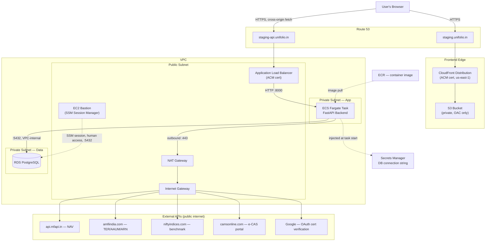

# AWS Technical Architecture & Request-Flow Specification

Companion to `Docs/orchestration/aws-golive-readiness-report.md` (the advisory document — target architecture, rationale, timeline) and `Docs/orchestration/aws-golive-launch-blockers.md` (code-level blockers). This document is the technical spec: exact AWS resource inventory, exact Terraform structure, and the precise request-by-request path for every major user action, traced both as network hops (technical) and as what the user sees (UX). Minimal prose — this is a reference to build against, not an argument for why to build it.

---

## 1. AWS requirements — exact resource inventory

### Networking

| Resource | Spec |
|---|---|
| VPC | 1x, CIDR `10.20.0.0/16` |
| Availability Zones | 2 (e.g. `ap-south-1a`, `ap-south-1b`) |
| Public subnets | `10.20.0.0/24`, `10.20.1.0/24` — one per AZ. Hosts: ALB, NAT Gateway, bastion. |
| Private subnet — app | `10.20.10.0/24`, `10.20.11.0/24` — one per AZ. Hosts: ECS Fargate task ENI. |
| Private subnet — data | `10.20.20.0/24`, `10.20.21.0/24` — one per AZ. Hosts: RDS. |
| Internet Gateway | 1x, attached to the VPC |
| NAT Gateway | 1x for staging (single AZ is acceptable at this scale — a second NAT in the other AZ is a production-hardening item, not a staging requirement), in a public subnet, with an Elastic IP |
| Route table — public | `0.0.0.0/0` → Internet Gateway |
| Route table — private app | `0.0.0.0/0` → NAT Gateway |
| Route table — private data | No default route. RDS never needs one. |

### Security groups

| SG | Inbound | Outbound |
|---|---|---|
| `alb-sg` | `443` from `0.0.0.0/0`; `80` from `0.0.0.0/0` (redirect only) | `8000` to `ecs-sg` |
| `ecs-sg` | `8000` from `alb-sg` only | `5432` to `rds-sg`; `443` to `0.0.0.0/0` (via NAT — needed for the 5 external hosts in §3 below) |
| `rds-sg` | `5432` from `ecs-sg`; `5432` from `bastion-sg` | none needed |
| `bastion-sg` | none (SSM-based access, no open ports) | `5432` to `rds-sg` |

### Compute & data

| Resource | Spec |
|---|---|
| RDS | PostgreSQL 16. **Staging: `db.t4g.small`. Production, sized for ~1,000 MAU: `db.t4g.medium`** (2 vCPU / 4GB — the burstable-credit ceiling on `small` is worth not relying on once traffic is continuous rather than test load). Single instance either way (no read replica yet), 20GB gp3 storage, `publicly_accessible=false`, private data subnet, storage encrypted at rest, automated backups on with a 7-day retention window (staging default — revisit before production), `manage_master_user_password=true` (RDS/Secrets Manager owns the credential) |
| ECR | 1 private repository, e.g. `unifolio-backend`, image scan on push enabled |
| ECS cluster | `unifolio-staging`, Fargate launch type only |
| ECS service | `backend`, **desired count = 1, auto-scaling disabled** (hard constraint, see the launch-blockers file), deployment type: rolling with `minimumHealthyPercent=0`/`maximumPercent=100` (i.e. stop-then-start, never two tasks briefly live) |
| ECS task definition | **Staging: 0.5 vCPU / 1 GB. Production, sized for ~1,000 MAU: 1 vCPU / 2 GB** — modest headroom for concurrent requests at this user count, still a single task until the in-process-cache rewrite lands (§1's capacity note, below). Container port `8000`, `essential=true` in both cases. |
| ALB | Internet-facing, 2 listeners: `80` (redirect to `443`), `443` (forward to target group) |
| Target group | Type `ip` (required for Fargate `awsvpc` mode), port `8000`, health check path `/health`, healthy threshold 2, unhealthy threshold 3, interval 30s |
| S3 bucket (frontend) | Private, `BlockPublicAccess` fully on, versioning on, accessed only via CloudFront Origin Access Control |
| CloudFront distribution | Origin = the S3 bucket via OAC, default root object `index.html`, custom error response: `404` → `/index.html` with HTTP `200`, viewer protocol policy: redirect HTTP to HTTPS |
| ACM certificate (API) | For `staging-api.<domain>`, issued in the ALB's region |
| ACM certificate (frontend) | For `staging.<domain>`, **must be issued in `us-east-1`** regardless of primary region — CloudFront requirement |
| Route 53 | `A`/`ALIAS` record `staging.<domain>` → CloudFront distribution; `A`/`ALIAS` record `staging-api.<domain>` → ALB |
| Secrets Manager | One secret holding the RDS connection string (RDS-managed per above) |
| EC2 bastion | `t3.micro`, public subnet, no key pair required, SSM instance profile attached, no inbound SG rule |
| IAM — ECS task execution role | `AmazonECSTaskExecutionRolePolicy` + `secretsmanager:GetSecretValue` scoped to the one DB-credential secret ARN |
| IAM — ECS task role | No permissions beyond default at launch (no app code writes to S3 or calls other AWS APIs today) |
| CloudWatch Logs | 1 log group per ECS task definition, stdout/stderr, retention 14 days for staging |

### Environment variables / secrets reaching the ECS task

| Name | Value | Delivery |
|---|---|---|
| `DATABASE_URL` | RDS connection string | Secrets Manager, via the task definition's `secrets` block (never `environment`) |
| `FRONTEND_BASE_URL` | `https://staging.<domain>` | Task definition `environment` |
| `ALLOWED_ORIGINS` | `https://staging.<domain>` | Task definition `environment` |
| `ENVIRONMENT` | `staging` | Task definition `environment` |
| `OTP_DELIVERY_MODE` | `stub` | Task definition `environment` |
| `GOOGLE_OAUTH_CLIENT_ID` | Real client ID, if Google Sign-In is enabled | Task definition `environment` |

### Capacity note: ~1,000 monthly active users

At this scale, raw request throughput is not the constraint — a check-in-periodically portfolio app at 1,000 MAU is low tens of concurrent requests at peak, comfortably inside a single 1 vCPU / 2GB task. **The actual constraint is availability, not capacity**: `desiredCount=1` (required by the in-process caches — see the launch-blockers file) means there is no failover if that one task is replaced or crashes, which is a real, user-visible incident at this user count rather than a theoretical edge case at internal-testing volumes. Size the SQLAlchemy connection pool explicitly for production rather than leaving the unconfigured default (5 + 10 overflow): `pool_size=10, max_overflow=20` is comfortably inside `db.t4g.medium`'s connection ceiling, with headroom for a second task once the cache rewrite removes the single-task constraint. NAT Gateway data-processing cost at this scale is negligible — a few GB/month of outbound API calls, dwarfed by the Gateway's fixed hourly charge.

---

## 2. Terraform strategy — exact structure

### Directory layout

```
infra/
  modules/
    networking/   → aws_vpc, aws_subnet ×6, aws_internet_gateway, aws_nat_gateway, aws_eip,
                     aws_route_table ×3, aws_route_table_association ×6, aws_security_group ×4
    database/     → aws_db_subnet_group, aws_db_instance
    ecr/          → aws_ecr_repository
    backend/      → aws_ecs_cluster, aws_ecs_service, aws_ecs_task_definition,
                     aws_lb, aws_lb_target_group, aws_lb_listener ×2,
                     aws_iam_role ×2, aws_iam_role_policy_attachment,
                     aws_cloudwatch_log_group
    frontend/     → aws_s3_bucket, aws_s3_bucket_policy, aws_cloudfront_distribution,
                     aws_cloudfront_origin_access_control
    dns/          → aws_acm_certificate ×2, aws_acm_certificate_validation ×2,
                     aws_route53_record ×4 (2 domain + 2 validation)
    bastion/      → aws_instance, aws_iam_instance_profile, aws_security_group
  envs/
    staging/
      main.tf        → module "networking" {...}, module "database" {...}, etc.
      backend.tf     → terraform { backend "s3" { bucket = "...", key = "staging/terraform.tfstate", dynamodb_table = "...", region = "..." } }
      terraform.tfvars
    production/
      main.tf        → same modules, different tfvars (2 NAT Gateways, larger RDS class, no desired-count=1 constraint once caches are fixed)
      backend.tf     → key = "production/terraform.tfstate" — a fully separate state file, not a workspace
      terraform.tfvars
```

### Bootstrap (manual, one-time, before any `terraform apply`)

```
aws s3api create-bucket --bucket <org>-terraform-state --region <region>
aws s3api put-bucket-versioning --bucket <org>-terraform-state --versioning-configuration Status=Enabled
aws dynamodb create-table --table-name terraform-locks \
  --attribute-definitions AttributeName=LockID,AttributeType=S \
  --key-schema AttributeName=LockID,KeyType=HASH \
  --billing-mode PAY_PER_REQUEST
```

### Secrets handling

- `aws_db_instance.manage_master_user_password = true` — Terraform's state never contains the plaintext password.
- All `.tfvars` files: no literal secrets. `sensitive = true` on any variable that could carry one.
- ECS task definition secrets reference the Secrets Manager ARN directly in the `secrets` block — Terraform writes the *reference*, not the value.

### Where CI/CD meets Terraform

Terraform owns: cluster, service (shape), task-definition *scaffold* (image tag as a variable). CI/CD owns: building the image, pushing to ECR, and registering a new task-definition revision + `aws ecs update-service --force-new-deployment` on every deploy. Do not make every code deploy a `terraform apply`.

### Manual-first vs. Terraform-first — confirmed decision

**The deadline moved from Wednesday to Friday — a confirmed 2 extra working days, not a hypothetical. Combined with AI-assisted authoring of the Terraform module boilerplate (Claude Code or similar drafting, a human reviewing/adapting/applying), the recommendation flips: Terraform-first for the whole stack, not manual-first.** This supersedes the original manual-first recommendation in the readiness report's earlier drafts. Breaking down where the time actually goes, with AI-assisted authoring factored in:

| Phase | Effort | Why it does or doesn't compress |
|---|---|---|
| Write all 7 modules (networking, database, ecr, backend, frontend, dns, bastion) | **1–1.5 days** (down from 2–3) | AI-assisted drafting compresses the boilerplate-writing time — this pattern (VPC/subnet/SG resource blocks, the standard ECS-behind-ALB shape, S3-behind-CloudFront-via-OAC) is exactly what a coding assistant drafts quickly. The human still reviews every value against the real account/region/domain — that review time doesn't compress, but it's a fraction of the original writing time. |
| First `apply` against a live AWS account, debug real provisioning behavior (ACM DNS validation timing, ECS service stabilization, NAT Gateway routing, CloudFront distribution propagation) | ~1 day | This does **not** compress with AI assistance — it's bound by AWS's own provisioning latency (RDS creation ~10–15 min/iteration, NAT Gateway ~2–5 min, ACM validation minutes-to-hours) and by ECS Express Mode's own rough edges, not by how fast the config was authored. |
| CI/CD (GitHub Actions, OIDC role, build → ECR → deploy) | 1–1.5 days | Now realistically in scope for the initial build, not deferred. |
| Validation pass | 0.5–1 day | |
| **Total** | **3.5–5 days**, much of it parallelizable across tracks (§3 below and the readiness report's §18/§22) | Fits inside the 4 available working days if it starts Monday and stays on track. |

One thing AI assistance does **not** change, worth naming explicitly: **ECS Express Mode is new (November 2025)** — per ADR-005's own risk note, it has "fewer Stack Overflow answers and community tooling maturity" than an established service, and Terraform's provider support for a brand-new console-first feature tends to lag the console UX. This is the single most likely place the plan slips — budget real debugging time for this specific module.

**Confirmed plan: Terraform-first for everything, with a hard checkpoint at end of day Tuesday** (readiness report §9/§15/§18). If networking + database + backend Terraform hasn't successfully applied by then, fall back to manual provisioning for the remainder (S3/CloudFront/ACM/Route53 are the easiest to provision manually and reconcile via `import` afterward) rather than continuing to push on the full-Terraform path and risking the Friday date itself.

---

## 3. Technical end-to-end flow: exact request path per action

External hosts referenced below (confirmed via direct grep against the codebase): `api.mfapi.in`, `www.amfiindia.com`, `www.niftyindices.com`, `www.camsonline.com`, and Google's OAuth public-certs endpoint. All reached identically: ECS task ENI (private app subnet) → private-app route table's default route → NAT Gateway (public subnet) → NAT's Elastic IP → Internet Gateway → public internet.

### Flow A — Cold load of the staging URL

1. Browser resolves `staging.<domain>` → Route 53 `ALIAS` record → CloudFront distribution domain.
2. TLS handshake at the nearest CloudFront edge location, SNI-matched against the `us-east-1` ACM certificate.
3. CloudFront checks its edge cache for `GET /` — cache miss on first load — issues an origin request to the S3 bucket, SigV4-signed via Origin Access Control (the bucket policy trusts only this specific OAC, nothing else can read the bucket).
4. S3 returns `index.html` (200); CloudFront caches it per its behavior settings and returns it to the browser.
5. Browser requests the JS/CSS bundle(s) referenced in `index.html` — same CloudFront → S3-via-OAC path, likely a cache hit on any request after the very first.
6. React boots client-side, checks `localStorage` for `unifolio_session_token` — none found on a first visit — renders the sign-in screen. No backend call has happened yet.

### Flow B — Sign in via stub OTP (phone or email)

1. Frontend `fetch()`s `POST https://staging-api.<domain>/auth/otp/request`. No cookies are sent (`credentials` is never set to `include` anywhere in the frontend — this is a pure Bearer-token model).
2. Browser resolves `staging-api.<domain>` → Route 53 → the ALB's DNS name.
3. TLS handshake at the ALB listener on `443`, terminated with the API's ACM certificate.
4. ALB's default listener rule forwards to the `backend-tg` target group.
5. ALB has already been health-checking the target group via `GET /health` every 30s; it forwards the live request to the one registered, healthy target — the ECS task's ENI IP, port `8000` (Fargate `awsvpc` mode gives the task its own network interface in the private app subnet).
6. Inside the container, FastAPI's `CORSMiddleware` checks the request's `Origin` header against `ALLOWED_ORIGINS` — passes.
7. `otp.py` generates the OTP, SHA-256-hashes it, and inserts a row into `otp_requests`.
8. That insert is a TCP connection from the ECS task to RDS's endpoint on `5432` — pure VPC-internal routing (private app subnet → private data subnet), permitted by `ecs-sg → rds-sg`, never touching NAT or the Internet Gateway.
9. Because `OTP_DELIVERY_MODE=stub`, the raw OTP is included directly in the JSON response body.
10. Response: ECS task → ALB → public internet → browser.
11. User submits the code → `POST /auth/otp/verify` — identical ALB → ECS → RDS path — a session row is created (`sessions` table, hashed token), the raw token returned once, in the response body only.
12. Frontend writes the token to `localStorage`. Every subsequent request carries `Authorization: Bearer <token>`.

### Flow C — Sign in via Google OAuth (if enabled on staging)

1. Google's Identity Services script (loaded directly from `accounts.google.com` — not our infrastructure at all) renders the button and handles the consent popup entirely outside our AWS resources.
2. Google returns a signed ID token to the frontend's JS callback.
3. Frontend `POST`s the ID token to `https://staging-api.<domain>/auth/oauth/google` — same ALB → ECS path as Flow B.
4. Inside the ECS task, `google_oauth.py`'s `id_token.verify_oauth2_token(...)` call makes an **outbound** HTTPS request from the container to Google's public-certs endpoint: ECS task ENI → NAT Gateway → Internet Gateway → public internet → Google. This is the one external dependency that turns "outbound internet" into a hard requirement for this specific auth method.
5. Google's response (its public signing keys) returns via the same path in reverse; the ID token's signature is verified in-process, no further network call.
6. Session created in RDS exactly as in Flow B step 11.

### Flow D — Dashboard / holdings view, cold cache

1. `GET https://staging-api.<domain>/household-members/{id}/holdings`, `Authorization` header present — ALB → ECS as above.
2. The session token is hashed and looked up against `sessions` in RDS.
3. `compute_holdings()` reads `transactions`/`folios` from RDS.
4. For any scheme with no cached (or expired) NAV row: `nav.py` issues an outbound call to `api.mfapi.in` — ECS task → NAT Gateway → Internet Gateway → `api.mfapi.in`.
5. The fetched NAV is upserted into `nav_history` (dialect-specific `ON CONFLICT` insert, resolved to the Postgres branch on RDS).
6. Response assembled and returned via ALB → browser.

### Flow E — CAS statement upload

1. `POST https://staging-api.<domain>/cas-imports` (multipart form: PDF bytes + optional password) — ALB → ECS.
2. `lifecycle_service.py` validates size (≤25MB) and the PDF magic bytes; `casparser` parses it, writing a transient temp file to the container's own ephemeral storage (Fargate's task-local filesystem layer — never a shared or persistent volume) and unlinking it immediately after parsing in a `finally` block.
3. Parsed transactions/folios/imports are written to RDS.
4. If the PDF is password-protected: the raw PDF bytes are buffered **in this ECS task's own process memory** (`buffer_cache.py`) pending a retry. The follow-up `PATCH .../password` request must land on this same task to find that buffer — the reason the ECS service must stay at exactly one task.
5. Response returned via ALB → browser.

### Flow F — PDF export (touches nearly every component in the architecture)

1. `POST https://staging-api.<domain>/analytics/export/pdf {payload}` — ALB → ECS.
2. `pdf_export.py` stores the payload **in this ECS task's own process memory**, keyed by a one-time token (`_export_payloads` — same single-task dependency as Flow E).
3. The same ECS task's own headless Chromium process (launched once, at container startup, by the `lifespan` handler) navigates to `https://staging.<domain>/print/analytics?token=...`. This is a genuine **outbound** request originating from inside the ECS task: ECS task ENI → NAT Gateway → Internet Gateway → public internet → CloudFront edge → S3 (identical mechanics to Flow A).
4. The print page, once loaded in that headless browser context, itself calls `GET https://staging-api.<domain>/analytics/export/payload/{token}` — a **second, fully independent** network round-trip: out of the ECS task via NAT/IGW, across the public internet, through Route 53, into the ALB, and back into — because the service runs exactly one task — the very same ECS task that started this whole flow.
5. Chromium renders the page and generates the PDF in-memory.
6. The PDF bytes are returned as the original `POST`'s HTTP response body, via ALB → browser, which then triggers a file download.

### Flow G — Human/operator access to RDS

1. Cloud engineer: AWS Console → Systems Manager → Session Manager → start a session on the bastion EC2 instance. No SSH, no open inbound port, every keystroke logged to CloudTrail.
2. From the bastion's shell: `psql` (or `alembic upgrade head`) directly against RDS's private endpoint — bastion is in a public subnet but the traffic itself is VPC-internal (`bastion-sg → rds-sg`, port `5432`), never touching the Internet Gateway or NAT.
3. No public internet is involved at any point in this flow.

---

## 4. User-perspective end-to-end flow

Same journeys as above, described purely as what the person sees — no AWS terminology.

**Opening the link.** A brief blank flash, then the app appears with a sign-in screen. Nothing to sign in with yet has been "loaded" from a user's point of view — it just looks instant after the first fraction of a second.

**Signing in (phone/email code).** Enter a phone number or email → "we sent you a code" — except on staging, the code is shown directly on screen (a deliberate, documented testing shortcut, not a bug) → type it in → land on the dashboard.

**Signing in (Google).** Click "Sign in with Google" → a Google popup appears, asking to choose an account → after confirming, the popup closes and the app is already signed in.

**Viewing the dashboard for the first time.** A short loading state (typically under a couple of seconds) while NAV data is fetched for the first time for each held scheme; subsequent visits are faster since that data is now cached. Holdings, allocation, and returns appear once loaded.

**Importing a CAS statement.** Pick a PDF → a brief "processing" state → either a summary ("12 new transactions found, 3 duplicates skipped") or, if the file is password-protected, a prompt to enter the password, submitted via a second small form. As long as the app stays up on one instance (the current, deliberate configuration), this password step behaves normally; it isn't something a user would ever notice as fragile under normal operation.

**Exporting a PDF.** Click "Export" → a loading spinner for a few seconds (this is the multi-hop Flow F happening invisibly) → the browser's normal "file downloaded" indicator appears.

**Session expiry.** After a period of inactivity, the next action a user takes quietly fails and the app redirects back to the sign-in screen — no error dialog, just a clean re-entry point.

---

*Technical reference document. No infrastructure has been created and no code has been changed in producing it. Pairs with `aws-golive-readiness-report.md` (rationale, timeline, decisions) and `aws-golive-launch-blockers.md` (code-level blockers and their resolution ordering).*

### Access and IAM boundaries per component

| Component | Needs access to | Should never be reachable by |
|---|---|---|
| EC2 bastion | RDS (private endpoint, port 5432) via Session Manager | The public internet on any inbound port; should have no inbound security group rule at all if using SSM |
| ECR | Pushed to by CI (or a developer's authenticated CLI); pulled from by ECS's task execution role | Public/anonymous access — keep the repository private |
| ECS task execution role | Pull from ECR, write to CloudWatch Logs, read the specific Secrets Manager secret(s) it needs | Broad `*` permissions on unrelated services |
| ECS task role (the app's own runtime identity) | RDS (via security group, not IAM), nothing else at launch | S3 write access is not needed today (no app code writes to S3) — don't grant it speculatively |
| ALB | Internet on 443 (and 80, redirecting to 443) | Nothing beyond routing to the ECS target group |
| RDS | Only the ECS task's security group, on 5432; the bastion's security group, on 5432 | The public internet, under any circumstance — see §11 |

## 11. Connectivity & request flow

**User → Frontend → Backend → Database**, end to end:

1. A user's browser resolves the frontend domain via **Route 53**, which points at **CloudFront**.
2. CloudFront serves the static React/Vite build from its **S3** origin (private bucket, reached only via Origin Access Control — the bucket itself is never public).
3. The React app, running in the browser, makes API calls to the backend domain (a separate subdomain, e.g. `staging-api.unifolio.in`) — this is **cross-origin** from CloudFront's domain, which is exactly why the CORS fix in §4 is a blocker, not a nice-to-have.
4. That backend domain resolves via Route 53 to the **Application Load Balancer**, which terminates HTTPS (using its own ACM certificate) and forwards plain HTTP to the **ECS Fargate task** over the VPC's internal network.
5. The ECS task talks to **RDS** over the VPC's internal network only (port 5432), using a connection string it received from **Secrets Manager** at container start — never a value baked into the image or a plaintext task-definition env var.
6. For the handful of features that need it (Google Sign-In verification, on-demand NAV/TER/AAUM/benchmark fetches, the CAMS e-CAS portal flow — see §12), the ECS task also makes **outbound** HTTPS calls to the public internet, via the NAT Gateway (or the alternative described in §12).

### Where each piece fits

- **ALB:** the only thing the public internet ever talks to on the backend side. Terminates HTTPS, health-checks the ECS task, forwards traffic. Sits in a public subnet.
- **CloudFront:** the only thing the public internet ever talks to on the frontend side. Terminates HTTPS, serves cached static assets, and (via its custom error response) rewrites unknown paths back to `index.html` so client-side "routes" like `/print/analytics` and `/mobile` work on a cold load.
- **DNS/domains:** two subdomains are the cleanest split — one for the frontend (→ CloudFront), one for the API (→ ALB). This avoids CloudFront needing to proxy API traffic through to the ALB, which is possible but adds unnecessary complexity for this stage.
- **CORS:** the backend's `allow_origins` must explicitly include the frontend's real domain (both are on the same top-level domain but different subdomains, which still counts as a different origin to the browser). This is §4's CORS blocker — fix it to read from an env var so staging and production can each set their own value.
- **Secrets to ECS:** via the task definition's `secrets` block, which references the Secrets Manager ARN — Fargate injects the resolved value as an environment variable inside the container at launch, without it ever appearing in the task definition itself or in any log of task-definition contents.
- **Should RDS ever be publicly accessible? No — never.** RDS should have `publicly_accessible = false`, sit in a private subnet with no route to an Internet Gateway, and its security group should allow inbound only from the ECS task's security group (for the app) and the bastion's security group (for humans). There is no legitimate reason for RDS to be reachable from the public internet at any point in this architecture, staging included.

### Security group relationships

```
Internet
   │ :443
   ▼
[ALB security group]  — inbound 443/80 from 0.0.0.0/0, outbound to ECS SG only
   │ :8000
   ▼
[ECS task security group]  — inbound 8000 from ALB SG only, outbound 5432 to RDS SG + 443 to NAT/IGW
   │ :5432
   ▼
[RDS security group]  — inbound 5432 from ECS SG and Bastion SG only, no other inbound, no outbound needed

[Bastion security group]  — no inbound (SSM-based access, not SSH), outbound 5432 to RDS SG only
```

### Architecture / data-flow diagram



---

## 12. Private networking & internet access

### Does the ECS backend require outbound internet access?

**Yes — confirmed directly against the codebase, not assumed.** A grep across the backend for outbound HTTP calls turns up exactly these external hosts:

| External host | Feature | Trigger |
|---|---|---|
| `api.mfapi.in` | NAV data (dashboard holdings, on-demand per scheme) | Every dashboard/holdings view for a scheme not already cached |
| `www.amfiindia.com` | TER, AAUM, ARN-name lookup (analytics) | On-demand, first analytics view of the day per category |
| `www.niftyindices.com` | Benchmark index history (analytics) | On-demand, first benchmark comparison per index/date-range |
| `www.camsonline.com` | CAMS e-CAS mailback portal request initiation (CAS import) | User-triggered, when a user requests their CAS via the CAMS portal flow |
| Google's OAuth certificate endpoint (via the `google-auth` library) | Google Sign-In ID-token verification | **Every single Google Sign-In**, since the backend must fetch Google's public keys to verify the token's signature |

### Is this continuous, or only for specific operations?

**On-demand, not continuous background traffic** — none of ADR-006's scheduled background jobs exist in code yet (confirmed in the prior audit), so there's no always-running polling loop hitting these hosts. But "on-demand" here means **unpredictable and frequent in practice**: any time a user signs in via Google, or views a dashboard/analytics page for data not already cached, the backend needs to reach one of these hosts right then, synchronously, as part of serving that request.

### What breaks if outbound internet is unavailable?

- **Google Sign-In fails completely if outbound internet is unavailable** — for staging, sign-in still works via stub-mode phone/email OTP (a purely internal, DB-backed flow with no external dependency), so this specifically isn't a total-outage risk for staging the way it would be if Google were the only enabled method. It remains the one dependency that turns "outbound internet is nice to have" into "outbound internet is required" for whichever sign-in methods are actually enabled — confirm this explicitly for whatever the production auth decision ends up being.
- NAV/TER/benchmark on-demand fetches fail — dashboards fall back to whatever's already cached in Postgres (nothing, on a brand-new database) or show a degraded/empty state; not a crash, but a materially broken first-user experience.
- The CAMS e-CAS portal-initiated import path fails; the direct file-upload CAS import path is unaffected (it doesn't call any external service).

### Recommended network design for staging

Given the above, **the ECS task needs a real, working path to the public internet even though it sits in a private subnet.** Two viable designs:

**Option A — NAT Gateway (recommended, more correct security posture):**
- Public subnets: the ALB, the NAT Gateway, and the bastion.
- Private subnets: the ECS task and RDS.
- Route table for the private app subnet sends `0.0.0.0/0` to the NAT Gateway; the NAT Gateway (in the public subnet) sends it onward to the Internet Gateway.
- RDS's private subnet has no route to the internet at all — it never needs one, and shouldn't have one.
- **Cost:** roughly $32–40/month baseline for the NAT Gateway itself, plus data-processing charges per GB. Not free, but standard for this pattern.

**Option B — Public subnet with a locked-down security group (cheaper, weaker isolation, acceptable for staging under time/cost pressure):**
- Run the ECS task in a public subnet with a public IP assigned, reachable via the Internet Gateway directly (no NAT Gateway needed).
- Lock the task's security group so **inbound** is allowed only from the ALB's security group — the task has a public IP but nothing can reach it directly except through the ALB, and outbound to the internet works via the Internet Gateway with no NAT cost.
- **The meaningful difference from Option A:** the task is *technically publicly addressable* (it has a real public IP, even though the security group blocks unsolicited inbound) rather than genuinely unreachable from the internet by network topology alone. This is a real, if modest, security posture downgrade — acceptable as a deliberate, named staging shortcut (see §15/§19), not something to carry into production.

**Recommendation:** Option A for anything that will touch real user data (i.e., production); Option B is a legitimate, explicitly-flagged cost/time shortcut for staging if the NAT Gateway cost approval (see §19) isn't resolved in time — but it needs to be a decision made knowingly, not a default fallen into silently.

**RDS never needs outbound internet access at all** — it only receives connections, from the ECS task and the bastion; it never initiates a call to anything.

---

## 13. Environment variables & secrets checklist

### Backend (ECS task definition — via Secrets Manager where noted)

| Variable | Production value | Source |
|---|---|---|
| `DATABASE_URL` | Real RDS Postgres connection string | Secrets Manager (RDS-managed, per §9) |
| `FRONTEND_BASE_URL` | Real CloudFront/custom domain (needed for the PDF-export Playwright navigation — silently breaks that one feature if left at the `localhost:5173` default) | Task definition env |
| `GOOGLE_OAUTH_CLIENT_ID` | Real Client ID, only if Google Sign-In is being offered on staging too (optional per §4/§15) | Task definition env |
| `OTP_DELIVERY_MODE` | **`stub`, deliberately, for staging** — team decision per §4, since staging has no real users/data. Requires the environment-flag guard fix (§4) to be merged first, or this value hard-fails against RDS Postgres. **Must be resolved to a real provider (or a permanent no-phone/email-auth decision) before production.** | Decision, not just config |
| `ENVIRONMENT` *(new)* | `staging` (or `production`) — the new flag the OTP guard fix (§4) reads instead of inferring safety from the database dialect | Task definition env |
| `ALLOWED_ORIGINS` *(new)* | The real production/staging frontend domain(s), once the CORS fix from §4 is implemented | Task definition env |

### Frontend (baked at build time — must be set before the production `npm run build`)

| Variable | Production value |
|---|---|
| `VITE_API_BASE_URL` | Real backend domain (e.g. `https://staging-api.unifolio.in`) |
| `VITE_GOOGLE_OAUTH_CLIENT_ID` | Real Client ID, matching the backend's |

No third-party API keys are needed today — AMFI, NSE, and mfapi.in are all unauthenticated public endpoints; the Google OAuth flow is ID-token-verification-only and uses no client secret. The only secret this launch genuinely needs is the RDS connection string, and it can be entirely RDS-managed (§9) rather than something anyone has to type in.
