# Journey Index

Ordered list of delivery stages. Each links to a `<date>-<stage>.md`
file with the full for-stakeholders/technical-detail record.

| Date | Stage | Outcome |
|---|---|---|
| 2026-07-22 → 2026-09-02 | [Product and architecture definition](2026-07-22-product-and-architecture-definition.md) | Build-ready spec set, six Accepted ADRs, schema reconciled to migration 0011. Three course corrections: deployment platform, auth method, schema drift |
| 2026-08-04 | [Foundation and CAS import backend](2026-08-04-foundation-and-cas-import-backend.md) | Empty-but-correct skeleton, full schema under migration control on both dialects, CAS import live in the monolith, prototype retired. ADR-001's premise found false and amended; a permanent no-PAN guard test added |
| 2026-08-05 | [Import Review UI and auth backend](2026-08-05-import-review-ui-and-auth-backend.md) | Import Review screens S8–S12 and phone+OTP auth. A production bug hidden by a test/production `autoflush` mismatch found and turned into a standing rule |
| 2026-08-06 | [Onboarding frontend, dashboard backend, and a silent data-loss fix](2026-08-06-onboarding-frontend-dashboard-backend-and-a-silent-data-loss-fix.md) | Onboarding and family CAS upload, the whole Main Dashboard backend, and migration `0002` closing a silent transaction-drop bug (INV-003) |
| 2026-08-07 | [Distributor comparison and a design-system handoff](2026-08-07-distributor-comparison-and-a-design-system-handoff.md) | Returns-by-distributor with a hand-verified ARN lookup (INV-004); frontend redesign handed to an external coding agent under a written brief |
| 2026-08-10 | [Analytics research and first integrations](2026-08-10-analytics-research-and-first-integrations.md) | Every analytics data source identified and live-verified; a missing category universe found and sourced (INV-001); a silently stale index endpoint replaced (INV-002); granular allocation shipped |
| 2026-08-12 → 2026-08-13 | [Delegated execution and the fund scorer](2026-08-12-delegated-execution-and-the-fund-scorer.md) | A written model-delegation process (ADR-011) and the three-ingredient Unifolio Scorer settled with the product owner (ADR-010) — which contradicts the vault's existing scoring methodology doc |
| 2026-08-14 | [Multi-method auth and the analytics frontend](2026-08-14-multi-method-auth-and-the-analytics-frontend.md) | Google and email sign-in added on a mandatory phone anchor, with non-silent account linking (ADR-008) and Postmark chosen but stubbed (ADR-009). Privacy Policy, real email delivery and Apple all outstanding |

```mermaid
flowchart LR
    A["Product idea:\nMF portfolio tracker"] --> B["Spec set:\n4 PRDs, TDD, schema,\napp flow, design system"]
    B --> C{"Formalising the\nstack surfaced\nproblems?"}
    C -->|"App Runner closed\nto new customers"| D["ADR-005:\nECS Express Mode"]
    C -->|"Auth reversed twice\n2026-08-17"| E["Passwordless throughout;\npassword tables dropped\n(migrations 0007-0008)"]
    C -->|"Schema doc 3-4\nmigrations stale"| F["Compliance audit;\nschema v1.4 then v1.5"]
    D --> G["Six ADRs Accepted;\nspec build-ready"]
    E --> G
    F --> G
    G --> H["Open conflicts carried\nforward, not papered over\n(07-risks-and-debt)"]

    G --> I["2026-08-04\nSkeleton + CAS import\nPrototype retired"]
    I --> J["2026-08-05\nImport Review UI\nPhone+OTP auth"]
    J --> K["2026-08-06\nOnboarding, Dashboard\nbackend"]
    K -->|"Normalisation fix had\ncreated a silent\ndata-loss path"| K2["INV-003 →\nmigration 0002:\n5-column dedupe key"]
    K2 --> L["2026-08-07\nDistributor comparison"]
    L -->|"Known ARN scraper\nwas dead"| L2["INV-004:\nAMFI's own endpoint,\nverified by hand"]
    L2 --> M["2026-08-10\nAnalytics research"]
    M -->|"No source published\nthe category universe"| M2["INV-001:\nAMFI daily NAV file's\nsection headings"]
    M -->|"Index endpoint responded\nbut had gone stale"| M3["INV-002:\nPOST endpoint from the\nsite's own JS"]
    M2 --> N["2026-08-12 → 08-13\nDelegation process (ADR-011)\nUnifolio Scorer (ADR-010)"]
    M3 --> N
    N -->|"Scorer formula contradicts\nthe vault's methodology doc"| N2["R-015 — OPEN"]
    N --> O["2026-08-14\nGoogle + email sign-in\non a phone anchor\n(ADR-008, ADR-009)"]
    O -->|"No Privacy Policy exists;\nGoogle requires one"| O2["R-023 — OPEN,\nlaunch blocker"]
    O --> H
```

