# Journey Index

Ordered list of delivery stages. Each links to a `<date>-<stage>.md`
file with the full for-stakeholders/technical-detail record.

| Date | Stage | Outcome |
|---|---|---|
| 2026-07-22 → 2026-09-02 | [Product and architecture definition](2026-07-22-product-and-architecture-definition.md) | Build-ready spec set, six Accepted ADRs, schema reconciled to migration 0011. Three course corrections: deployment platform, auth method, schema drift |
| 2026-08-04 | [Foundation and CAS import backend](2026-08-04-foundation-and-cas-import-backend.md) | Empty-but-correct skeleton, full schema under migration control on both dialects, CAS import live in the monolith, prototype retired. ADR-001's premise found false and amended; a permanent no-PAN guard test added |
| 2026-08-05 | [Import Review UI and auth backend](2026-08-05-import-review-ui-and-auth-backend.md) | Import Review screens S8–S12 and phone+OTP auth. A production bug hidden by a test/production `autoflush` mismatch found and turned into a standing rule |
| 2026-08-06 | [Onboarding frontend, dashboard backend, and a silent data-loss fix](2026-08-06-onboarding-frontend-dashboard-backend-and-a-silent-data-loss-fix.md) | Onboarding and family CAS upload, the whole Main Dashboard backend, and migration `0002` closing a silent transaction-drop bug (INV-003) |
| 2026-08-07 | [Distributor comparison and a design-system handoff](2026-08-07-distributor-comparison-and-a-design-system-handoff.md) | Returns-by-distributor with a hand-verified ARN lookup (INV-004); frontend redesign handed to an external coding agent under a written brief |
| 2026-08-10 | [Analytics research and first integrations](2026-08-10-analytics-research-and-first-integrations.md) | Every analytics data source identified and live-verified; a missing category universe found and sourced (INV-001); a silently stale index endpoint replaced (INV-002); granular allocation shipped |
| 2026-08-12 → 2026-08-13 | [Delegated execution and the fund scorer](2026-08-12-delegated-execution-and-the-fund-scorer.md) | A written model-delegation process (ADR-011) and the three-ingredient Unifolio Scorer settled with the product owner (ADR-010) — which contradicts the vault's existing scoring methodology doc |
| 2026-08-14 | [Multi-method auth and the analytics frontend](2026-08-14-multi-method-auth-and-the-analytics-frontend.md) | Google and email sign-in added on a mandatory phone anchor, with non-silent account linking (ADR-008) and Postmark chosen but stubbed (ADR-009). Privacy Policy, real email delivery and Apple all outstanding |
| 2026-08-17 | [Email and password auth, built in full and reversed](2026-08-17-email-password-auth-built-and-reversed.md) | Migration `0006`, bcrypt, five routes, two tables and the email-OTP path deleted — then reversed the same day by management. A reachable crash in identity selection found by reading and fixed (INV-006) |
| 2026-08-18 | [The active-SIP window is replaced by a cadence model](2026-08-18-active-sip-cadence-redesign.md) | The 40-day window rejected by the product owner and replaced by cadence projection (ADR-012), reversing one clause of the 2026-08-06 accounting conventions. Designed and planned, not built |
| 2026-08-18 → 2026-08-19 | [A visual and motion redesign, and four concepts for one auth panel](2026-08-18-visual-motion-redesign-and-the-auth-panel.md) | A zero-token-change design system pass handed to an external agent; one decorative panel through four concepts in 48 hours with no accepted record (R-033); a real import-flow routing defect found on the way (INV-007) |
| 2026-08-19 → 2026-08-25 | [The mobile track pulls ahead of desktop](2026-08-19-the-mobile-track-pulls-ahead.md) | A mobile design system, two mockup-stage rejections recorded with reasons, and the finding that the desktop Main Dashboard is still a stub while mobile is mature (R-037). A doc-versus-code routing contradiction flagged, not resolved (R-035) |
| 2026-08-20 → 2026-08-27 | [Analytics deepening, and a category split that was deferred](2026-08-20-analytics-deepening-and-a-deferred-split.md) | PDF export via a server-side headless browser and a capability token (ADR-013); distributor comparison moved to portfolio level, old route deleted; the 1,150-scheme index-fund category found unsplittable and deferred (INV-005). No plan executed |
| 2026-08-25 → 2026-08-26 | [Phase 2: stocks and demat import](2026-08-25-phase-2-stocks-and-demat-import.md) | Nine ingestion routes assessed; statement upload plus in-house email ingestion chosen, broker APIs and the Account Aggregator ruled out for this phase (ADR-014). No equity cost basis exists in the source data and none is fabricated. Seven deviations flagged, including the PAN question (R-043) |
| 2026-08-31 | [The marketing website goes to a second external agent](2026-08-31-marketing-website-handoff.md) | A creative brief handed to Manus, which builds and hosts outside the product repo. Five placeholders outstanding, one carrying a factual claim that contradicts how ingestion actually works (R-046) |

```mermaid
flowchart LR
    A["Product idea:\nMF portfolio tracker"] --> B["Spec set:\n4 PRDs, TDD, schema,\napp flow, design system"]
    B --> C{"Formalising the\nstack surfaced\nproblems?"}
    C -->|"App Runner closed\nto new customers"| D["ADR-005:\nECS Express Mode"]
    C -->|"Auth reversed twice\n2026-08-17"| E["Passwordless throughout;\npassword tables dropped\n(migrations 0007-0008)"]
    C -->|"Schema doc 3-4\nmigrations stale"| F["Compliance audit;\nschema v1.4 then v1.5"]
    D --> G["Six ADRs Accepted;\nspec build-ready"]
    E --> G
    F --> G
    G --> H["Open conflicts carried\nforward, not papered over\n(07-risks-and-debt)"]

    G --> I["2026-08-04\nSkeleton + CAS import\nPrototype retired"]
    I --> J["2026-08-05\nImport Review UI\nPhone+OTP auth"]
    J --> K["2026-08-06\nOnboarding, Dashboard\nbackend"]
    K -->|"Normalisation fix had\ncreated a silent\ndata-loss path"| K2["INV-003 →\nmigration 0002:\n5-column dedupe key"]
    K2 --> L["2026-08-07\nDistributor comparison"]
    L -->|"Known ARN scraper\nwas dead"| L2["INV-004:\nAMFI's own endpoint,\nverified by hand"]
    L2 --> M["2026-08-10\nAnalytics research"]
    M -->|"No source published\nthe category universe"| M2["INV-001:\nAMFI daily NAV file's\nsection headings"]
    M -->|"Index endpoint responded\nbut had gone stale"| M3["INV-002:\nPOST endpoint from the\nsite's own JS"]
    M2 --> N["2026-08-12 → 08-13\nDelegation process (ADR-011)\nUnifolio Scorer (ADR-010)"]
    M3 --> N
    N -->|"Scorer formula contradicts\nthe vault's methodology doc"| N2["R-015 — OPEN"]
    N --> O["2026-08-14\nGoogle + email sign-in\non a phone anchor\n(ADR-008, ADR-009)"]
    O -->|"No Privacy Policy exists;\nGoogle requires one"| O2["R-023 — OPEN,\nlaunch blocker"]
    O --> P["2026-08-17\nEmail+password auth\nbuilt in full"]
    P -->|"Reversed the same day\nby management"| P2["Passwordless restored;\npassword tables dropped\n(0007-0008)"]
    P -->|"New provider missing from\nthe precedence map"| P3["INV-006:\nreachable KeyError,\nfixed same day"]
    P2 --> Q["2026-08-18\nSIP cadence model\nreplaces the 40-day window\n(ADR-012)"]
    Q -->|"Reverses one clause of the\n2026-08-06 conventions"| Q2["PRD-03 FR-6 note\nstill unwritten (R-032)"]
    P2 --> R["2026-08-18 → 08-19\nVisual + motion redesign\nhanded to Antigravity"]
    R -->|"One panel, four concepts\nin 48 hours"| R2["R-033 — no accepted\ndesign record"]
    R -->|"Waiting view gated on\ntwo conflicting states"| R3["INV-007:\nimport waiting screen\nunreachable"]
    R --> S["2026-08-19 → 08-25\nMobile design system"]
    S -->|"Desktop dashboard is\nstill a stub"| S2["R-037 — mobile is\nahead of web"]
    S -->|"Viewport auto-switch vs\nMOBILE_APP_EXECUTION.md"| S3["R-035 — OPEN,\ndoc vs code"]
    Q --> T["2026-08-20 → 08-27\nPDF export (ADR-013),\nportfolio distributor view,\nloading states settled"]
    T -->|"1,150 schemes, no split\nthat is native and effective"| T2["INV-005:\ndeferred with a\nrevisit trigger"]
    T --> U["2026-08-25 → 08-26\nPhase 2: stocks + demat\n(ADR-014)"]
    U -->|"PAN rule stated three\ndifferent ways"| U2["R-043 — OPEN,\nblocks email ingestion"]
    U -->|"Depository CAS has no\ntransaction history"| U3["Holdings only;\nno fabricated cost basis"]
    S --> V["2026-08-31\nMarketing site handed\nto Manus (2nd external agent)"]
    V -->|"Trust-bar claim contradicts\nactual CAS ingestion"| V2["R-046 — OPEN,\nlaunch-facing"]
    U --> W["6 of 8 plans in this\nfortnight not fully built\n(R-051)"]
    V --> H
    W --> H
```

