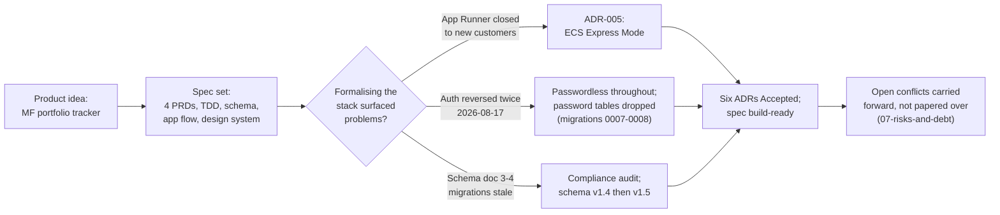

# Journey Index

Ordered list of delivery stages. Each links to a `<date>-<stage>.md`
file with the full for-stakeholders/technical-detail record.

| Date | Stage | Outcome |
|---|---|---|
| 2026-07-22 → 2026-09-02 | [Product and architecture definition](2026-07-22-product-and-architecture-definition.md) | Build-ready spec set, six Accepted ADRs, schema reconciled to migration 0011. Three course corrections: deployment platform, auth method, schema drift |

_Later stages populate as batches 2-6 are ingested — implementation work
(`Docs/superpowers/plans/`) is batch 2 and is not yet recorded here._

