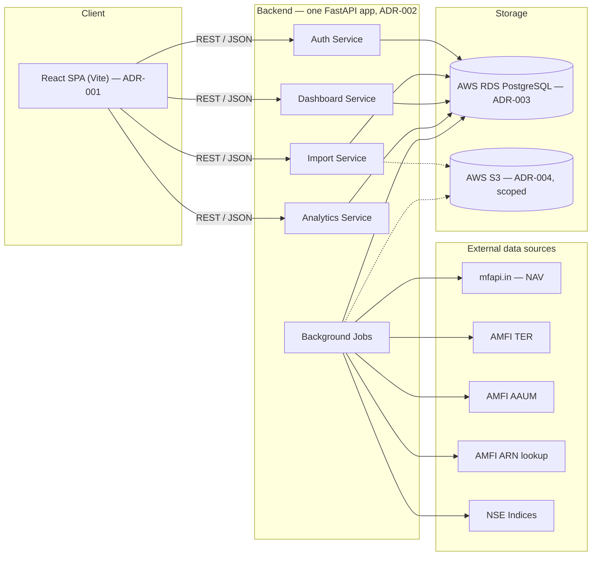

# Building Blocks

The system boundary — components and external dependencies. This is not deployment
topology; for that see [deployment](deployment.md).

## Four logical services, one deployment

Auth, Import, Dashboard, and Analytics are **logical** boundaries inside a single
FastAPI application — not four separate deployments. This applies ADR-001's
"monolith-appropriate-at-this-team-size" reasoning identically to the backend.

### Auth Service
Owns `otp_requests` and `sessions`, and reads `auth_identities`. Endpoints: request OTP,
verify OTP (which creates a session), refresh session. **No password anywhere** —
password authentication was removed from the schema by migration 0008. Foundational
only: rate-limiting and lockout policy belong to the deferred Auth/Security PRD; this
service implements the base flow that PRD will build on.

### Import Service
Owns `imports`, `folios`, `transactions`, and writes to `schemes` on first encounter.
Implements the full parse/confirm flow: upload → `casparser` invocation → confidence
scoring against `schemes` → review payload → confirm → dedupe-constrained insert into
`transactions`. The same endpoints serve both the first import during onboarding and
the dashboard's later "Add data" re-entry — Ongoing Data Addition is not a separate
code path.

### Dashboard Service
Read paths over `folios`, `transactions`, and `portfolio_snapshots`, plus the write path
for `portfolio_snapshots` (computed, never user-submitted). Implements the holdings
table, allocation summary, SIP detection, investment cash flow, the family aggregate
(computed, not stored — see [data model](data-model.md) principle 5), and distributor
comparison reading `arn_directory` — which **never blocks**: an unresolved ARN falls back
to displaying the raw ARN code.

### Analytics Service
Read paths over `nav_history`, `scheme_ter`, `scheme_aaum`, `benchmark_index_history`,
and `fund_scores`, computing category ranking, category-average comparison, benchmark
XIRR, weighted TER, and the score display **on read**. There are no per-user analytics
tables; portfolio-level scores are computed, not stored.

### Background Jobs
Not user-facing. Scheduled and on-demand jobs refreshing reference data and computing
snapshots and scores. Mechanism per ADR-006; sources and cadences in
[`05-docs/reference/external-data-sources.md`](../05-docs/reference/external-data-sources.md).

## Two stores, deliberately separated

- **Postgres (RDS)** — all structured, queryable, permanent data: users, household
  members, folios, transactions, imports, snapshots, and all reference tables.
- **S3** — cached raw payloads of public reference data, and future generated exports.
  Never the uploaded CAS PDF (ADR-004).

## Frontend module boundaries

One React application, with internal boundaries by feature: Import Review, Onboarding,
Main Dashboard, Analytics Dashboard. Cross-cutting components — the "Fund Signal"
element appears on both the Main Dashboard and Import Review — are shared directly,
which is precisely the thing micro-frontends would have made harder (ADR-001).

## Related

- [ADR-001](../03-decisions/ADR-001-frontend-application-architecture.md),
  [ADR-002](../03-decisions/ADR-002-backend-api-framework.md),
  [ADR-003](../03-decisions/ADR-003-primary-database-rds-postgresql.md),
  [ADR-004](../03-decisions/ADR-004-object-storage-scope-and-cas-pdf-retention.md)
- [API surface](../05-docs/reference/api-surface.md)
