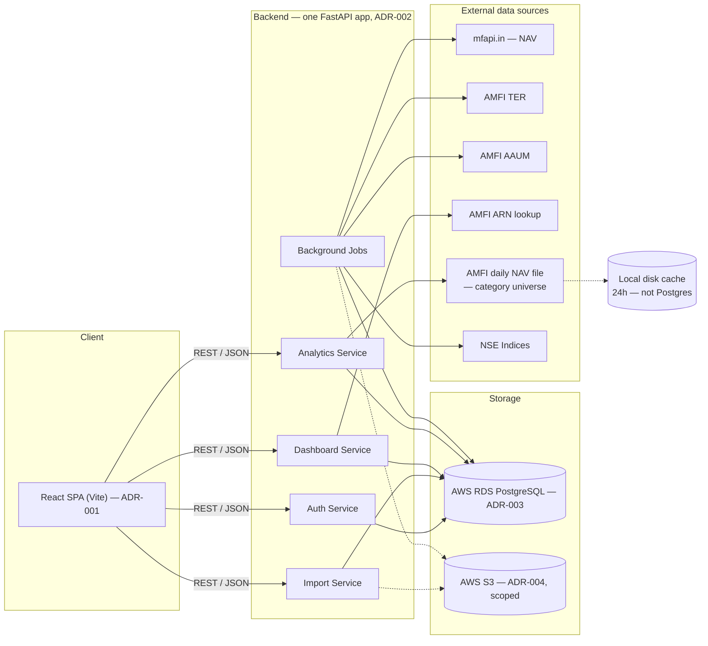

# Building Blocks

The system boundary — components and external dependencies. This is not deployment
topology; for that see [deployment](deployment.md).

## Four logical services, one deployment

Auth, Import, Dashboard, and Analytics are **logical** boundaries inside a single
FastAPI application — not four separate deployments. This applies ADR-001's
"monolith-appropriate-at-this-team-size" reasoning identically to the backend.

### Auth Service
Owns `otp_requests` and `sessions`, and — since 2026-08-14 — owns the
identities table that is the source of truth for how a user proves who
they are, plus a pending-verification table for a just-verified Google or email
identity that cannot yet hold a session
([ADR-008](../03-decisions/ADR-008-phone-anchored-multi-method-identity.md)).
Endpoints: request OTP, verify OTP (which creates a session), refresh
session, verify a Google ID token, and complete a link or a mandatory-phone
step. **No password anywhere** — password authentication was removed from
the schema by migration 0008.

Three implementation facts worth keeping visible:
- OTP codes are hashed with SHA-256, deliberately not a slow password hash;
  session tokens are opaque random strings stored only as a hash and
  returned to the client exactly once.
- The OTP table was generalised on 2026-08-14 to accept either a phone
  number or an email address, rather than a second email-OTP table being
  added.
- Outbound delivery is an abstraction with **stub implementations only** —
  no SMS provider is chosen ([R-025](../07-risks-and-debt.md)) and the
  chosen email provider is not wired up
  ([ADR-009](../03-decisions/ADR-009-transactional-email-provider.md),
  [R-024](../07-risks-and-debt.md)).

Still foundational: rate-limiting beyond a per-request attempt cap of 5, and
lockout policy, belong to the deferred Auth/Security PRD.

### Import Service
Owns `imports`, `folios`, `transactions`, and writes to `schemes` on first encounter.
Implements the full parse/confirm flow: upload → `casparser` invocation → confidence
scoring against `schemes` → review payload → confirm → dedupe-constrained insert into
`transactions`. The same endpoints serve both the first import during onboarding and
the dashboard's later "Add data" re-entry — Ongoing Data Addition is not a separate
code path.

### Dashboard Service
Read paths over `folios`, `transactions`, and `portfolio_snapshots`, plus the write path
for `portfolio_snapshots` (computed, never user-submitted). Implements the holdings table
(FIFO cost basis), allocation summary, SIP detection, investment cash flow, the family
aggregate (computed, not stored — see [data model](data-model.md) principle 5), and
distributor comparison.

The organising constraint across all of it: **every compute function is
parameterized by a list of household member IDs**, so the per-member view
(a one-item list) and the family aggregate (every member the caller owns)
share one implementation rather than two that can drift.

Distributor comparison reads `arn_directory` and **never blocks**: an
unresolved ARN falls back to displaying the raw ARN code.

> **Correction, 2026-09-17 (batch 2a).** This section previously implied the
> ARN lookup was populated elsewhere. As implemented on 2026-08-07, the
> ARN-lookup client and its cache **live in the Dashboard service** and are
> triggered by the distributor-comparison read path. The vault elsewhere
> records ARN resolution as triggered inline by the **Import** service
> (decisions-log 2026-07-22, ADR-006,
> [runtime and data flow](runtime-and-data-flow.md)). Those are two different
> services triggered by two different events. Not resolved — see
> [R-016](../07-risks-and-debt.md) and
> [INV-004](../04-investigations/INV-004-amfi-arn-distributor-lookup.md).

### Analytics Service
Read paths over `nav_history`, `scheme_ter`, `scheme_aaum`,
`benchmark_index_history`, and `fund_scores`, computing granular
SEBI-category allocation, category ranking, category-average comparison,
benchmark XIRR, weighted TER, and the score display **on read**. There are no
per-user analytics tables; portfolio-level scores are computed, not stored,
and the FR-7 score breakdown is recomputed on every read rather than
persisted.

> **Correction, 2026-09-22 (batch 2c).** The "no per-user analytics tables,
> computed not stored" description above was accurate through batch 2b, but
> is superseded as of 2026-09-02. Two new tables now exist —
> `analytics_sections` (per household, per scope, per section) and
> `analytics_recompute_status` — and the read path this paragraph describes
> is replaced by a consolidated `GET /analytics/{scope}` reading precomputed,
> persisted rows, with recomputation dispatched via ECS Fargate `RunTask`
> rather than happening inline on read. See
> [ADR-015](../03-decisions/ADR-015-analytics-precompute-architecture.md).
> This correction is left above the original paragraph, not merged into it,
> so the "as originally built" description stays intact.

Two things it owns that are not in Postgres at all: the **category
universe**, parsed from AMFI's daily full-NAV text file and cached to local
disk for 24 hours ([INV-001](../04-investigations/INV-001-category-universe-gap.md)),
and a hand-written Newton-Raphson XIRR solver operating purely on `Decimal` —
a numeric library was rejected because it would force conversion to floating
point.

### Background Jobs
Not user-facing. Scheduled and on-demand jobs refreshing reference data and computing
snapshots and scores. Mechanism per ADR-006; sources and cadences in
[`05-docs/reference/external-data-sources.md`](../05-docs/reference/external-data-sources.md).

## Two stores, deliberately separated

- **Postgres (RDS)** — all structured, queryable, permanent data: users, household
  members, folios, transactions, imports, snapshots, and all reference tables.
- **S3** — cached raw payloads of public reference data, and future generated exports.
  Never the uploaded CAS PDF (ADR-004).

## Frontend module boundaries

One React application, with internal boundaries by feature: Import Review,
Onboarding/Auth, Main Dashboard, Analytics Dashboard. Cross-cutting
components — the "Fund Signal" element appears on both the Main Dashboard
and Import Review — are shared directly, which is precisely the thing
micro-frontends would have made harder (ADR-001).

There is **no router** anywhere in the application, and each flow solves
navigation locally. See
[frontend composition](frontend-composition.md) for how, and for the rules
that hold across every flow.

## Related

- [ADR-001](../03-decisions/ADR-001-frontend-application-architecture.md),
  [ADR-002](../03-decisions/ADR-002-backend-api-framework.md),
  [ADR-003](../03-decisions/ADR-003-primary-database-rds-postgresql.md),
  [ADR-004](../03-decisions/ADR-004-object-storage-scope-and-cas-pdf-retention.md)
- [API surface](../05-docs/reference/api-surface.md)
