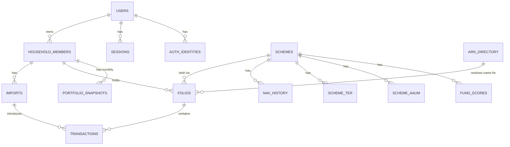

# Data Model

Full column-level detail lives in
[`05-docs/reference/database-schema.md`](../05-docs/reference/database-schema.md). This
section covers the shape and the five principles that produced it — the parts worth
understanding before reading any table definition.

## Five design principles

**1. Two clearly separated data domains.** *User data* — household members, folios,
transactions, imports — is private and per-user. *Reference data* — the scheme master,
NAV history, TER, AAUM, benchmark indices, the ARN directory — is public, shared
platform-wide, and never duplicated per user. This distinction was implicit across the
PRDs and is made explicit here because it directly shapes the tables: **reference tables
carry no user or household foreign key at all.**

**2. Imports are repeatable events, not a one-time onboarding artifact.** A household
member *has many* imports. There is no "has imported" flag on the member record. This is
what makes Ongoing Data Addition a natural consequence of the schema rather than a
feature bolted on later.

**3. No raw CAS PDF storage anywhere.** Per ADR-004, no column in any table references a
source document — only parsed output. Similarly, **no PAN column exists anywhere in this
schema**; the parsed PAN is held in memory during the active parse/review session, shown
masked (`ABCDE****F`), and discarded with the PDF.

**4. `NUMERIC`, never `FLOAT`, for every money, unit, and NAV field.** PRD-01's
Decimal-safe maths constraint is carried literally into the column types rather than
left as a coding convention.

**5. The family aggregate default is computed, not stored.** Whether a member's
dashboard defaults to the family aggregate or the per-member view depends on whether
other household members exist — derivable from a simple count. No `default_view` column
exists, and its absence is deliberate: it is one fewer piece of stored state that could
go silently stale relative to actual family composition.

## Entity relationships

`otp_requests` and `pending_identity_verifications` are standalone transient tables keyed
on a phone number or token hash, not tied to a `users` row at creation time.
`schemes`, `nav_history`, `scheme_ter`, `scheme_aaum`, `benchmark_index_history`,
`arn_directory`, and `fund_scores` are reference data with no household or user foreign
key, per principle 1.

## Three Postgres features the schema depends on

These matter because they have no SQLite equivalent and are the reason the migration
(see [the runbook](../05-docs/how-to/migrate-sqlite-to-postgres.md)) needs explicit
verification rather than "the app seems to work."

| Feature | Where | Why |
|---|---|---|
| `PARTITION BY RANGE`, yearly | `transactions`, `nav_history` | The two tables that grow without bound. NAV history alone was already ~410,000 rows in the dev database across 143 schemes in a single category |
| `JSONB` | `imports.raw_parser_output` | PRD-01 FR-4 requires the full raw parser output persisted for debugging |
| Native `ENUM` | `imports.status`, `folios.plan_type`, others | SQLAlchemy's `Enum` type abstracts the difference; noted so it is not mistaken for a gap needing manual work |

## Deduplication

`transactions` carries a unique constraint on **`(folio_id, date, amount, units, type)`**
— five columns, per migration 0002. This is the implemented fact and it should be
treated as authoritative over the PRDs, which disagree with it and with each other; see
[`07-risks-and-debt.md`](../07-risks-and-debt.md).

The reason for the fifth column: amounts and units are normalised to positive magnitudes,
so an equal-magnitude same-day purchase and redemption pair is not sign-distinguishable
and collided under the earlier four-column key.

## Indexing

- `transactions(folio_id, date)` — supports the holdings-table and XIRR queries that
  dominate the dashboard read patterns.
- `nav_history(scheme_id, date)` — supports both current-NAV lookups and the historical
  range scans the monthly snapshot backfill needs.
- `household_members(user_id)` — supports the family-aggregate count from principle 5.
- `household_members(user_id) WHERE relationship = 'self'` — a **partial unique index**
  (migration 0011) enforcing exactly one account-holder row per user. This gap existed in
  the documentation before the code caught up.

## `relationship` field shape

A fixed enum — `self` / `spouse` / `parent` / `child` / `sibling` / `other` — plus a
free-text fallback label used only when `other` is selected. Structured enough for
consistent family-grouping logic, flexible enough not to force awkward edge cases into
the wrong bucket.

## What this model deliberately does not cover

- Partition maintenance automation (creating next year's partition ahead of time) — an
  operational runbook item, not a schema design question.
- Auth and security policy at the schema level (rate-limiting, session-expiry UX, device
  management) — deferred to the Auth/Security PRD.

> **Correction, 2026-09-22 (batch 2c).** This section previously listed
> "per-user analytics tables" as deliberately out of scope, true through
> batch 2b. As of migration `0012` (2026-09-02), that is no longer the
> model's shape: `analytics_sections` and `analytics_recompute_status` are
> now per-household analytics tables, added deliberately to fix a connection-
> pool exhaustion problem. `fund_scores` remains fund-level reference data,
> unchanged. See [ADR-015](../03-decisions/ADR-015-analytics-precompute-architecture.md).
> The migration chain referenced elsewhere in this vault has also moved on:
> `0012_analytics_sections`, `0013_account_deletion_grace_period`,
> `0014_analytics_recompute_generation` — none confirmed applied to the real
> staging RDS instance as of the 2026-09-11 source material (R-052).

## Related

- [ADR-003](../03-decisions/ADR-003-primary-database-rds-postgresql.md),
  [ADR-004](../03-decisions/ADR-004-object-storage-scope-and-cas-pdf-retention.md)
- [Database schema reference](../05-docs/reference/database-schema.md)
- [Migration runbook](../05-docs/how-to/migrate-sqlite-to-postgres.md)
