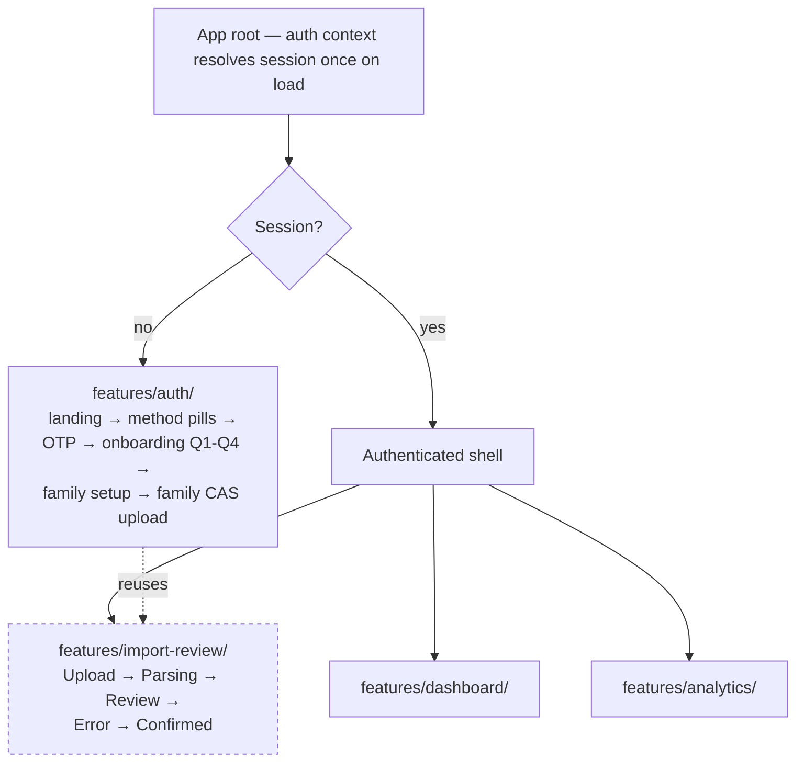

# Frontend Composition

How the React SPA is actually put together — feature boundaries, how state
and navigation work inside each flow, and the rules that hold across all of
them. For the component inventory and screen list see
[screen inventory and flows](../05-docs/reference/screen-inventory-and-flows.md);
for why it is one SPA rather than micro-frontends see
[ADR-001](../03-decisions/ADR-001-frontend-application-architecture.md).

## There is no router

The application has never had one, at any point in the material recorded
here, and each flow that needed navigation solved it locally instead:

| Flow | Navigation mechanism | Why not a router |
|---|---|---|
| Import Review (2026-08-05) | A step enum owned by one stateful parent; five child screens render off it | The flow is linear, short-lived, and thrown away on completion. A router was explicitly considered and rejected as premature |
| Onboarding (2026-08-06) | A history **array plus a cursor** | Back moves the cursor without truncating forward history, so a user who steps back and then forward again does not lose answers already given. A router's history stack does not give this for free |
| Multi-method auth (2026-08-14) | The same step machine, extended with two new steps and one new rendering mode | Extending beat replacing; the mandatory-phone case reuses the *existing* phone and OTP steps behind a context flag rather than adding a fifth step |

This has a consequence that reaches back into a backend decision: because
flow state lives in memory and nothing is persisted, **any auth flow
requiring a full-page redirect would destroy it.** That is one of the stated
reasons the Google OAuth redirect flow was rejected in
[ADR-008](../03-decisions/ADR-008-phone-anchored-multi-method-identity.md) in
favour of the rendered sign-in button and ID-token verification.

## Feature boundaries

- `features/import-review/` — S8–S12 (Upload, Parsing, Review, Error,
  Confirmed). Self-contained; talks to the parse and confirm endpoints
  directly.
- `features/auth/` — everything from the landing screen through onboarding
  completion, including family setup and the family CAS upload subsystem.
  Reuses Import Review's screens rather than duplicating them.
- `features/dashboard/`, `features/analytics/` — the authenticated surfaces.

An auth context resolves session state **once on load** and drives the
top-level render branch. This is the only global state in the application:
there is no state library, and no React context beyond auth and the
per-flow ones.

## Rules that hold everywhere

**Money never becomes a number.** Amount, unit and NAV values arrive from the
API as strings and are displayed as-is — never parsed into a JavaScript
number, never formatted through arithmetic. This is the frontend mirror of
the backend's `Decimal`-everywhere rule
([quality and constraints](quality-and-constraints.md)), and it is the reason
the API returns them as strings in the first place.

**The UI never guesses, and the server does not trust it.** Confirm is
disabled client-side until every low-confidence scheme match and every
`unclassified` plan type has a human override. The server independently
refuses the same cases with a 409. The client-side disable is the
affordance; the server's refusal is the guarantee.

**Errors are a routed taxonomy, not a catch-all.** The import flow routes
parse failure, scheme-confidence failure, session-not-found and network
failure to four distinct screen states, each with its own test. A single
"something went wrong" state was not accepted.

**Three-way outcomes are modelled as discriminated unions.** The 2026-08-14
verify call returns logged-in, link-required, or phone-required; modelling it
as a union means no caller can silently forget a case.

**Vocabularies the backend leaves open are locked on the client.** The
`onboarding_step` values are a frontend constant even though the backend
column is free text, so resume-after-reload is deterministic rather than
dependent on whatever string was last written.

## Two backend shapes expressed as frontend rules

Both of these are frontend constraints that exist only because of how the
backend is built, and both are worth knowing before anyone "optimises" the
client:

1. **Family CAS files are parsed sequentially, never in parallel.** The
   backend holds a single in-memory preview per session, so concurrent parse
   calls race each other.
2. **The account holder's own household-member row is resolved
   list-then-create, never blind-create.** There is no
   `PATCH /household-members` endpoint, so a session resumed after a reload
   would otherwise insert a duplicate `self` row.

## State that is deliberately not persisted

| State | Lost on | Rejected alternative |
|---|---|---|
| Import Review in-flight preview | Page reload | `sessionStorage` persistence — rejected; a reload restarts the flow |
| Family CAS upload queue | Page reload | IndexedDB persistence — rejected as premature. See [R-027](../07-risks-and-debt.md) |
| Auth flow step and collected answers | Page reload or any full-page redirect | No persisted flow state; this is what rules out the OAuth redirect flow |

## Styling and component libraries — as of 2026-08-14

CSS Modules over design tokens exposed as CSS custom properties (a single
global stylesheet was considered and rejected). On the working branch checked
on 2026-08-14, **Tailwind and shadcn/ui are genuinely in use, and Bklit UI is
not installed** — the project's component configuration registers its registry
as a pull-on-demand source, but no package exists. The same day's analytics
frontend design specifies Bklit UI for "mostly everything." Those two
statements cannot both be acted on. See
[R-019](../07-risks-and-debt.md) — unresolved.

One deliberate carve-out is recorded in the analytics design: the existing
allocation donut is reused **unchanged** rather than replaced with a
new-library equivalent, because the design schema's consistent-chart-language
rule outweighs visual consistency with a component library.

## Related

- [ADR-001](../03-decisions/ADR-001-frontend-application-architecture.md),
  [ADR-008](../03-decisions/ADR-008-phone-anchored-multi-method-identity.md)
- [Building blocks](building-blocks.md),
  [design tokens](../05-docs/reference/design-tokens.md),
  [design language](../05-docs/explanation/design-language.md)
- Journey: [2026-08-05](../02-journey/2026-08-05-import-review-ui-and-auth-backend.md),
  [2026-08-06](../02-journey/2026-08-06-onboarding-frontend-dashboard-backend-and-a-silent-data-loss-fix.md),
  [2026-08-14](../02-journey/2026-08-14-multi-method-auth-and-the-analytics-frontend.md)
- Evidence: `08-evidence/documents/specs/2026-08-05-import-review-frontend-design.md`,
  `08-evidence/documents/specs/2026-08-06-phase-2b-onboarding-frontend-design.md`,
  `08-evidence/documents/specs/2026-08-14-multi-method-auth-frontend-design.md`,
  `08-evidence/documents/specs/2026-08-14-analytics-frontend-design.md`
