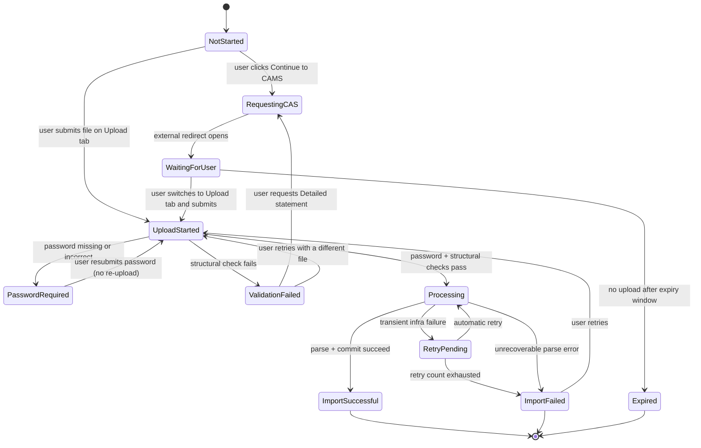
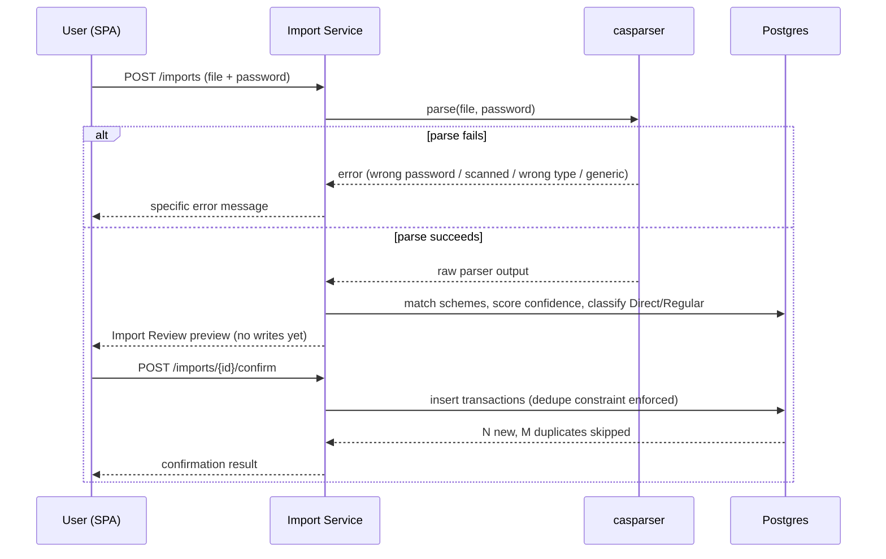
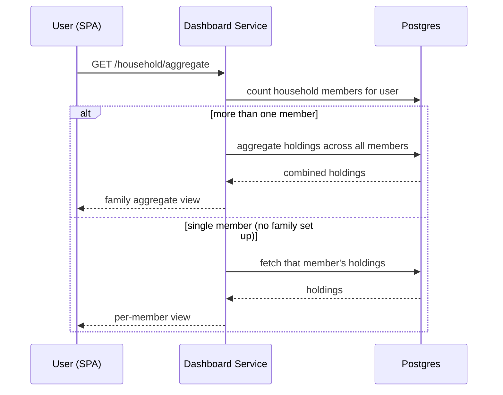

# Runtime and Data Flow

## CAS import — the state machine

This is the authoritative lifecycle, from `Updated-CAS-App-Flow.md`. It supersedes the
simpler upload → parse → review → confirm sequence in PRD-01 and the original App Flow,
which describe the same feature one generation earlier. **Both generations are retained
as sources; see [`07-risks-and-debt.md`](../07-risks-and-debt.md) for the unreconciled
differences.**

| State | User-visible | Notes |
|---|---|---|
| `NotStarted` | Implicit | No record created yet |
| `RequestingCAS` | Yes | Momentary; transitions straight to `WaitingForUser` |
| `WaitingForUser` | Yes | Persistent banner; no visible timeout, expires internally after 7 days |
| `UploadStarted` | Yes ("Uploading…") | Very brief; file being read/transmitted |
| `PasswordRequired` | Yes | Inline, specific, **recoverable without re-upload** |
| `ValidationFailed` | Yes | Distinguishes Summary-vs-Detailed statement from a generic mismatch |
| `Processing` | Yes (progress) | Covers parse, dedupe, and coverage-gap evaluation |
| `RetryPending` | No | Internal only; still shows as "Processing" |
| `ImportSuccessful` | Yes | Terminal; shows added/skipped transaction counts |
| `ImportFailed` | Yes | Terminal; specific where possible, plus a retry action |
| `Expired` | No | Banner disappears; the user can start fresh at any time |

Two details worth keeping visible because they are easy to lose in implementation:
`PasswordRequired` must not force a re-upload — the file stays, only the password is
resubmitted; and `ValidationFailed` must name the Summary-vs-Detailed mistake
specifically, because it is the single most likely user error and a generic message
leaves the user with nothing to act on.

## CAS import — the earlier synchronous sequence

Retained from the TDD because it is what the two-phase parse/confirm API actually does
once a file is in hand.

The load-bearing property: **nothing is written to `transactions` until the user
confirms.** The parse phase produces a preview only. Duplicate rejection is enforced by
a database constraint rather than application logic, so re-uploading an overlapping
statement is safe by construction rather than by care — see [data model](data-model.md).

## Dashboard load — family aggregate by default

The default view is **derived from a count query, not from a stored preference.** That
is deliberate: a stored `default_view` column would go stale the moment family
composition changed.

## Scheduled reference-data refresh

Every periodic job follows the same shape: EventBridge Scheduler fires → ECS Fargate
`RunTask` starts a one-off container from the same image as the API → the job module
fetches from its public source → writes to the matching reference table in Postgres
(and the raw payload to S3) → exits.

The failure path is uniform and is a product decision, not just an engineering one:
**a failed refresh never produces an error state in the UI.** It produces a stale-data
label — a NAV shown with a freshness indicator, a TER shown as of its last known month.
Missing monthly snapshots render as unavailable, never as zero. Funds with insufficient
history are skipped by the scorer rather than scored badly.

ARN name resolution is the exception to all of the above: it is **on demand**, triggered
inline by the Import Service the first time a previously-unseen ARN code appears, and it
falls back to displaying the raw ARN code rather than blocking anything.

## Authentication

Passwordless throughout: phone + OTP, email + OTP, or Google. `auth_identities` is the
source of truth for how a user logs in; a verified phone number is mandatory and the
flows converge on it. Password authentication existed briefly in the schema and was
removed by migration 0008. See
[`07-risks-and-debt.md`](../07-risks-and-debt.md) for the documented reversal history —
PRD-02's FR-2 was revised twice on 2026-08-17.

## Related

- [Building blocks](building-blocks.md), [data model](data-model.md)
- [Screen inventory and flows](../05-docs/reference/screen-inventory-and-flows.md)
- [ADR-006](../03-decisions/ADR-006-background-job-scheduling.md)
