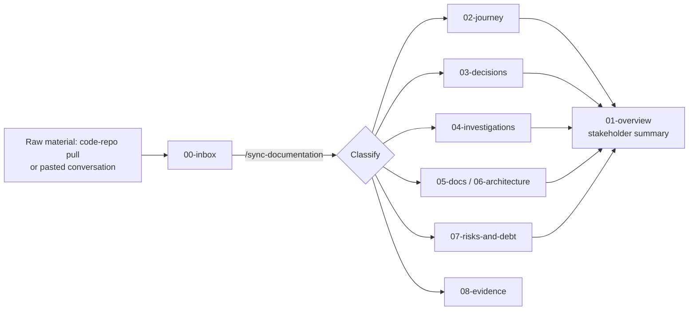

# Map

This file is the index — what's where, and what to read first.

## Start here

- [Executive overview](01-overview/executive-overview.md) — front door for anyone new to this project
- [Current status](01-overview/current-status.md) — living snapshot, overwritten each update
- [Roadmap](01-overview/roadmap.md)
- [Journey index](02-journey/00-index.md) — the A→B→C→D delivery narrative

## Records

- [Decisions](03-decisions/) — `decisions-log.md` for small calls, `ADR-XXX` files for major ones with alternatives considered
- [Investigations](04-investigations/) — troubleshooting and root-cause digs, including incidents
- [Risks and technical debt](07-risks-and-debt.md)

## Reference

- [Architecture](06-architecture/00-index.md)
- [Docs](05-docs/) — tutorials, how-to guides, reference, explanation (Diátaxis)

## Raw material

- [Inbox](00-inbox/) — unprocessed raw material; run `/sync-documentation` to process it
- [Evidence](08-evidence/) — conversation exports, logs, screenshots, test output cited by records above

## How this vault works

Nothing here is edited directly for routine updates — raw material goes
into `00-inbox/`, gets processed by `/sync-documentation`, and every
write is approved before it lands.
